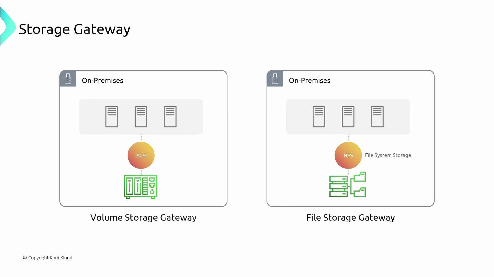
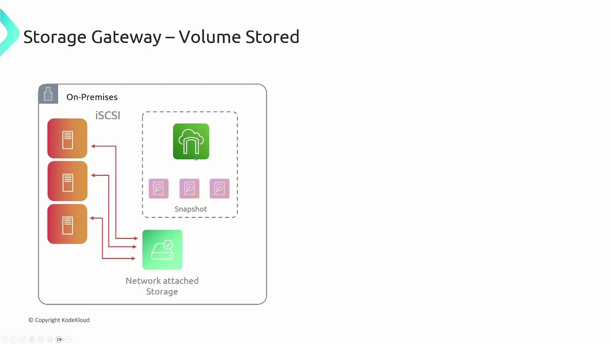
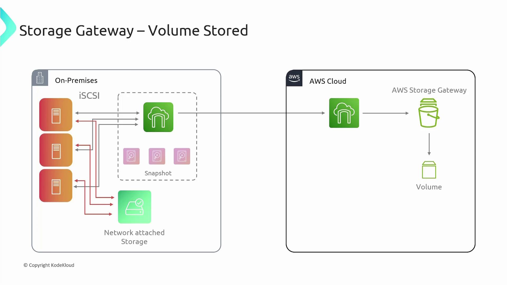
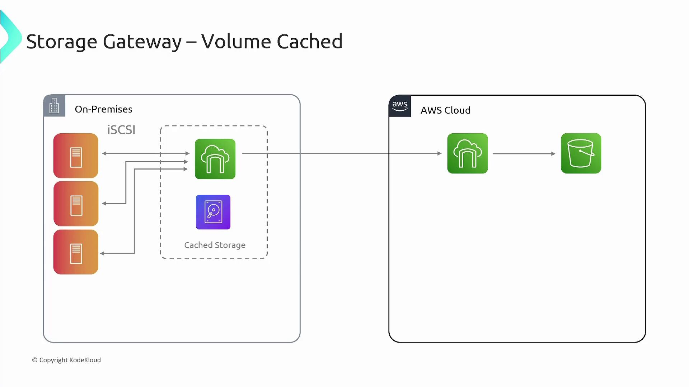
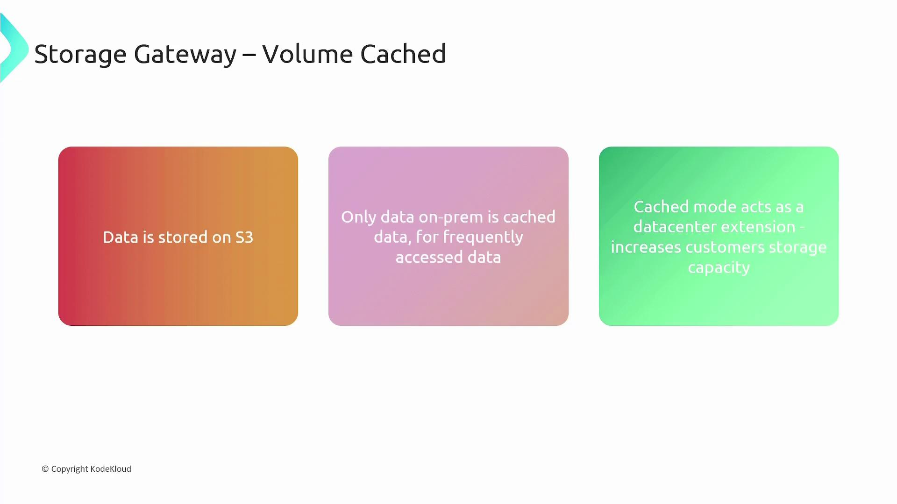
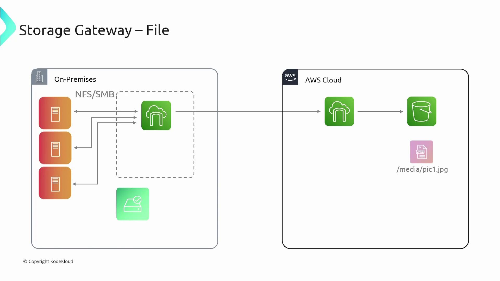
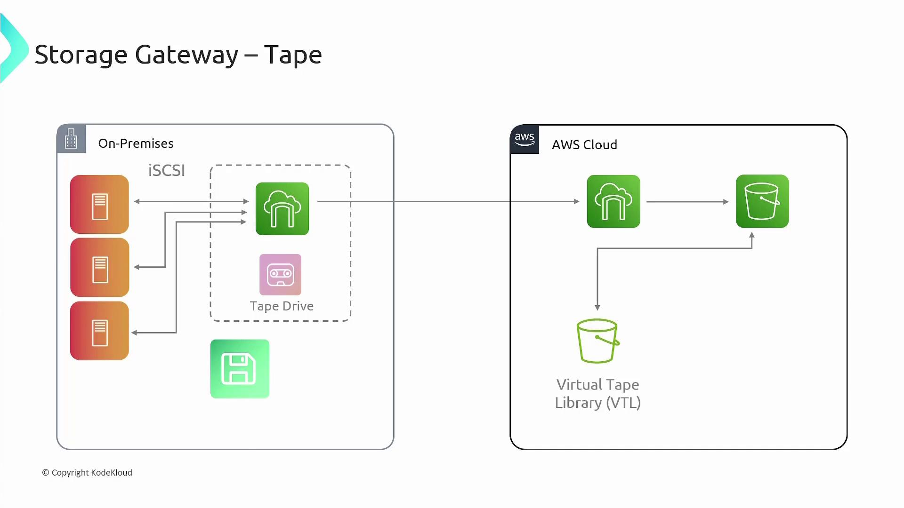
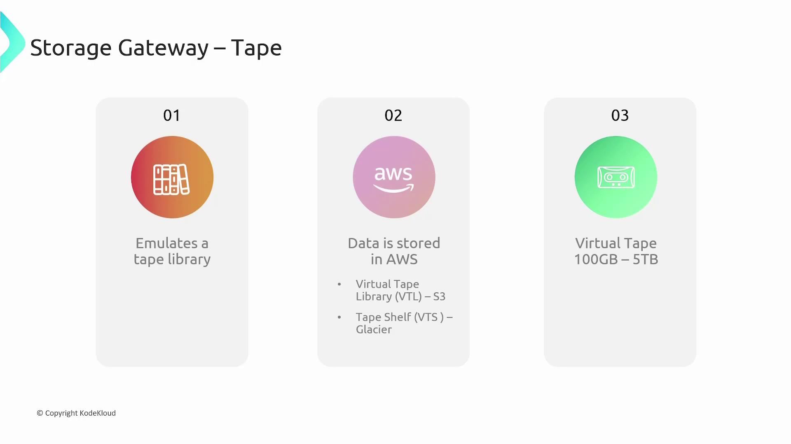
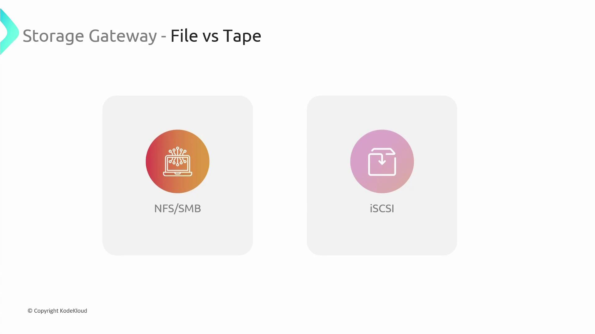

# Storage Gateway

Source: https://notes.kodekloud.com/docs/AWS-Solutions-Architect-Associate-Certification/Services-Storage/Storage-Gateway/page

This article provides an overview of AWS Storage Gateway, a hybrid cloud storage service integrating on-premises environments with AWS Cloud storage.

This article provides an in-depth overview of AWS Storage Gateway, a hybrid cloud storage service that seamlessly integrates your on-premises environment with AWS Cloud storage. With scalable storage resources, AWS Storage Gateway bridges the gap between local applications and the cloud, offering solutions for extending storage capacity, facilitating gradual migration, enabling cost-effective backups, and supporting disaster recovery.

<Callout icon="lightbulb">
  * Extend your on-premises storage capacity without expensive hardware upgrades.
  * Simplify data migration by replicating on-premises data to the cloud.
  * Reduce backup costs using AWS storage solutions.
  * Enhance disaster recovery with rapid data replication to AWS.
</Callout>

AWS Storage Gateway can be deployed either as a virtual machine or as a physical appliance in your data center. Depending on your storage protocols, you can choose between three modes: Volume, File, and Tape. For instance, if you use iSCSI for block storage in your network-attached storage (NAS), the Volume Gateway is the ideal choice, whereas NFS or SMB protocols are best suited for the File Gateway.

<Frame>
  
</Frame>

Below, we delve into the specifics of each operating mode, starting with the Volume Gateway.

***

## Volume Gateway

The Volume Gateway operates in two sub-modes: Stored Mode and Cached Mode. Both modes present block storage volumes over iSCSI to your servers, but they differ in where the primary data storage occurs.

### Volume Stored Mode

In Volume Stored Mode, the Storage Gateway appliance is installed in your on-premises data center and connected to your servers via iSCSI, much like a traditional NAS system. In this configuration, the appliance stores data locally on its physical disks before asynchronously replicating it to AWS S3 as EBS snapshots. These snapshots can later be used to create EBS volumes, making them ideal for backup and disaster recovery scenarios.

<Frame>
  
</Frame>

Key features of Volume Stored Mode include:

* Local storage of data on the appliance’s physical disks.
* Asynchronous replication of data to AWS S3 in the form of EBS snapshots.
* Simplified backup and disaster recovery; however, on-premises storage capacity remains limited to the appliance's physical disks.

<Frame>
  
</Frame>

### Volume Cached Mode

Volume Cached Mode is designed to extend your on-premises storage using the virtually unlimited capacity of AWS Cloud storage. In this mode, the Storage Gateway appliance does not maintain a full copy of your data on-premises. Instead, it stores frequently accessed data locally as a cache while keeping the entire data set in AWS S3. This configuration not only reduces your dependency on local storage capacity but also improves performance by keeping hot data close to your applications.

<Frame>
  
</Frame>

Advantages of Volume Cached Mode:

* Elimination of the need for large on-premises storage infrastructure.
* Fast access to frequently used data through local caching.
* Seamless extension of your data center capacity by leveraging AWS S3.

<Frame>
  
</Frame>

***

## File Gateway

The File Gateway provides an optimized solution for file-based storage, allowing servers to connect using standard protocols such as NFS or SMB. Deployed as either a virtual machine or a physical appliance, the File Gateway functions as a file server in your on-premises environment.

When a server writes a file (for example, /media/pic1.jpg), the gateway does not store the file locally apart from minimal caching for performance. Instead, it converts the file into an object stored in AWS S3, with the object's key reflecting its original file system path. This approach offers you virtually unlimited storage capacity while maintaining a simple, file-based interface.

<Frame>
  
</Frame>

***

## Tape Gateway

For organizations that have traditionally relied on physical tape-based backup systems, the Tape Gateway offers a modern alternative. This mode emulates a tape backup system using the Storage Gateway appliance, which communicates over iSCSI to produce virtual tape libraries (VTL) within AWS S3.

When data is written via the Tape Gateway, it behaves much like a traditional tape library, enabling you to maintain familiarity with legacy backup processes. Over time, data can be migrated from the VTL to a Virtual Tape Shelf that utilizes AWS Glacier for long-term archival storage. Virtual tapes in the VTL can range from 100GB to 5TB in size.

<Frame>
  
</Frame>

<Frame>
  
</Frame>

The primary differences between File and Tape Gateways are:

* File Gateway uses NFS/SMB protocols for direct file storage, converting files into objects stored in AWS S3.
* Tape Gateway emulates a traditional tape library over iSCSI, storing backup data in a VTL and archiving it to AWS Glacier for long-term retention.

<Frame>
  
</Frame>

***

In summary, AWS Storage Gateway offers versatile modes—Volume (Stored and Cached), File, and Tape—to meet diverse storage needs such as backup, data migration, capacity extension, and disaster recovery. Choose the configuration that best aligns with your current storage protocols and operational requirements to harness the benefits of a hybrid cloud storage solution.

For further reading on AWS Storage Gateway and other hybrid cloud solutions, check out the [AWS Documentation](https://aws.amazon.com/storagegateway/).

<CardGroup>
  <Card title="Watch Video" icon="video" href="https://learn.kodekloud.com/user/courses/aws-solutions-architect-associate-certification/module/23e00d1f-6422-4fef-a9bf-e8f007be5514/lesson/9ae1b4a6-48cd-47fd-a5e6-e2dda4cbcfe3" />
</CardGroup>
