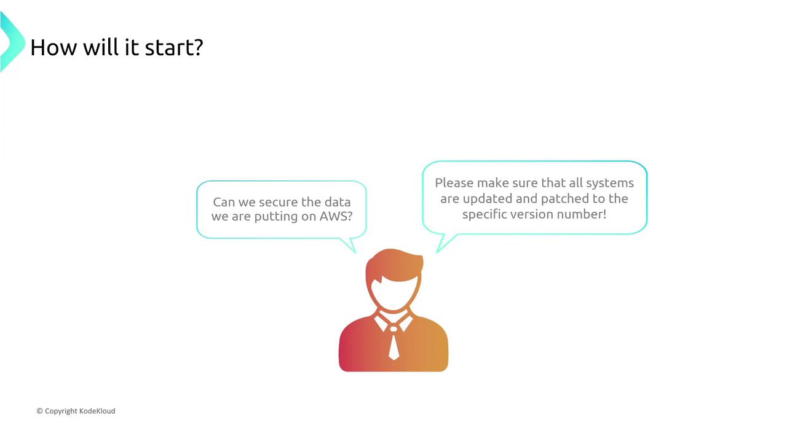
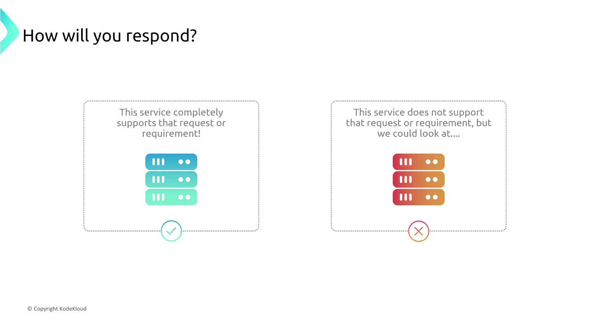
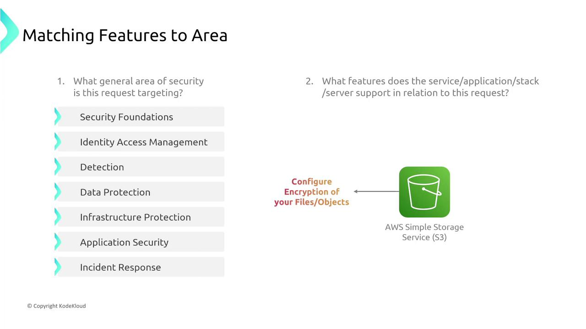
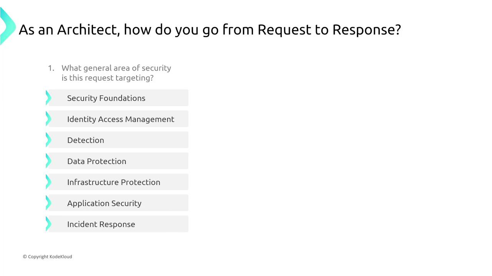
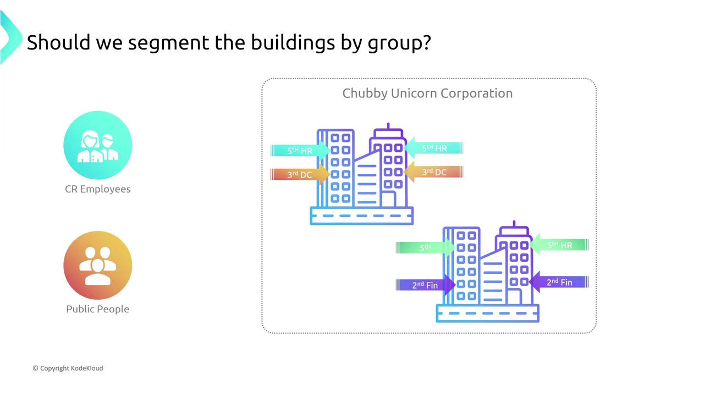
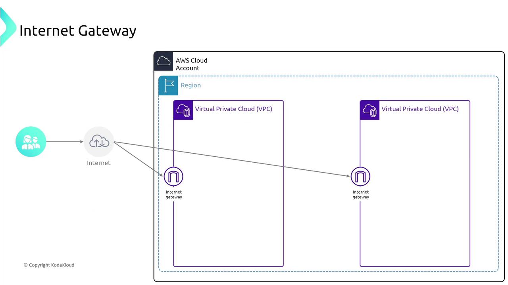
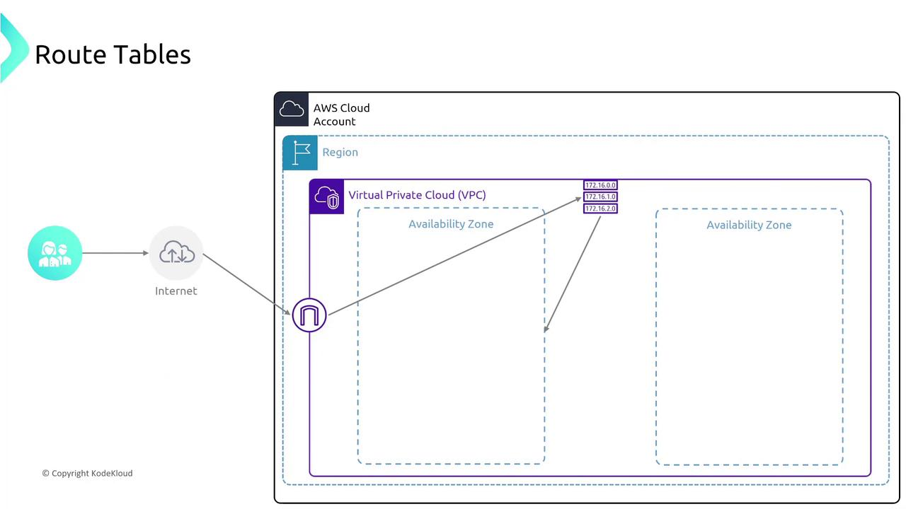
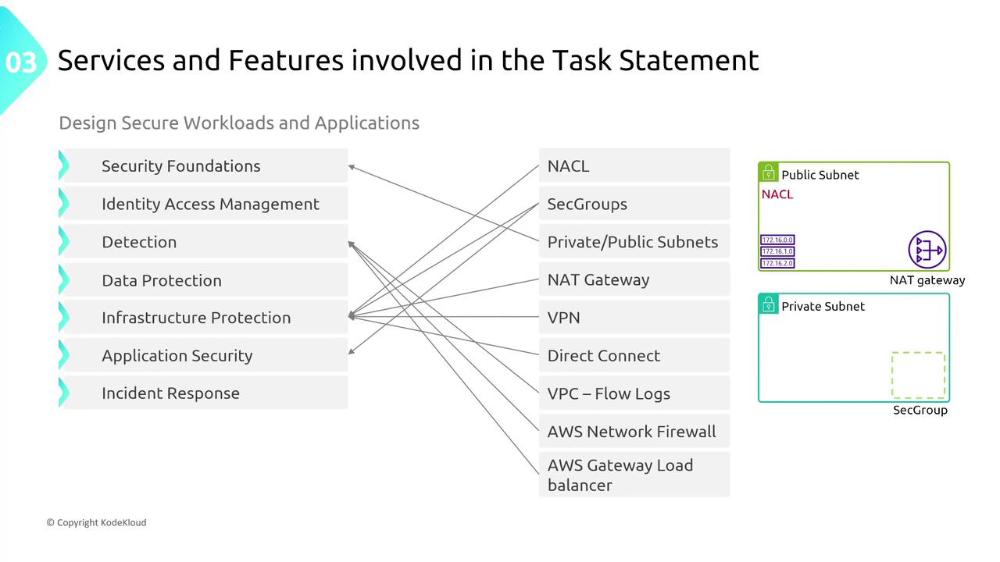

# Turning up Security on Network Services Part 1

Source: https://notes.kodekloud.com/docs/AWS-Solutions-Architect-Associate-Certification/Designing-for-Security/Turning-up-Security-on-Network-Services-Part-1/page

This article focuses on enhancing security for network services on AWS by fine-tuning service configurations and aligning security features with AWS capabilities.

Welcome, future solutions architects! Presented by Michael Forrester, this article is the first installment in our "Designing for X" series. In this session, we focus on enhancing security for network services on AWS. Prepare to take detailed notes as we cover a substantial amount of material at a brisk pace.

The objective is to demonstrate how to bolster security on familiar AWS services by fine-tuning the service configurations—essentially, adjusting the "knobs" that control key security features.

***

## Introduction to Security Design Conversations

Security design discussions often begin when a stakeholder makes a specific request. For example:

* "Can we secure the data stored in AWS?"
* "Please ensure that Java on our systems is patched to a specific version."

Consider the scenario where someone inquires about S3 encryption. You might explain that S3 data is encrypted by default. Similarly, if the request involves RDS encryption, you would note that encryption was enabled when the service was provisioned.

The key takeaway is that when you receive a request—whether it's for updated software patches (using Systems Manager, for example) or to enable encryption—you must first verify if the AWS service supports that feature. If not, alternative solutions or third-party configurations may be required.

<Frame>
  
</Frame>

Requests are rooted in technical requirements, but they usually serve broader business needs. Your role is to align the requested security feature with the corresponding AWS service capability. For example, while S3 encryption falls under data protection, other areas include identity access management, threat detection, application security, and incident response.

<Frame>
  
</Frame>

Categorizing requests helps you quickly determine whether a service natively offers the required feature or if additional measures are needed.

***

## Matching Security Features to AWS Services

Let's delve into some AWS examples to illustrate how security features align with services:

### Data Protection

For S3, enabling encryption is a key data protection measure. Additionally, versioning is another feature that safeguards data integrity.

<Frame>
  
</Frame>

### Detection

Activating detailed logging on an S3 bucket can be viewed as a detection mechanism—helping you monitor object access. Likewise, VPC flow logs serve as an event detection tool rather than solely preventing unauthorized access.

<Frame>
  
</Frame>

### Identity and Access Management (IAM)

Adjustments to access control lists (ACLs) and enhanced logging for detailed access insights tie into IAM and broader application security.

When preparing for the AWS certification exam, analyze the security request by identifying the target category: application layer, network infrastructure, or data security. The solution should maximize security while minimizing cost and operational overhead.

<Frame>
  
</Frame>

For certification, you should be familiar with essential task statements such as:

* Designing secure access to AWS resources.
* Designing secure workload and application environments.
* Determining appropriate data security controls.

Consider a scenario from the fictional "Chubby Unicorn Company," where the requirement is to block unneeded ports for the application "Glitterbomb." In this case, network ACLs, security groups, or dedicated network firewalls might be utilized.

<Frame>
  
</Frame>

When evaluating options, always balance enhanced security with cost-effectiveness and operational simplicity.

***

## Deconstructing Complex Networking Diagrams

Understanding how to deconstruct intricate network security diagrams is an essential skill. Consider the following narrative inspired by Chubby Unicorn Company:

### 1. Multiple Campuses in a Region

Imagine an AWS account as a collection of campuses (regions). Think of AWS regions and accounts as numerous office locations, each segmented by groups—like different floors in a building representing public and private subnets.

<Frame>
  
</Frame>

### 2. Segmentation Within a Building

Within a VPC:

* The first floor (public subnet) is accessible via an Internet Gateway.
* Upper floors (private subnets) host sensitive operations.

Security measures include:

* Public subnets managed by route tables and protected by Network ACLs (NACLs).
* Private subnets that rely on NAT Gateways for outbound communications.
* Instance-level firewalls enforced by security groups.

### 3. Routing and Address Resolution

An Internet Gateway allows external traffic to reach public subnets. Route tables then "direct traffic" much like a receptionist, ensuring that data reaches the appropriate destination. Private subnets typically route via NAT Gateways to maintain secure outbound connections.

<Frame>
  
</Frame>

### 4. Availability Zones and Redundancy

Availability Zones (AZs) can be thought of as separate buildings that are geographically isolated yet interconnected by routing tables. This design maximizes redundancy and security by ensuring isolated and secure traffic flows across distinct locations.

<Frame>
  
</Frame>

### 5. Additional Security Measures

To further secure your AWS infrastructure, consider the following:

* VPC Endpoints provide private connections to AWS services (such as S3), obviating the need for public internet routes.
* Load Balancers distribute network traffic across multiple instances or subnets to ensure both performance and security.
* For IPv6 traffic, an egress-only Internet Gateway functions similarly to a NAT Gateway by allowing only outbound connections.

Each component—from the Internet Gateway to security groups and NAT gateways—plays a critical role in your overall AWS network security architecture.

<Frame>
  
</Frame>

***

## Simplifying Complexity for Secure Design

To summarize your approach:

* Understand the security request (e.g., secure data, enforce patch compliance, restrict network access).
* Identify the AWS features and services that address the request.
* Deconstruct complex diagrams by analyzing each component individually (VPC, subnets, NACLs, security groups, gateways, and route tables).
* Design solutions that strike an optimal balance between robust security, cost-effectiveness, and operational simplicity.

By methodically breaking down your architecture, you will be well-equipped to answer design questions and ensure that your solutions meet the stringent security standards required by the AWS certification exam.

<Frame>
  
</Frame>

<Callout icon="lightbulb">
  Keep in mind that while these examples pertain to exam scenarios, staying current with AWS documentation is crucial in real-world applications.
</Callout>

Happy architecting as you continue to secure network services and advance your design career!

Explore more resources:

* [AWS Certified Solutions Architect – Associate Exam Guide](https://aws.amazon.com/certification/certified-solutions-architect-associate/)
* [AWS Security Best Practices](https://aws.amazon.com/architecture/security-best-practices/)
* [Kubernetes Documentation](https://kubernetes.io/docs/)
* [Docker Hub](https://hub.docker.com/)

<CardGroup>
  <Card title="Watch Video" icon="video" href="https://learn.kodekloud.com/user/courses/aws-solutions-architect-associate-certification/module/fcdcac66-6274-4b2f-912a-d6e9de511e5a/lesson/07950f74-7a1b-4fa8-907f-b1776f797bf2" />
</CardGroup>
