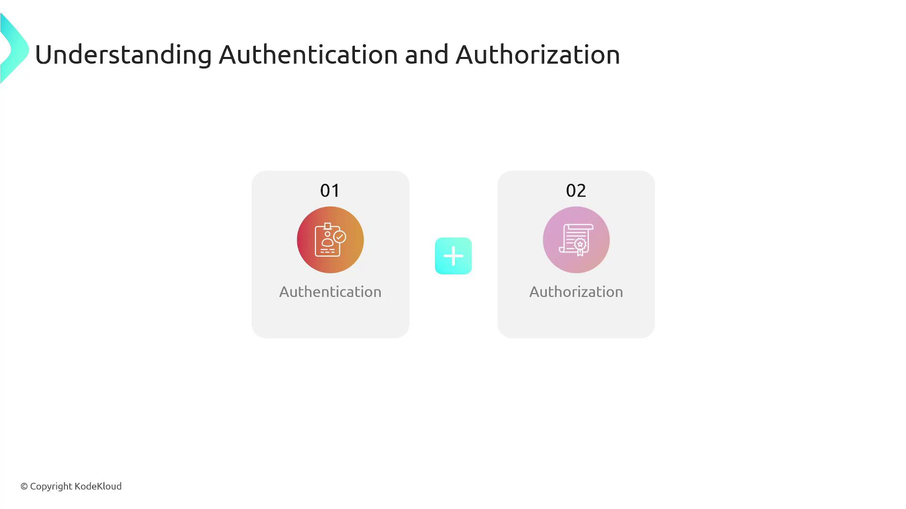
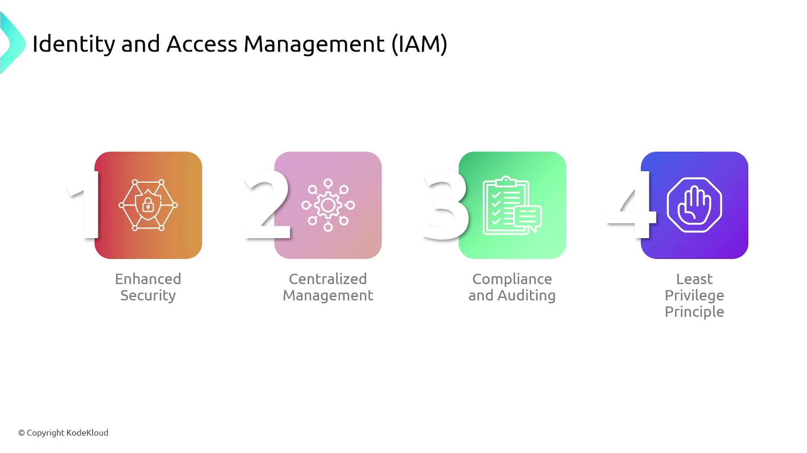
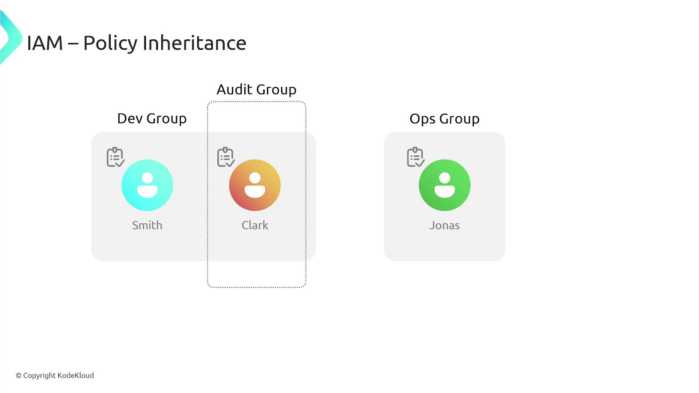

# IAM

Source: https://notes.kodekloud.com/docs/AWS-Solutions-Architect-Associate-Certification/Services-Security/IAM/page

This lesson explores AWS Identity and Access Management, focusing on securely managing authentication and authorization within an AWS environment.

In this lesson, we explore AWS Identity and Access Management (IAM), a service dedicated to securely managing authentication and authorization within an AWS environment.

IAM verifies that users are who they claim to be (authentication) and determines what AWS resources they can access (authorization).

<Frame>
  
</Frame>

For example, when a user initiates an operation — such as creating an [S3 bucket](https://learn.kodekloud.com/user/courses/amazon-simple-storage-service-amazon-s3) — IAM first confirms the user's identity and then checks if they have the appropriate permissions to perform that action. This secure mechanism centralizes identity verification and permission management, ensuring compliance and robust audit trails based on the principle of least privilege. This principle restricts users to the permissions necessary for their tasks.

<Frame>
  
</Frame>

<Callout icon="lightbulb">
  When granting AWS access, creating an individual IAM user is essential. An IAM user represents a single entity (whether a person or an application) and starts with no permissions by default. Administrators must explicitly assign permissions via IAM policies.
</Callout>

In practice, if a team is only responsible for working with [AWS RDS](https://learn.kodekloud.com/user/courses/aws-rds) databases, they should be granted permissions solely for RDS—not for other services like [S3](https://learn.kodekloud.com/user/courses/amazon-simple-storage-service-amazon-s3).

IAM also supports grouping similar users. Groups allow you to assign a common set of policies to multiple users at once. For instance, if both Smith and Clark are part of the "dev" group, they automatically inherit all permissions associated with that group. Since users can belong to multiple groups, Clark might also gain additional permissions if he is a member of the "audit" group.

<Frame>
  
</Frame>

<Callout icon="triangle-alert">
  Remember: New IAM users have no access to AWS resources until permissions are explicitly granted through IAM policies.
</Callout>

IAM policies are defined in JSON format. Below is an example policy document that grants a user permission to list the contents of an S3 bucket and retrieve objects from that bucket:

```json theme={null}
{
  "Version": "2012-10-17",
  "Statement": [
    {
      "Effect": "Allow",
      "Action": [
        "s3:ListBucket",
        "s3:GetObject"
      ],
      "Resource": [
        "arn:aws:s3:::KodeKloud-bucket",
        "arn:aws:s3:::KodeKloud-bucket/*"
      ]
    }
  ]
}
```

This policy document includes:

* The policy language version ("2012-10-17").
* A statement that:
  * Specifies the actions permitted (listing the bucket and retrieving objects).
  * Sets the effect to "Allow", granting the specified permissions.
  * Defines the specific S3 bucket and its contents to which these permissions apply.

After creating such a policy, you can assign it to an IAM user or group, thereby enforcing the defined access controls.

When studying for the [AWS Solutions Architect Associate Certification](https://learn.kodekloud.com/user/courses/aws-solutions-architect-associate-certification), keep these IAM concepts in mind. Mastering authentication, authorization, and the proper structuring of IAM policies is crucial for ensuring AWS security best practices.

<CardGroup>
  <Card title="Watch Video" icon="video" href="https://learn.kodekloud.com/user/courses/aws-solutions-architect-associate-certification/module/6b2d9e18-1714-499c-83d4-4d1f7ff29e66/lesson/67951b40-98b5-4996-a302-78950a1fb8b5" />
</CardGroup>
