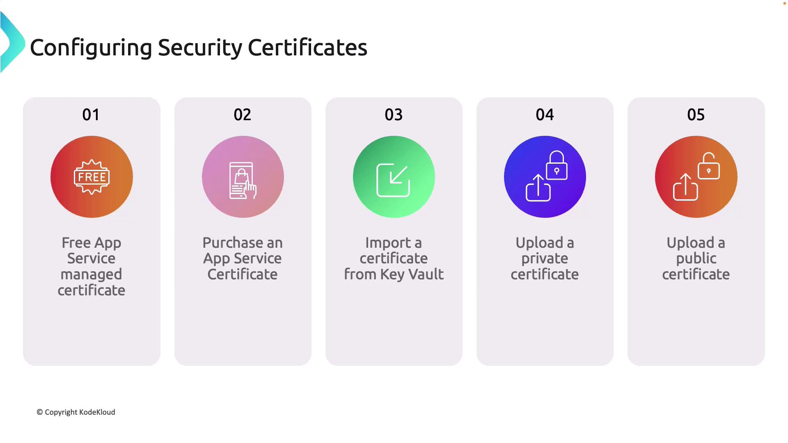
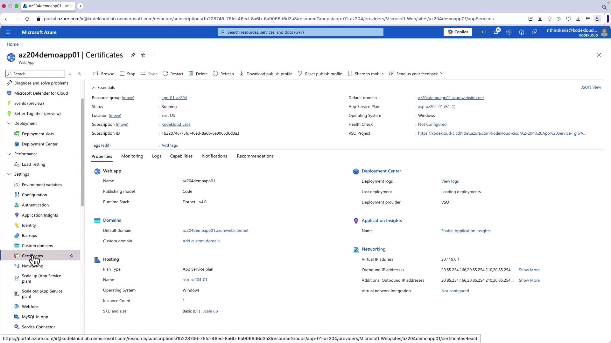
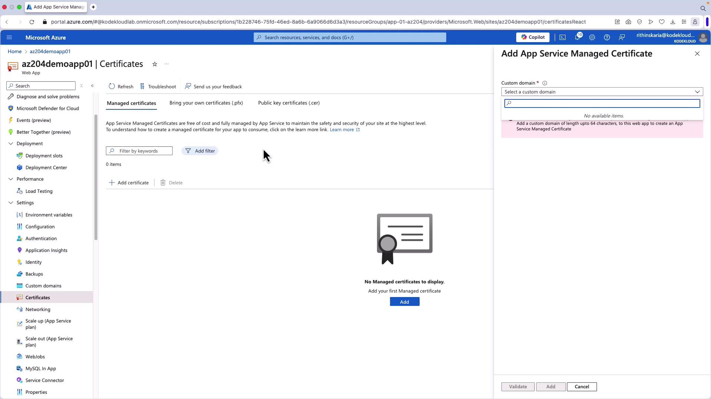
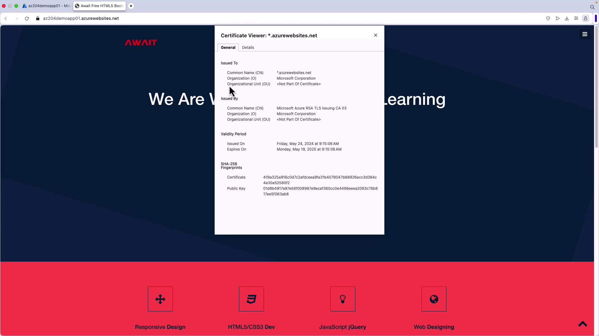
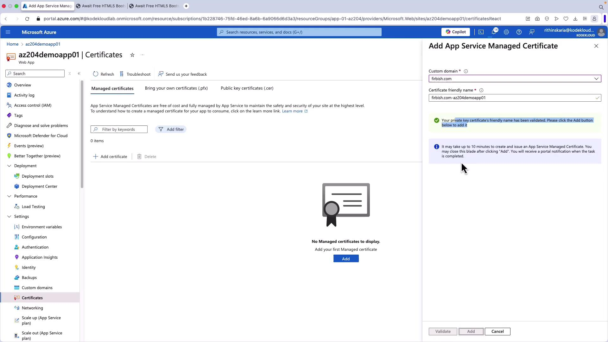
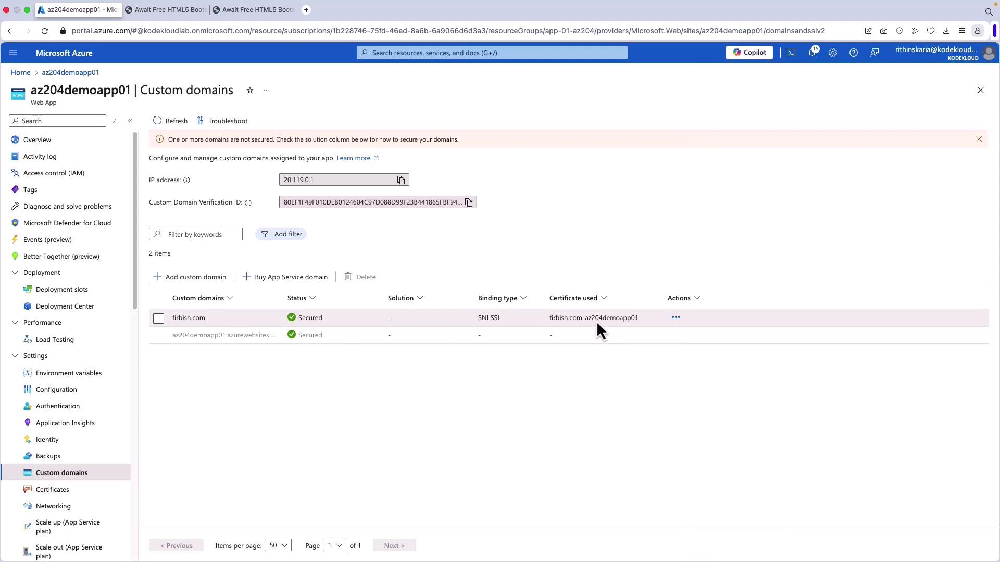
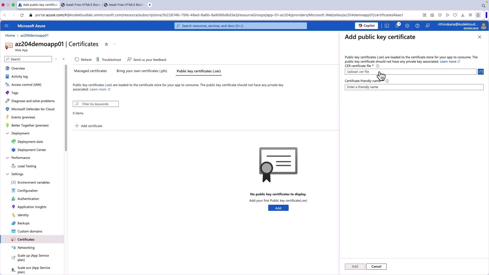

# Configuring Security Certificates

Source: https://notes.kodekloud.com/docs/AZ-204-Developing-Solutions-for-Microsoft-Azure/Configuring-Web-App-Settings/Configuring-Security-Certificates/page

This guide explains how to configure security certificates on Azure App Service for SSL/TLS encryption on custom domains and application endpoints.

In this guide, you'll learn how to configure security certificates on Azure App Service. Depending on your requirements and the certificate source, Azure offers a variety of methods for managing SSL/TLS encryption on your custom domains or application endpoints. The available options are:

1. Free App Service Managed Certificate
2. Purchased App Service Certificate
3. Importing a Certificate from Key Vault
4. Uploading a Private Certificate
5. Uploading a Public Certificate

***

## Free App Service Managed Certificate

The Free App Service Managed Certificate secures your custom domain at no extra cost, providing basic SSL/TLS encryption with automatic renewal. This option is ideal for enabling HTTPS quickly on a single custom domain.

<Callout icon="lightbulb">
  Ensure that you note:

  * Only non-wildcard custom domains are supported.
  * The certificate does not cover both www and non-www versions of the domain simultaneously.
</Callout>

***

## Purchased App Service Certificate

For enhanced security features and greater flexibility, consider purchasing an Azure App Service Certificate directly from Microsoft Azure. This certificate offers benefits such as:

* Support for both custom domains and wildcard certificates.
* Automatic renewals, simplifying certificate management.
* Seamless integration with your existing Azure resources.

This solution is particularly recommended when you need to secure multiple subdomains or require a wildcard certificate for comprehensive protection.

***

## Importing a Certificate from Key Vault

If you already own a certificate, you can store it in Azure Key Vault and import it into your App Service. This method is especially advantageous for organizations with centralized certificate management, as it allows:

* Automated certificate rotation.
* Reduced risk of certificate expiration.
* Compliance with strict security policies.

***

## Uploading a Private Certificate

You can also upload a private certificate directly to your App Service. This approach is beneficial when:

* Your certificate is purchased from a third-party certificate authority.
* Your organization generates certificates internally.

<Callout icon="lightbulb">
  When uploading a private certificate, always ensure that the private key is included and managed securely.
</Callout>

This method offers full control over the certificate, making it ideal for scenarios where Azure management is not used.

***

## Uploading a Public Certificate

Public certificates can be loaded into your App Service or application code when remote resource access is needed. Note that these certificates are not used to secure custom domains.

<Frame>
  
</Frame>

***

## Working with Security Certificates in Azure Portal

Follow these steps to manage security certificates using the Azure Portal:

1. Log in to the Azure Portal and navigate to your App Service.
2. From the App Service menu, select **Certificates** on the left-hand side.

<Frame>
  
</Frame>

3. Click **Add** to register a new certificate. By default, Azure uses the azurewebsites.net domain for web app access, which comes with a built-in certificate.

<Frame>
  
</Frame>

4. To verify encryption, copy your website URL and open it in a browser. A valid certificate issued by Microsoft Corporation indicates that the connection is secure. The built-in certificate is provided free of charge.

<Frame>
  
</Frame>

***

## Configuring a Custom Domain

When you use a custom domain, binding a certificate is essential for secure connections. Follow these steps to add and secure your custom domain:

1. Navigate to the **Custom domains** section within your App Service.
2. Enter the custom domain name (e.g., "firbish.com") and use an A record to point your domain to your App Service.
3. Add the required DNS records via your DNS provider, and click **Validate** in the Azure Portal to confirm domain ownership.

<Frame>
  
</Frame>

4. Once validated, your custom domain will initially be unsecured since no certificate is bound to it. Return to **Certificates** and select **Manage Certificates**.
5. Click **Add Certificate**, select the custom domain (e.g., firbish.com), and click **Validate**. Note that creating an App Service Managed Certificate may take up to 10 minutes.

<Frame>
  
</Frame>

6. After the certificate is created, return to **Custom domains**, click **Add Binding**, select the newly created certificate, then click **Add** to bind the certificate to your custom domain.
7. Refresh your website (using an incognito window if needed) by navigating to [https://firbish.com](https://firbish.com). A secure connection will be indicated by a lock icon; clicking the icon will display certificate details like the common name and validity dates.

<Frame>
  
</Frame>

***

## Additional Certificate Options

Azure App Service supports several additional certificate configurations beyond the free option:

* **Bring Your Own Certificate (BYOC):** Upload certificates that you already own. This is useful for third-party certificates or when you require a wildcard certificate.
* **Import from Key Vault:** Utilize certificates stored in Azure Key Vault.
* **Uploading Public Certificates:** Load public certificates (CER files) into your application for scenarios where binding them to a custom domain is not necessary.

<Frame>
  
</Frame>

***

This concludes our comprehensive guide on configuring security certificates in Azure App Service. For more information on enhancing security, consider exploring additional resources on diagnostic logging and advanced monitoring techniques.

Learn more about [Azure App Service Security](https://docs.microsoft.com/en-us/azure/app-service/) and stay updated with the latest practices!

<CardGroup>
  <Card title="Watch Video" icon="video" href="https://learn.kodekloud.com/user/courses/az-204-developing-solutions-for-microsoft-azure/module/874e2f85-3b70-421e-94c6-722d572e440f/lesson/ed61dfda-dce4-44c5-858e-9c20aab5add3" />
</CardGroup>
