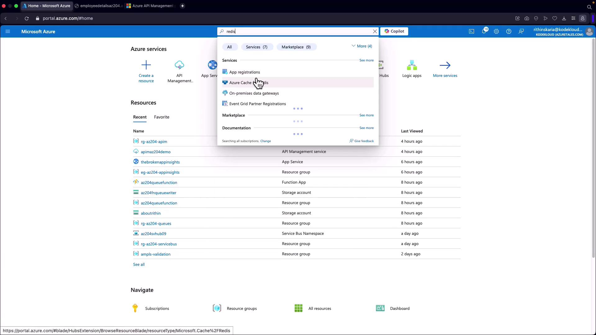
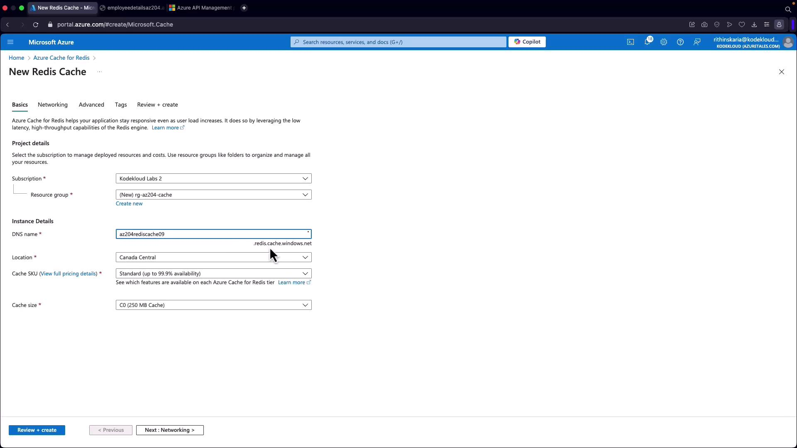
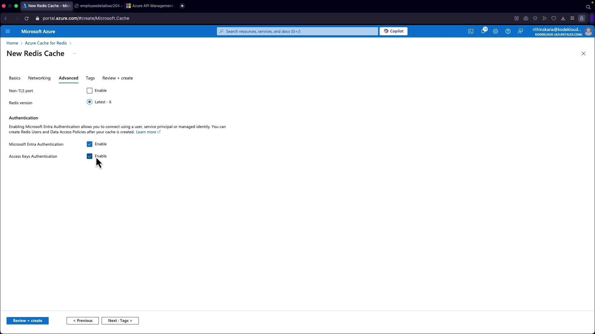
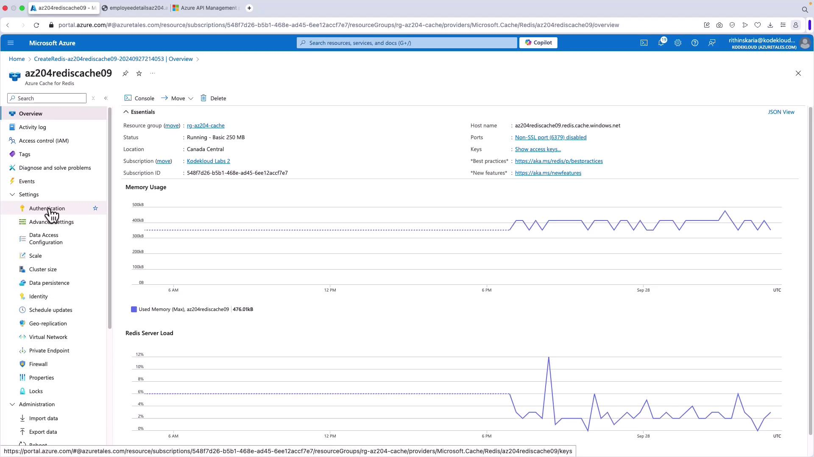
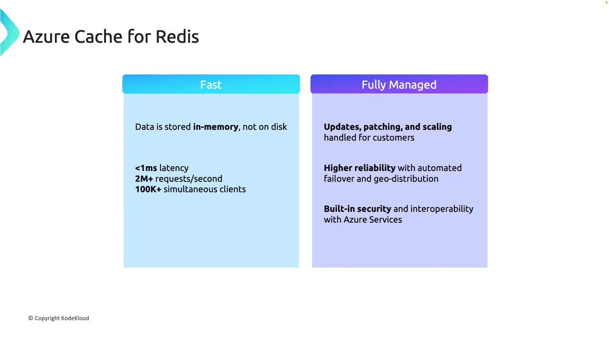
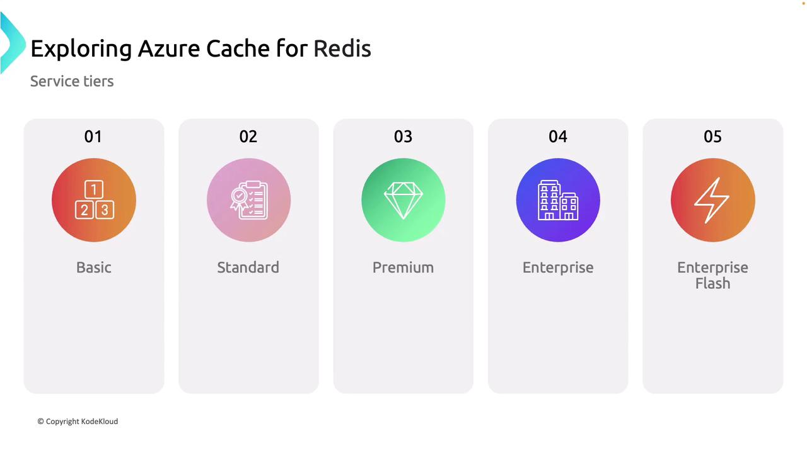

# Check server availability
ping

# Store a key-value pair
set [key] [value]

# Increment the value of a key by 1
incr [key]

# Return the data type of the value stored at key
type [key]

# Retrieve the value stored under a key
get [key]

# Check if a key exists (returns 1 if present, 0 otherwise)
exists [key]

# Increment the value of a key by a specified amount
incrby [key] [amount]

# Delete a key and its value
del [key]

# Clear all data in the current database
flushdb
```

For example, you can use the `set` command to save a key-value pair and the `get` command to retrieve that value.

***

## Setting Expiration Times on Cache Values

Managing cache lifetime is crucial. Redis allows you to set an expiration time on keys using the `expire` command, ensuring that stale data is automatically removed. Consider the following example, which sets a 5-second expiration on a counter key:

```bash theme={null}
# Set the counter key with a value of 100
> set counter 100
OK

# Set the key "counter" to expire after 5 seconds
> expire counter 5
(integer) 1

# Immediately retrieve the value (it should still exist)
> get counter
"100"

# After waiting for more than 5 seconds, retrieving the key returns nil
> get counter
(nil)
```

<Callout icon="lightbulb">
  The `SET` command stores the counter value while the `EXPIRE` command ensures that the value is removed after the specified time.
</Callout>

***

## Accessing Azure Cache for Redis from a Client Application

Once your cache is configured, you need two key pieces of information to access it from a client application:

1. **Hostname:**\
   This is the fully qualified domain name of your Azure Cache for Redis instance, available in the Azure portal.

2. **Access Key:**\
   This key acts like a password. Retrieve it from the authentication section in the Azure portal.

Ensure that the Azure Cache for Redis CLI is installed on your system (available for Windows, macOS, and Linux) before you attempt to connect.

***

## Deploying and Connecting via the Azure Portal

Follow these steps to deploy and connect to an Azure Cache for Redis instance using the Azure portal and the Redis CLI:

1. **Searching for Redis in the Azure Portal:**\
   Open the Azure portal and search for "Redis" to display available Azure Cache for Redis options.

<Frame>
  
</Frame>

2. **Creating a Redis Cache Instance:**
   * Click on "Create Redis Cache."
   * Create a new resource group (for example, "RG AZ204 Cache").
   * Provide a unique DNS name for the cache instance (e.g., "Canada Central").
   * Select a pricing tier. For demonstration, choose the basic tier (C0 with 250 MB).
   * In the networking tab, configure settings as per your security requirements.
   * In the advanced settings tab, ensure that access keys authentication is enabled.

<Frame>
  
</Frame>

<Frame>
  
</Frame>

Once validation passes, click on "Review and Create" followed by "Create." After deployment, navigate to the resource overview where the hostname and access keys are displayed.

<Frame>
  
</Frame>

3. **Connecting Using the Redis CLI:**\
   Open your terminal and connect to your instance using the Redis CLI. If TLS is enabled (which is the default for Azure Cache for Redis), use the following command by replacing the hostname and access key with your resource’s specific details:

   ```bash theme={null}
   redis-cli -h az204rediscache09.redis.cache.windows.net -a pqtzSgrxbqWWWIp9uh0xHG1gEuDjImDwzAzCaIkfKZU= -p 6380 --tls
   ```

   Verify connectivity by issuing a `ping` command:

   ```bash theme={null}
   az204rediscache09.redis.cache.windows.net:6380> ping
   PONG
   ```

   Then, set and retrieve a key to further confirm connectivity:

   ```bash theme={null}
   # Setting the key "name" with value "admin"
   az204rediscache09.redis.cache.windows.net:6380> set name admin
   OK

   # Retrieving the value of "name"
   az204rediscache09.redis.cache.windows.net:6380> get name
   "admin"
   ```

<Callout icon="lightbulb">
  This demonstration shows how to deploy, connect, and interact with an Azure Cache for Redis instance using the Redis CLI.
</Callout>

***

## Connecting to Azure Cache for Redis from .NET

After verifying connectivity via the Redis CLI, you can connect to your cache from a .NET application. Follow these steps in your .NET project:

1. Add the appropriate Redis client library (such as [StackExchange.Redis](https://stackexchange.github.io/StackExchange.Redis/)).
2. Use the hostname and access key from your Azure Cache for Redis instance, and connect via port 6380 for TLS connections.
3. Implement the client code to interact with the cache as needed.

This enables your .NET application to seamlessly leverage Azure Cache for Redis for high-performance caching.

***

This article provides a comprehensive overview of configuring and managing Azure Cache for Redis—from its initial deployment in the Azure portal to performance tuning using Redis commands and secure client connections.

For further reading and detailed information, please refer to the official [Azure Cache for Redis Documentation](https://learn.microsoft.com/azure/azure-cache-for-redis/).

<CardGroup>
  <Card title="Watch Video" icon="video" href="https://learn.kodekloud.com/user/courses/az-204-developing-solutions-for-microsoft-azure/module/1d6464e7-4ccd-4858-850d-60397cdf3293/lesson/963456da-2bed-4061-b952-9afc9de64064" />
</CardGroup>


# Exploring Azure Cache for Redis

Source: https://notes.kodekloud.com/docs/AZ-204-Developing-Solutions-for-Microsoft-Azure/Developing-Azure-Cache-for-Redis/Exploring-Azure-Cache-for-Redis/page

This article explores Azure Cache for Redis, a managed caching solution that enhances data retrieval speed, scalability, and reliability for various applications.

Azure Cache for Redis is a fully managed, high-performance caching solution on the Azure platform. Powered by the open-source, in-memory NoSQL data store Redis, it delivers extremely fast data retrieval and versatility. The community-driven development of Redis ensures continuous enhancements and robust reliability.

Redis stores all data in memory, resulting in minimal latency for data retrieval. Operating as a key-value store, every value is accessed using a unique key. Its flexible data structures and scalability make it an excellent option for applications requiring real-time performance. For example, using the Redis CLI, you can set and retrieve a value as shown below:

```bash theme={null}
> SET key "Hello World!"
> GET key
"Hello World!"
```

In this example, the key is associated with the value "Hello World!", demonstrating the basic operations of Redis.

Azure Cache for Redis further enhances these capabilities by offering a fully managed service that integrates seamlessly into the Azure ecosystem. This service provides a number of significant benefits:

* In-memory data storage with latency under 1 millisecond.
* The capacity to handle over 2 million requests per second.
* Support for more than 100,000 simultaneous clients.
* Automatic updates, patching, and scaling managed by Azure.
* High reliability with automated failover and geo-replication.
* Built-in security features and seamless integration with other Azure services.

<Callout icon="lightbulb">
  For more information on caching strategies and best practices, refer to the [Azure Caching Documentation](https://docs.microsoft.com/en-us/azure/architecture/patterns/caching).
</Callout>

To summarize these features, review the comparison chart below:

<Frame>
  
</Frame>

## Key Scenarios for Azure Cache for Redis

Azure Cache for Redis is ideal for several critical scenarios where speed, scalability, and reliability are essential:

* **Data Cache:** Accelerates access to frequently used data by storing it in memory, greatly reducing latency.
* **Content Cache:** Ensures content remains readily available for content-rich applications.
* **Session Store:** Manages user session state data for real-time applications, providing a seamless user experience.
* **Job and Message Queuing:** Supports rapid data retrieval and efficient management of background job processing and messaging.
* **Distributed Transactions:** Maintains consistency and reliability in transactions across distributed systems.

These capabilities help businesses achieve faster data access, enhanced scalability, and reliable transaction handling. The key scenarios for Azure Cache for Redis are illustrated in the diagram below:

<Frame>
  
</Frame>

## Service Tiers of Azure Cache for Redis

Azure Cache for Redis is available in multiple service tiers, each designed to meet different performance requirements and workload demands. The service tiers include:

| Service Tier     | Description                                                                                                              |
| ---------------- | ------------------------------------------------------------------------------------------------------------------------ |
| Basic            | Ideal for non-critical applications and testing environments with fundamental caching needs.                             |
| Standard         | Suitable for production workloads with built-in failover support and redundancy.                                         |
| Premium          | Delivers enhanced performance with advanced features such as clustering and improved failover capabilities.              |
| Enterprise       | Designed for large-scale, mission-critical applications offering high reliability, better scaling, and geo-distribution. |
| Enterprise Flash | Focuses on extremely low latency and high-throughput operations for demanding workloads.                                 |

This tiered structure enables organizations to choose the right level of performance and reliability based on specific application needs. The service tier comparison is depicted in the image below:

<Frame>
  
</Frame>

<Callout icon="triangle-alert">
  When selecting a service tier, make sure to evaluate your application’s performance requirements and data consistency needs. Upgrading tiers may involve additional costs.
</Callout>

## Configuring Azure Cache for Redis

With an understanding of what Azure Cache for Redis offers, along with its key scenarios and service tiers, you can now move on to configuring and integrating it into your applications effectively. This foundational overview provides you with the insight necessary to leverage Azure Cache for Redis for faster and more efficient data handling.

For comprehensive guidance on configuration and best practices, please refer to the [Azure Cache for Redis Documentation](https://docs.microsoft.com/en-us/azure/azure-cache-for-redis/).

By following these guidelines, you ensure that your applications can take full advantage of real-time caching, scalability, and reliability provided by Azure Cache for Redis.

<CardGroup>
  <Card title="Watch Video" icon="video" href="https://learn.kodekloud.com/user/courses/az-204-developing-solutions-for-microsoft-azure/module/1d6464e7-4ccd-4858-850d-60397cdf3293/lesson/301f7363-0c8a-45f8-a2e8-49631d696cc7" />
</CardGroup>
