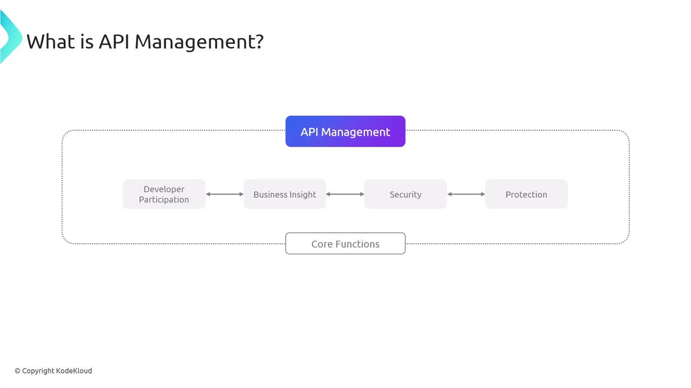
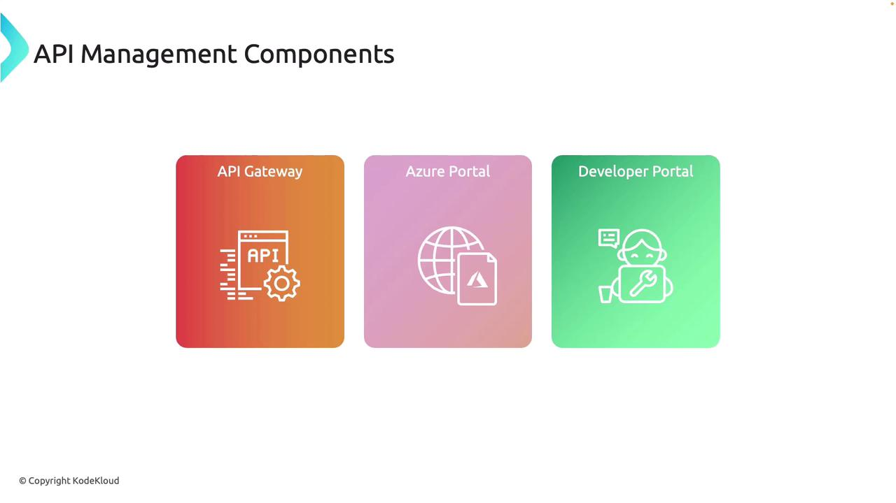
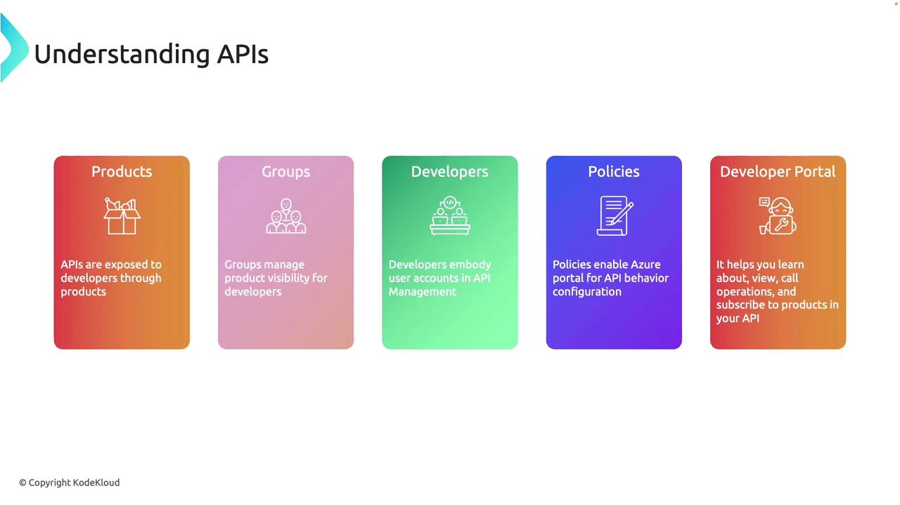

# Discovering API Management Service

Source: https://notes.kodekloud.com/docs/AZ-204-Developing-Solutions-for-Microsoft-Azure/Exploring-API-Management/Discovering-API-Management-Service/page

This article explores Azure API Management Service, focusing on its role in building secure and efficient API-driven architectures.

In this lesson, we explore API Management Service—a vital component in building scalable, secure, and efficient API-driven architectures. We begin with an overview of Azure API Management, which plays a crucial role as the gateway between API consumers (such as internal teams, partners, or external developers) and backend services. This service streamlines the process of publishing, securing, transforming, maintaining, and monitoring APIs, allowing developers to focus on innovation while it manages security, traffic, analytics, and more.

Azure API Management facilitates developer engagement, provides actionable business insights, and enforces robust security policies to protect APIs from malicious attacks and misuse. Each API managed through this service comprises one or more operations, representing individual functions or endpoints, and these APIs can be grouped into products—a topic we will cover later.

<Callout icon="lightbulb">
  • Enhanced security and efficient traffic management\
  • Improved scalability through developer engagement\
  • Simplified API monitoring with integrated analytics
</Callout>

## Core Components of API Management

### API Gateway

API Gateway is the main entry point for all client requests routed to your APIs. It handles critical tasks such as:

* Routing requests to appropriate backend services
* Enforcing rate limits
* Transforming requests as needed
* Implementing security measures

By validating incoming requests, the API Gateway ensures that only legitimate traffic reaches your backend infrastructure.

### Azure Portal

The Azure Portal is the administrative hub for deploying and managing your API Management resources. It enables you to:

* Configure APIs and enforce security policies
* Monitor API traffic and gather performance insights
* Adjust settings to optimize API behavior based on real-time analytics

### Developer Portal

The Developer Portal is designed for API consumers. It provides a self-service interface where users can:

* Explore available APIs and products
* Subscribe to and test APIs
* Access comprehensive API documentation

This portal is essential for fostering an active developer community and ensuring seamless API integration.

<Frame>
  
</Frame>

The diagram above illustrates how API Management offers efficient, secure, and well-managed services.

Additionally, the following diagram highlights the three primary components of API Management: API Gateway, Azure Portal, and Developer Portal.

<Frame>
  
</Frame>

## Structuring and Managing APIs in Azure

APIs are commonly exposed to developers through products in Azure API Management. A product is a bundle that groups APIs along with specific policies, usage limits, and pricing models. Developers subscribe to these products to gain access to the APIs they need.

### Groups

Groups help control the visibility of products by managing access for various user categories. You can define custom groups or use standard groups such as administrators, developers, and guests.

### Developers

Developers, as external API consumers, rely on the Developer Portal to explore, test, and integrate APIs. Effective management of developer accounts is crucial to ensure that only authorized users access your API products.

### Policies

Policies in Azure API Management allow you to define and enforce specific rules and behaviors for your APIs. These include security verifications, request transformations, and rate-limiting measures—all manageable via the Azure Portal. Policies are vital to maintaining both the performance and protection of your API infrastructure.

### Developer Portal (Revisited)

As discussed earlier, the Developer Portal is a comprehensive self-service resource where developers can access detailed API documentation, experiment with API calls, and manage their subscriptions. This portal is key to ensuring a smooth and interactive developer experience.

<Frame>
  
</Frame>

With these foundational concepts, you now understand how to structure and expose your APIs effectively within Azure API Management, ensuring robust security and streamlined developer engagement.

<Callout icon="lightbulb">
  Up next: We will dive deeper into Azure API Management and guide you through the process of deploying it in the cloud.
</Callout>

<CardGroup>
  <Card title="Watch Video" icon="video" href="https://learn.kodekloud.com/user/courses/az-204-developing-solutions-for-microsoft-azure/module/4fb192a0-bdef-49d6-9dd7-7e788680ea1a/lesson/14983c56-930a-4e01-868c-c4f830bf1a0e" />
</CardGroup>
