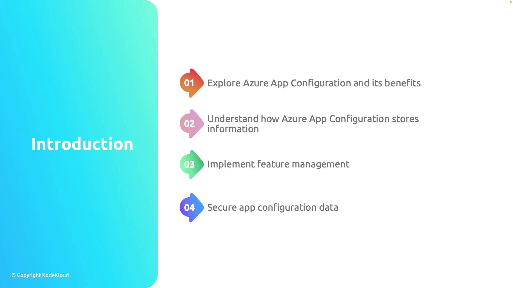

# Introduction

Source: https://notes.kodekloud.com/docs/AZ-204-Developing-Solutions-for-Microsoft-Azure/Implementing-Azure-App-Configuration/Introduction/page

This module explores the benefits and capabilities of Azure App Configuration, including data storage, feature management, and securing configuration data.

Welcome to this module on Implementing Azure App Configuration. In this guide, we will explore the essential benefits and capabilities of using Azure App Configuration. Our discussion is organized into the following four key sections:

1. Exploring the benefits of Azure App Configuration.
2. Learning how to store configuration data within Azure App Configuration.
3. Implementing feature management.
4. Securing configuration data within the service.

<Frame>
  
</Frame>

<Callout icon="lightbulb">
  Azure App Configuration provides a centralized location to manage your configuration settings across multiple environments. For more details, consider reading the [Azure App Configuration documentation](https://docs.microsoft.com/en-us/azure/azure-app-configuration/overview).
</Callout>

Let’s begin by exploring the capabilities and advantages of Azure App Configuration, and how it can transform the way you manage application settings.

<CardGroup>
  <Card title="Watch Video" icon="video" href="https://learn.kodekloud.com/user/courses/az-204-developing-solutions-for-microsoft-azure/module/705e9ab6-55cd-4824-8c7a-79570dc8e52f/lesson/cc574010-54ff-4887-b5bb-210f945edb1b" />
</CardGroup>
