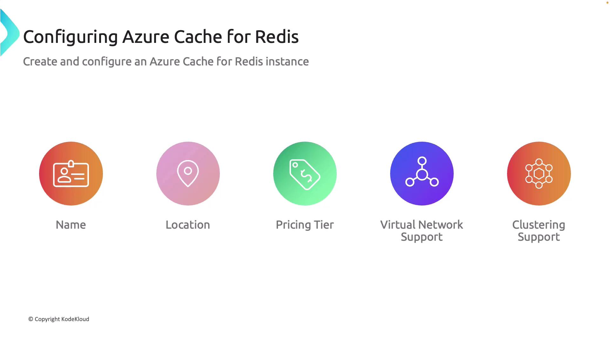

# Configuring Azure Cache for Redis

Source: https://notes.kodekloud.com/docs/AZ-204-Developing-Solutions-for-Microsoft-Azure/Developing-Azure-Cache-for-Redis/Configuring-Azure-Cache-for-Redis/page

This article provides a comprehensive overview of configuring and managing Azure Cache for Redis from deployment to performance tuning and secure client connections.

In this guide, you will learn how to configure Azure Cache for Redis and interact with it using essential Redis commands, the Redis CLI, and a .NET client. We cover core configuration components, key commands, and a step-by-step deployment process via the Azure portal.

***

## Core Configuration Components

When setting up Azure Cache for Redis, consider the following configurations to optimize your instance for your application needs:

* **Name:**\
  Assign a unique name to easily identify and manage your Azure Cache for Redis instance within the Azure portal. Ensure that the name is unique across Azure.

* **Location:**\
  Select a data center that is geographically close to your users or other services. This minimizes latency and enhances performance.

* **Pricing Tier:**\
  Azure Cache for Redis is available in various pricing tiers—Basic, Standard, Premium, Enterprise, and Enterprise Flash. Each tier provides different levels of scalability, features, and cost. Choose the tier that best meets your budget and performance requirements.

* **Virtual Network Support:**\
  Enhance security by deploying your Redis instance within a virtual network. This isolates your cache from the public internet and provides better control over network traffic.

* **Clustering Support:**\
  For high-workload environments, clustering enables data distribution across multiple nodes, which improves scalability and availability.



***

## Essential Redis Commands

After configuring your Azure Cache for Redis instance, you can interact with it using a variety of Redis commands. Below is a list of common commands for managing your cache:

```bash theme={null}
