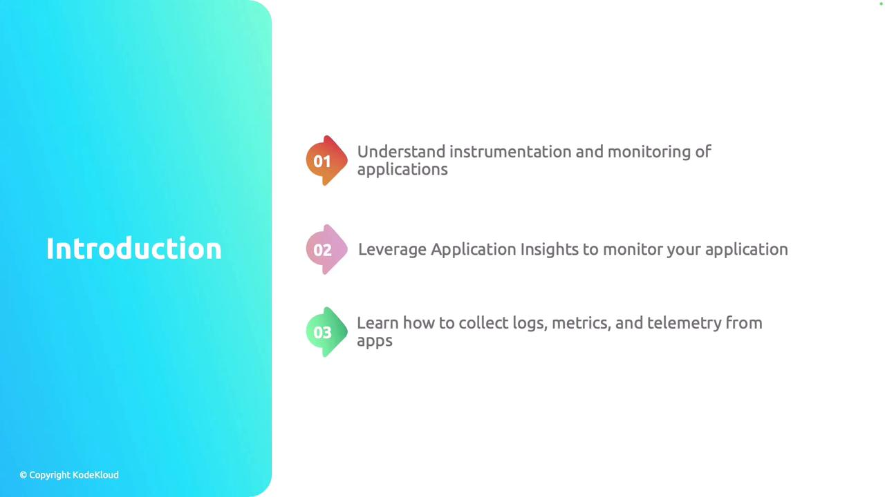

# Introduction

Source: https://notes.kodekloud.com/docs/AZ-204-Developing-Solutions-for-Microsoft-Azure/Monitoring-App-Performance/Introduction/page

This lesson covers instrumentation and monitoring techniques for optimizing application performance using Azure Application Insights.

Welcome to this comprehensive lesson on Monitoring App Performance. In this session, we will explore the fundamentals of instrumentation and monitoring—essential techniques for understanding and optimizing your application's performance.

In this lesson, you will learn:

* The basics of instrumentation and monitoring.
* How to leverage Azure Application Insights for effective performance tracking.
* Methods to collect logs, metrics, and telemetry using Application Insights alongside native Azure features.

<Callout icon="lightbulb">
  Azure Application Insights offers robust real-time monitoring capabilities, helping you diagnose issues and improve overall application reliability.
</Callout>

Let's begin by exploring the core functionalities of Application Insights.

<Frame>
  
</Frame>

<CardGroup>
  <Card title="Watch Video" icon="video" href="https://learn.kodekloud.com/user/courses/az-204-developing-solutions-for-microsoft-azure/module/25287e89-7860-401f-a2c1-af5a7a2e07c6/lesson/75a0e19b-6d09-4730-9bb0-723aed57d990" />
</CardGroup>
