# Design for Azure Logic Apps

Source: https://notes.kodekloud.com/docs/AZ-305-Microsoft-Azure-Solutions-Architect-Expert/Design-a-compute-solution/Design-for-Azure-Logic-Apps/page

This article explores using Azure Logic Apps for event-driven, low-code solutions and provides a step-by-step guide to creating workflows.

In this article, we explore when and how to use Azure Logic Apps to implement event-driven, low-code solutions. Azure Logic Apps is ideal for integration scenarios, offering a designer-first approach with hundreds of pre-built connectors. Unlike Azure Functions—which require code—Logic Apps lets you create powerful workflows through a visual interface, streamlining the creation of event-driven processes, especially those with short-lived durations.

To illustrate the differences between these two services, consider the following flowchart:

<Frame>
  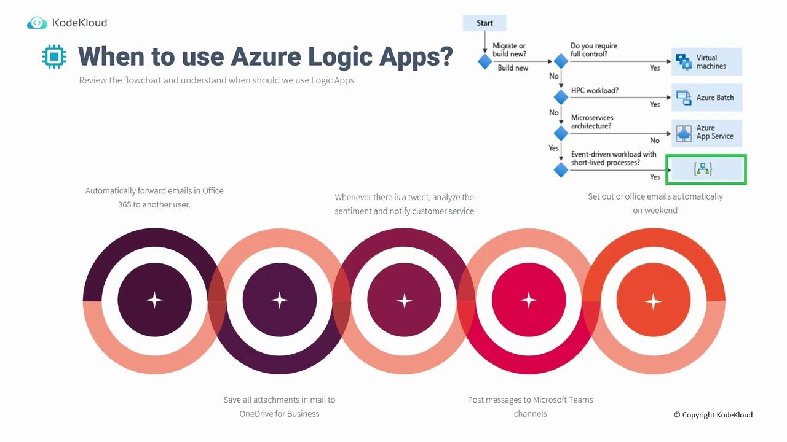
</Frame>

Logic Apps works in a manner similar to the Shortcuts App on your iPhone or iPad, where you can easily build workflows through a series of customizable steps. Although minimal coding might be needed (for tasks such as string manipulation), most of the process leverages connectors that integrate with services like OneDrive, Salesforce, Google Drive, Gmail, and many more. If needed, custom connectors can be developed using REST APIs.

Below are some common use cases for Azure Logic Apps:

* Automatically forward emails in Office 365 to a designated user.
* Save email attachments directly to OneDrive for Business.
* Analyze tweet sentiments using Text Analytics and notify customer service based on the results.
* Post messages to Microsoft Teams channels.
* Set out-of-office emails automatically on weekends, ensuring timely responses even when manual activation is missed.

<Callout icon="lightbulb">
  If you have previously used Power Automate Flow, you will find many similarities in the available connectors and workflow processes.
</Callout>

Let's compare the two Azure services at a high level:

* **Azure Functions:** Employs a code-first strategy, enabling custom workflows using languages like PowerShell, .NET, or Python.
* **Azure Logic Apps:** Uses a designer-first strategy with a visual interface (Logic Apps Designer) and pre-built actions, reducing the need for manual coding.

<Frame>
  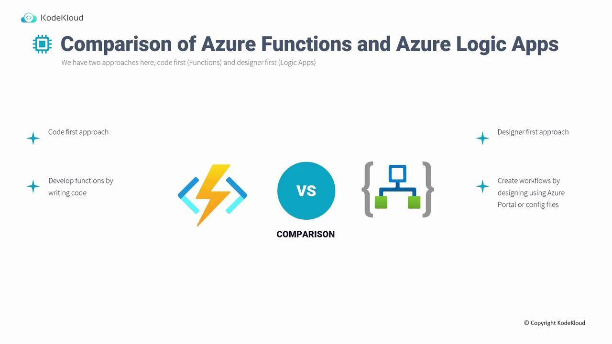
</Frame>

For workflows that demand complex custom code, Azure Functions may be a better fit. However, when looking for a low-code solution with extensive integration capabilities—provided that the external applications support open API specifications—Logic Apps is often the preferred choice.

## Building a Logic App in the Azure Portal

Follow this step-by-step example to create a business workflow using Azure Logic Apps. In our scenario, a new team member named Linda receives an email containing invoice numbers. The goal is to process these invoices and send back a confirmation number. To ensure Linda never misses an invoice, a workflow is designed so that every incoming invoice email triggers a message to her Microsoft Teams account. Upon her response, a confirmation email is automatically sent to notify the team.

### Step 1. Create the Logic App

1. Log in to the [Azure Portal](https://portal.azure.com) and search for "Logic Apps".
2. Click on "Add" to create a new resource.
3. Create a new resource group if required.
4. Select the **Consumption model** for a serverless, cost-effective solution that charges per execution.
5. Enter a name (for example, "Linda Teams Workflow") and select a region (such as "East US").
6. Create the Logic App.

<Frame>
  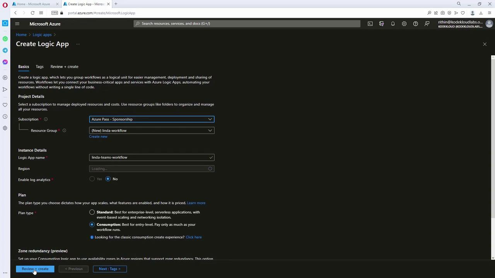
</Frame>

Once the Logic App is created, click "Go to resource" to open the Logic Apps Designer, where you will see a list of available triggers.

<Frame>
  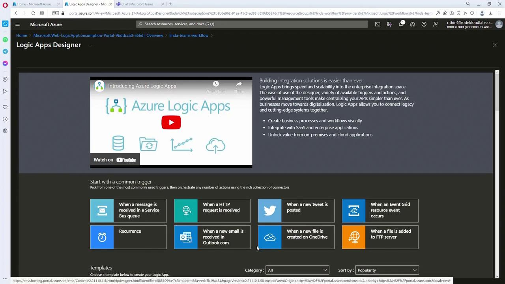
</Frame>

### Step 2. Configure the Email Trigger

Since the workflow initiates with an email from a specific sender containing "INV" in the subject, select the **Outlook 365** trigger ("When a new email arrives").

<Frame>
  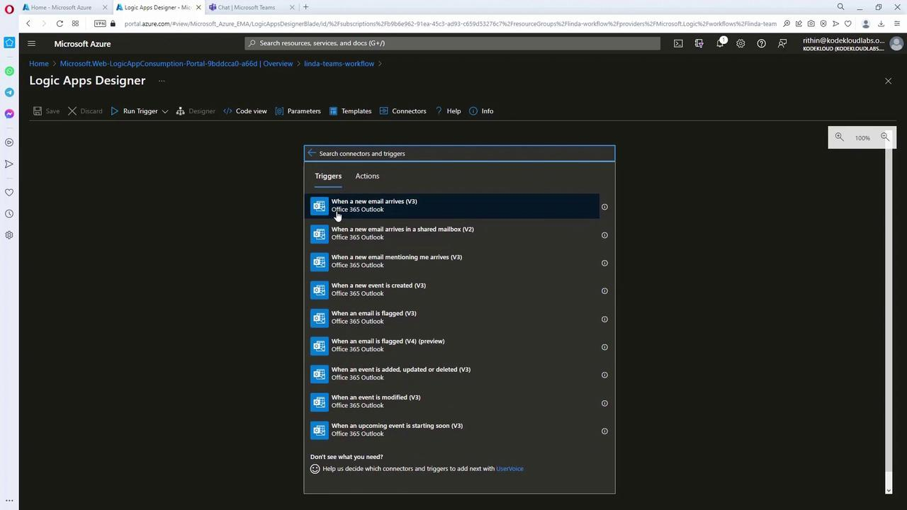
</Frame>

Steps to configure:

1. Connect the Outlook 365 connector using Linda’s account.
2. Set up the trigger with filters such as the "Inbox" folder, importance level, and a subject filter for "INV."

<Frame>
  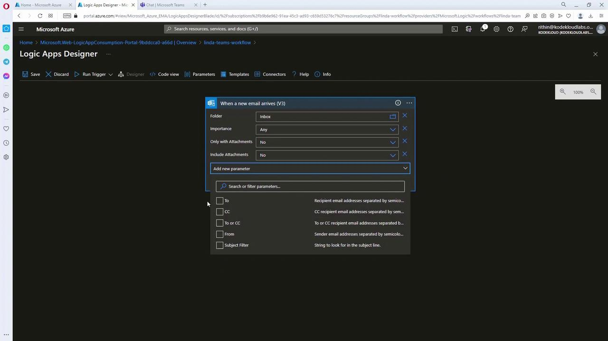
</Frame>

### Step 3. Setting Up the Microsoft Teams Action

After the email trigger, add an action to send a message in Microsoft Teams:

1. Select the Microsoft Teams connector.
2. Connect using Linda’s account.
3. Choose the "Post a message" action (or similar) to display a notification that includes dynamic content from the email, such as the invoice number from the subject.

<Frame>
  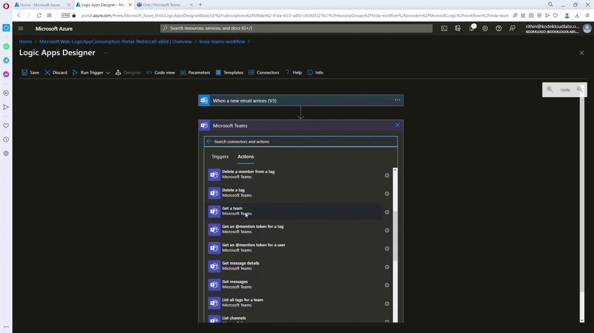
</Frame>

Ensure the message parameters include dynamic content (e.g., headline and body) that automatically integrates the invoice details from the email trigger.

### Step 4. Adding Conditional Logic Based on User Response

In order to verify whether the invoice was processed (e.g., a response of "completed" or "pending"), add a conditional branch:

1. Use the Control action "Condition".
2. Configure the condition to evaluate the "Selected Option" returned by the Teams connector.
   * **If the condition is true (response equals "completed"):**
     * Use the Outlook 365 action "Send an email" to notify Rithin while cc’ing Linda.
     * Include dynamic content, such as the confirmation number extracted from the Teams response.

<Frame>
  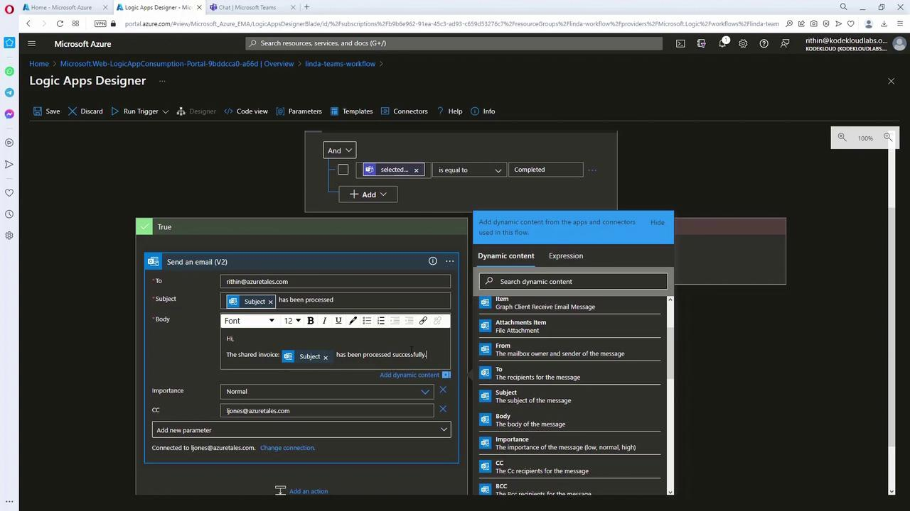
</Frame>

* **If the condition is false (response equals "pending"):**
  * Terminate the workflow, optionally logging an error message like "User did not complete" with an error code (e.g., 500).

<Frame>
  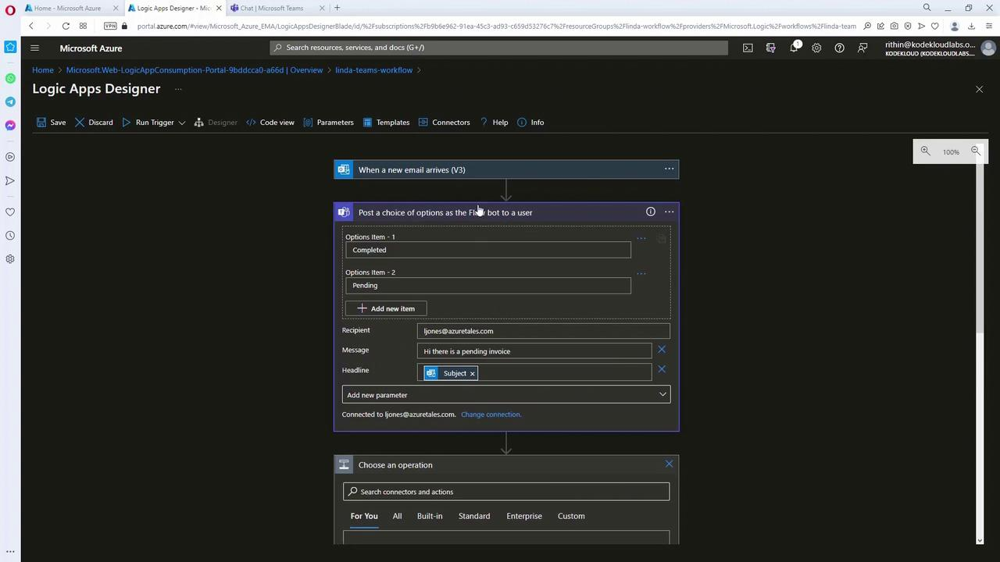
</Frame>

After setting up the conditional logic and corresponding actions, save your Logic App.

<Callout icon="lightbulb">
  Before testing, double-check that all dynamic content parameters are correctly mapped from previous steps to ensure the workflow runs smoothly.
</Callout>

### Testing the Logic App

To verify the workflow:

1. Send an email from Linda’s mailbox with a subject containing "INV" along with the invoice number.
2. The Logic App will trigger and subsequently send a Teams message with the invoice details.
3. When Linda replies (for example, with "completed" and a confirmation number), the Logic App will automatically send an email notification confirming that the invoice has been processed.

Below is a sample JSON output from the trigger:

```json theme={null}
{
  "subscribe": {
    "method": "post",
    "queries": {
      "fetchOnlyWithAttachment": "False",
      "folderPath": "Inbox",
      "importance": "Any"
    }
  }
}
```

And a sample payload for the email trigger:

```json theme={null}
{
  "BodyPreview": "please process.",
  "importance": "normal.",
  "conversationId": "AAQAGQZzJk4OTQkLWFmZDQ2NGIyNC04NTRlTM2Yjk4",
  "isRead": false,
  "isHtml": true,
  "body": "<html><head><meta http-equiv=\"Content-Type\" content=\"text/html; charset=utf-8\"></head><body>",
  "from": "rithin@azuretales.com",
  "toRecipients": ["jiones@azuretales.com"]
}
```

After Linda receives the email, she will see a notification on Microsoft Teams:

<Frame>
  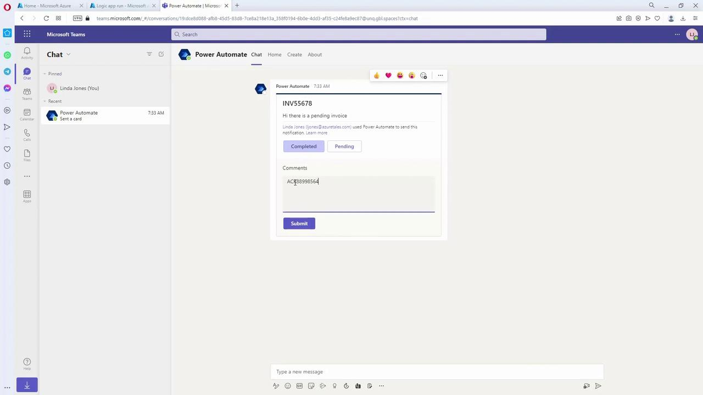
</Frame>

Once Linda responds, Rithin will receive an email containing the invoice details and confirmation number. The dynamic content populated from earlier steps ensures a seamless, low-code integration process.

<Frame>
  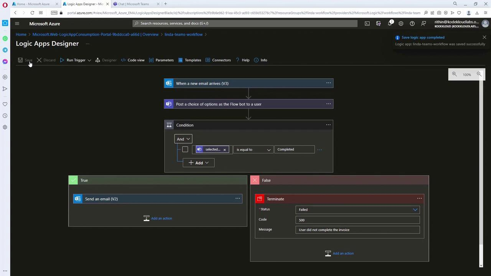
</Frame>

Finally, check the run status in the Logic Apps interface. A successful run displays a "Succeeded" status along with step-by-step details, which can help troubleshoot if any issues arise.

<Frame>
  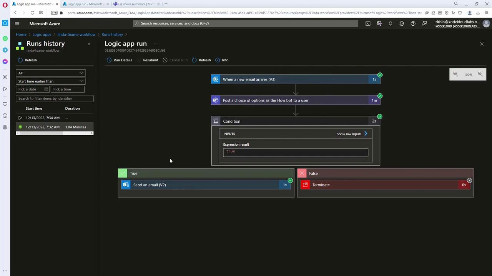
</Frame>

## Conclusion

Azure Logic Apps offer a low-code, designer-first alternative for building complex integrations. By leveraging a visual designer and hundreds of connectors for Office 365, Microsoft Teams, and other systems, you can create efficient, streamlined workflows with minimal coding effort. This tutorial demonstrated how to integrate email triggers, conditional logic, and dynamic content into a cohesive business process.

Before moving on, ensure you have fully explored this scenario and completed all associated quiz questions to reinforce your learning.

Thank you for following along.

<CardGroup>
  <Card title="Watch Video" icon="video" href="https://learn.kodekloud.com/user/courses/az-305-microsoft-azure-solutions-architect-expert/module/bf1d18e5-9589-48cf-99af-4150d985241a/lesson/25b96c5d-3c61-43d7-ac15-2fac523ee721" />
</CardGroup>
