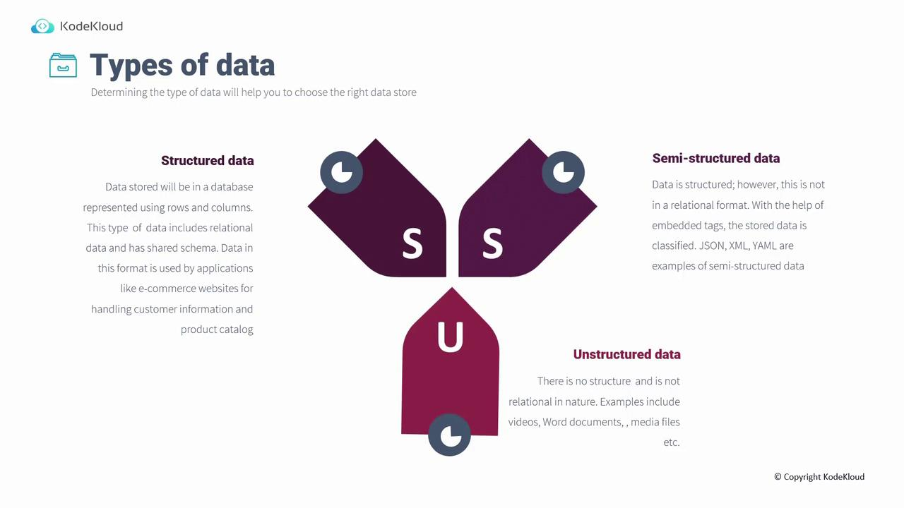
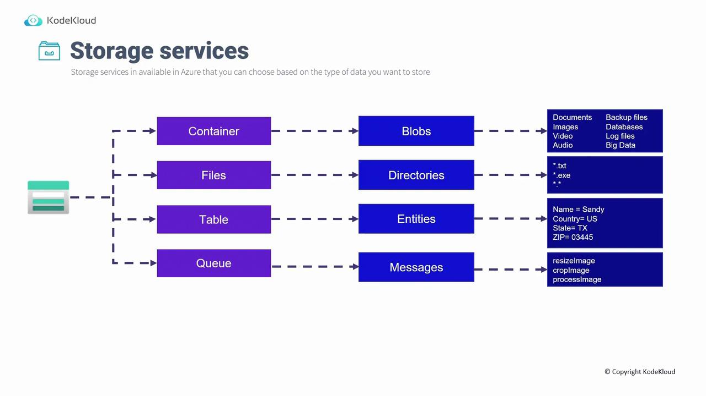

# Design for data storage

Source: https://notes.kodekloud.com/docs/AZ-305-Microsoft-Azure-Solutions-Architect-Expert/Design-a-nonrelational-data-storage-solution/Design-for-data-storage/page

This article discusses designing nonrelational data storage solutions, focusing on Azures storage services for structured, semi-structured, and unstructured data.

In this article, we discuss Module 6: Design a Nonrelational Data Storage Solution, which covers both Storage Accounts and Cosmos DB. We'll begin by exploring the fundamentals of designing for data storage.

## Types of Data

Selecting the right storage solution starts with understanding the varying types of data:

### Structured Data

Structured data is organized in a relational database format using rows and columns with a shared schema. This type of data is commonly used for managing customer information and product catalogs on e-commerce websites.

<Frame>
  
</Frame>

### Semi-Structured Data

Semi-structured data maintains some organizational tags or fields without adhering to a strict relational model. Formats such as JSON, YAML, and XML fall into this category, offering flexibility through embedded tags that facilitate data classification and filtering.

### Unstructured Data

Unstructured data lacks a predefined model or format. This includes items like videos, Word documents, PDF files, and various media formats that require adaptable storage services to handle their diverse structures.

## Azure Storage Services

Azure offers a comprehensive suite of storage services tailored to different data types and access patterns. Many of these services were also introduced in our previous [AZ-104: Microsoft Azure Administrator](https://learn.kodekloud.com/user/courses/az-104-microsoft-azure-administrator) course.

### Blob Storage

Blob Storage is optimized for storing unstructured data such as documents, images, videos, and audio files. By using containers, you can efficiently organize and manage your blobs.

### File Storage

Azure File Storage provides cloud-based file shares using SMB or NFS protocols. This service enables you to structure directories and store a variety of files (e.g., TXT, executables) that can be accessed across multiple systems by mounting the share.

### Table Storage

Table Storage is a NoSQL database service designed for flexible schema management. It stores entities with properties like name, county, country, and state, making it suitable for applications that require rapid, scalable data management.

### Queue Storage

Queue Storage offers a robust messaging solution that decouples application components for streamlined processing. For example, in a function-based architecture, a user action—like clicking on a resized image—can trigger a message that is queued for sequential processing, ensuring orderly and efficient workflow management.

<Frame>
  
</Frame>

<Callout icon="lightbulb">
  Azure's diverse storage offerings enable you to craft a data management strategy that aligns with your application needs, whether you're handling structured, semi-structured, or unstructured data.
</Callout>

These storage services are critical for designing comprehensive solutions for modern data storage. In the next section, we will focus on designing for Azure Storage Accounts, building on the principles discussed here to ensure robust cloud infrastructure implementation.

<CardGroup>
  <Card title="Watch Video" icon="video" href="https://learn.kodekloud.com/user/courses/az-305-microsoft-azure-solutions-architect-expert/module/7f522b0e-e9c6-4a0a-acfa-345ee6ebb885/lesson/999d9b74-e169-4f7e-867c-5ea099334376" />
</CardGroup>
