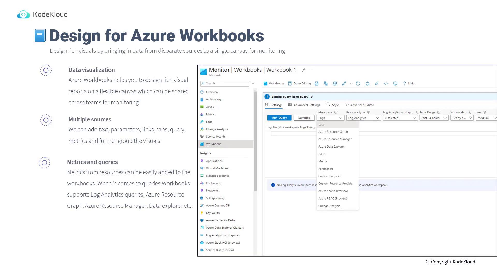

# Design for Azure workbooks and Insights

Source: https://notes.kodekloud.com/docs/AZ-305-Microsoft-Azure-Solutions-Architect-Expert/Design-a-logging-and-monitoring-solution/Design-for-Azure-workbooks-and-Insights/page

This lesson explains designing effective Azure Workbooks and using Azure Insights for monitoring and visualizing resources.

This lesson explains how to design effective Azure Workbooks and use Azure Insights to monitor and visualize your resources. Azure Workbooks is a flexible service that lets you create rich, interactive visual reports incorporating text, parameters, links, queries, metrics, and more. These reports can be shared across teams to enhance collaboration and provide deeper insights into your resource performance.



Workbooks allow you to combine both metrics and queries from diverse sources. You can easily integrate resource metric data and leverage various query languages and tools such as Log Analytics queries, Azure Resource Graph, Resource Manager, REST API queries, and Data Explorer. Sharing your workbook is simple—just click the share button at the top of the interface to distribute your report.


***

## Creating a VM Performance Workbook in the Azure Portal

In this section, you will learn to build a simple workbook that monitors virtual machine (VM) performance. Follow these steps to create a dynamic dashboard showing performance metrics like CPU usage, network statistics, and disk performance.

### Step 1: Adding a Markdown Heading

Begin by adding a Markdown text block to label your workbook. This heading identifies the purpose of your report:

```markdown theme={null}
