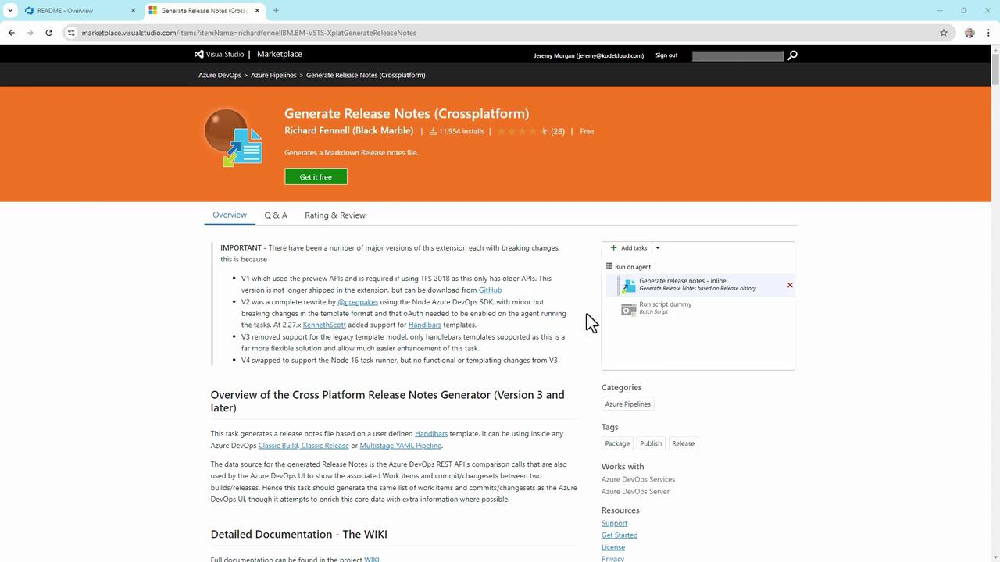
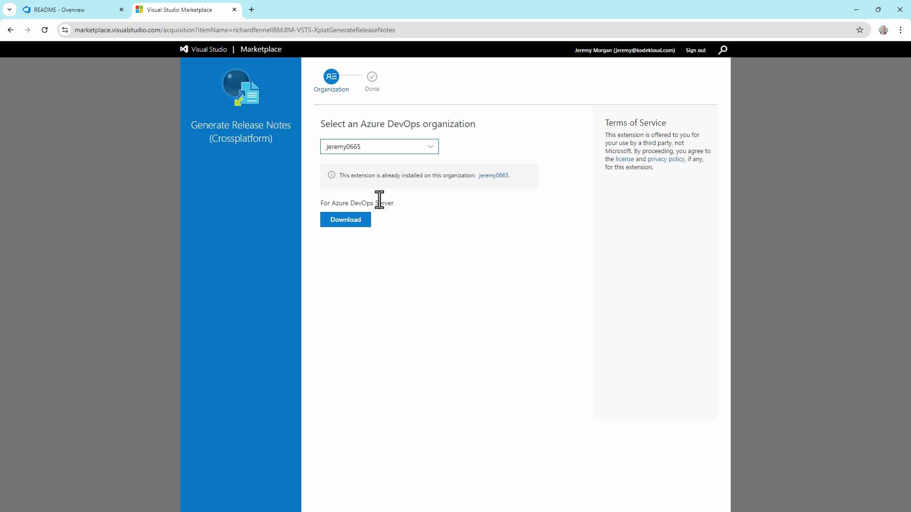

# Demo Generating Release Notes

Source: https://notes.kodekloud.com/docs/AZ-400-Designing-and-Implementing-Microsoft-DevOps-Solutions/Configure-Activity-Traceability-and-Flow-of-Work/Demo-Generating-Release-Notes/page

This guide explains how to automate Markdown release notes generation and publishing to an Azure DevOps Wiki for a .NET Web API application.

In this guide, you’ll learn how to automatically generate Markdown-based release notes for your .NET Web API application and publish them to an Azure DevOps Wiki. By integrating the **Generate Release Notes (Crossplatform)** extension into your CI pipeline, you can maintain an up-to-date, code-based wiki—no manual steps required.

We’ll use a sample project called **TestWeb** and demonstrate:

* Installing the release-notes extension
* Creating and configuring an Azure Pipelines YAML
* Generating, copying, and committing the release notes

<Frame>
  
</Frame>

***

## 1. Install the “Generate Release Notes (Crossplatform)” Extension

1. Go to the [Visual Studio Marketplace](https://marketplace.visualstudio.com).
2. Search for **Generate Release Notes (Crossplatform)** by Richard Fennell.
3. Click **Get it Free** and select your Azure DevOps organization.

<Frame>
  
</Frame>

<Callout icon="lightbulb">
  If you’re running Azure DevOps Server (on-prem), download the extension package directly from its Marketplace page and upload it to your server.
</Callout>

<Frame>
  
</Frame>

***

## 2. Create a Starter Pipeline

1. In Azure DevOps, navigate to **Pipelines** → **Create Pipeline**.
2. Choose **Azure Repos** → your **TestWeb** repository.
3. Select **Starter pipeline** to scaffold a basic `azure-pipelines.yml`.

```yaml theme={null}
