# azure-pipelines.yml (Starter)
trigger:
  - master

pool:
  vmImage: 'windows-latest'

steps:
  - script: echo Hello, world!
    displayName: 'Run a one-line script'
```

Replace the sample scripts with .NET build and test steps:

```yaml theme={null}
# azure-pipelines.yml (Build + Test)
trigger:
  - master

pool:
  vmImage: 'windows-latest'

steps:
  - task: UseDotNet@2
    inputs:
      packageType: 'sdk'
      version: '1.0.x'
      installationPath: '$(Agent.ToolsDirectory)/dotnet'

  - script: dotnet --version
    displayName: 'Check .NET Version'

  - script: dotnet restore
    displayName: 'Restore dependencies'

  - script: dotnet build --configuration Release --no-restore
    displayName: 'Build project'

  - script: dotnet test --no-build --verbosity normal
    displayName: 'Run tests'
```

Save and run the pipeline. After it succeeds, you’ll see a successful build run:

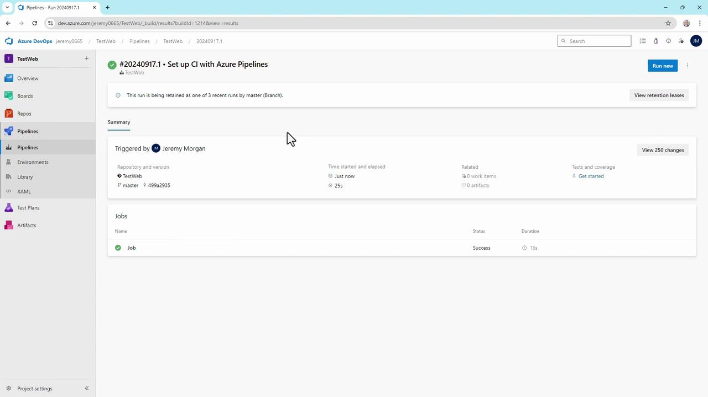

***

## 3. Add the Generate Release Notes Task

Extend your YAML to generate and publish release notes in four steps:

```yaml theme={null}
# azure-pipelines.yml (Generate & Publish Release Notes)
trigger:
  - master

pool:
  vmImage: 'windows-latest'

steps:
  # Build and Test (from previous section)
  - task: UseDotNet@2
    inputs:
      packageType: 'sdk'
      version: '1.0.x'
      installationPath: '$(Agent.ToolsDirectory)/dotnet'
  - script: dotnet restore; dotnet build --configuration Release --no-restore; dotnet test --no-build
    displayName: 'Restore, Build, and Test'

  # 1. Generate release notes in repo root
  - task: XplatGenerateReleaseNotes@4
    inputs:
      outputFile: '$(Build.Repository.LocalPath)\releasenotes_$(Build.BuildId).md'
      templateLocation: 'Inline'
      inlineTemplate: |
        ## Build {{buildDetails.buildNumber}}
        **Branch:** {{buildDetails.sourceBranch}}
        **Author:** {{buildDetails.requestedFor.displayName}}
        **Commit:** {{buildDetails.sourceVersion}}
      dumpPayloadToConsole: false
      replaceFile: true

  # 2. Copy to wiki folder
  - task: CopyFiles@2
    displayName: 'Copy Release Notes to Wiki Folder'
    inputs:
      SourceFolder: '$(Build.Repository.LocalPath)'
      Contents: 'releasenotes_$(Build.BuildId).md'
      TargetFolder: '$(Build.Repository.LocalPath)/wiki'
      CleanTargetFolder: true
      OverWrite: true

  # 3. Clean up temporary file
  - script: del "$(Build.Repository.LocalPath)\releasenotes_$(Build.BuildId).md"
    displayName: 'Delete Temporary Release Notes File'

  # 4. Commit back to wiki (skip CI)
  - task: CmdLine@2
    displayName: 'Commit Release Notes to Wiki'
    inputs:
      script: |
        git checkout master
        git pull
        git config --global user.email "you@example.com"
        git config --global user.name "Your Name"
        git add wiki/releasenotes_$(Build.BuildId).md
        git commit -m "[skip ci] Update release notes for build $(Build.BuildId)"
        git push origin HEAD:master
```

Run the updated pipeline and inspect the release-notes generation logs:

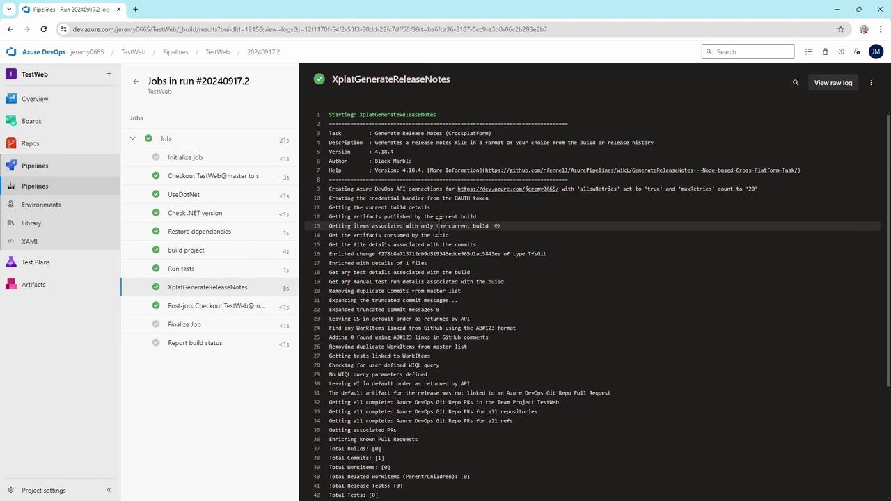

***

## 4. Edit and View in Visual Studio Code

For easier editing, clone the repo locally and open **azure-pipelines.yml** in VS Code. You’ll find all tasks, including the release-notes steps, in one file.

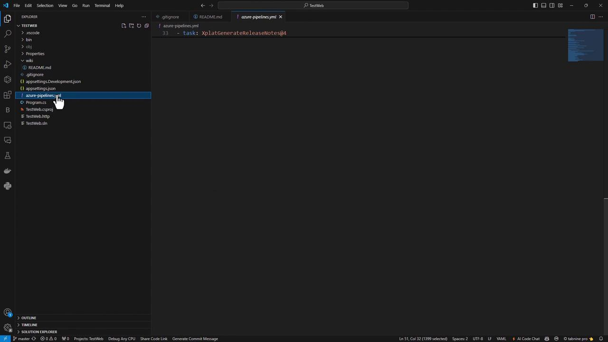

***

## 5. Review Logs and Verify the Wiki

After another run, confirm the copy step output:

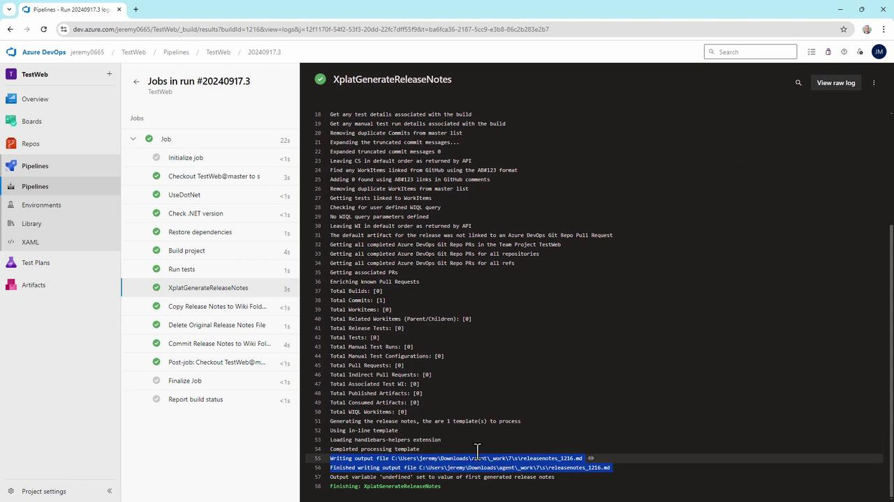

Cleaning target folder: C:\agent\_work\7\s\wiki
Copying C:\agent\_work\7\releasenotes\_1216.md to C:\agent\_work\7\s\wiki\releasenotes\_1216.md

Finally, navigate to your Azure DevOps Wiki—each build now publishes a new `releasenotes_<BuildId>.md` page:

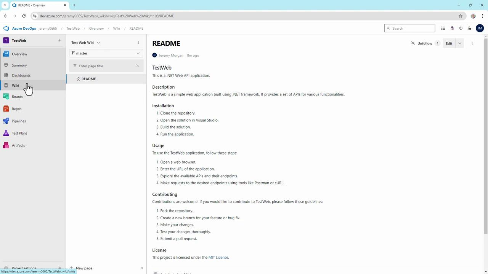

> **lightbulb** This template shows build number, branch, author, and commit. Extend the Handlebars template to include work items, pull requests, changelogs, or custom fields from Azure Boards.

***

With this setup, every commit to `master` triggers a pipeline that generates and publishes release notes to your Azure DevOps Wiki—fully automated, CI-safe, and effortless to maintain.

## Links and References

* [Generate Release Notes Extension (MarketPlace)](https://marketplace.visualstudio.com/items?itemName=richardfennellBM.BM-VSTS-GenerateReleaseNotes)
* [Azure Pipelines YAML Reference](https://docs.microsoft.com/azure/devops/pipelines/yaml-schema)
* [Azure DevOps Wiki Documentation](https://docs.microsoft.com/azure/devops/project/wiki/wiki-overview)

- [Watch Video](https://learn.kodekloud.com/user/courses/az-400/module/503e97d4-be52-440b-8a4e-8610d1eca6ed/lesson/f3d0bf76-5e14-43d4-a4d0-abc85e00b331)


# Demo Integrate Azure Pipelines and GitHub Actions

Source: https://notes.kodekloud.com/docs/AZ-400-Designing-and-Implementing-Microsoft-DevOps-Solutions/Configure-Activity-Traceability-and-Flow-of-Work/Demo-Integrate-Azure-Pipelines-and-GitHub-Actions/page

This guide explains how to trigger an Azure Pipeline from a GitHub Action upon code pushes to the main branch.

In this guide, you’ll learn how to trigger an Azure Pipeline automatically from a GitHub Action whenever you push code to the `main` branch. By the end, you’ll have a seamless CI flow between GitHub and Azure DevOps.

***

## 1. Connect GitHub to Azure DevOps

1. In your Azure DevOps project (e.g., **SimpleWebAPI**), navigate to **Project Settings** → **GitHub Connections**.
2. Click **Connect Your GitHub Account** and authorize Azure DevOps to access your repos.
3. Select the **SimpleWebAPI** repository and hit **Save**, then approve the installation in GitHub.

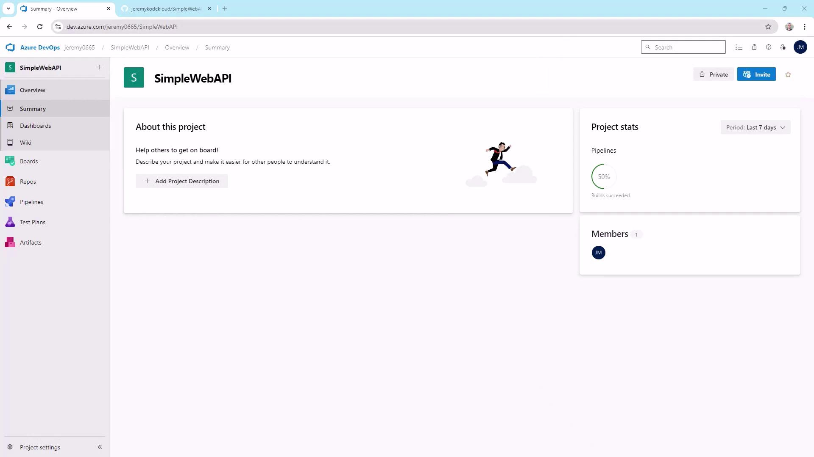

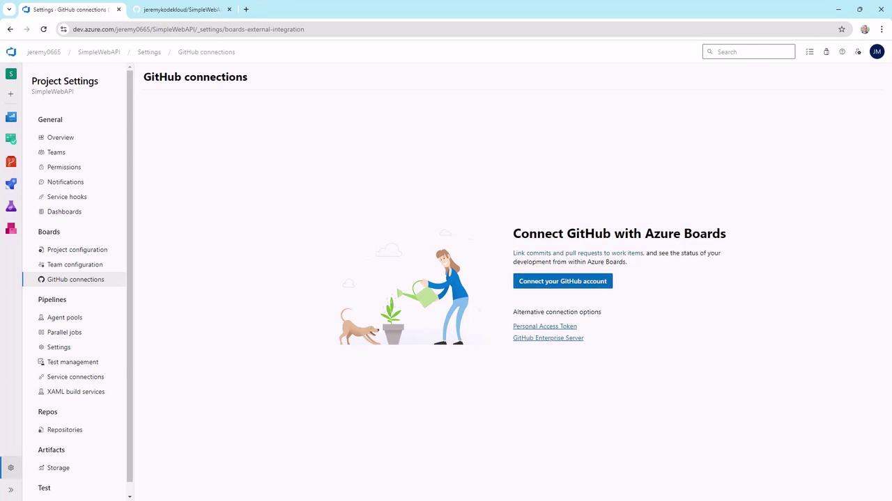

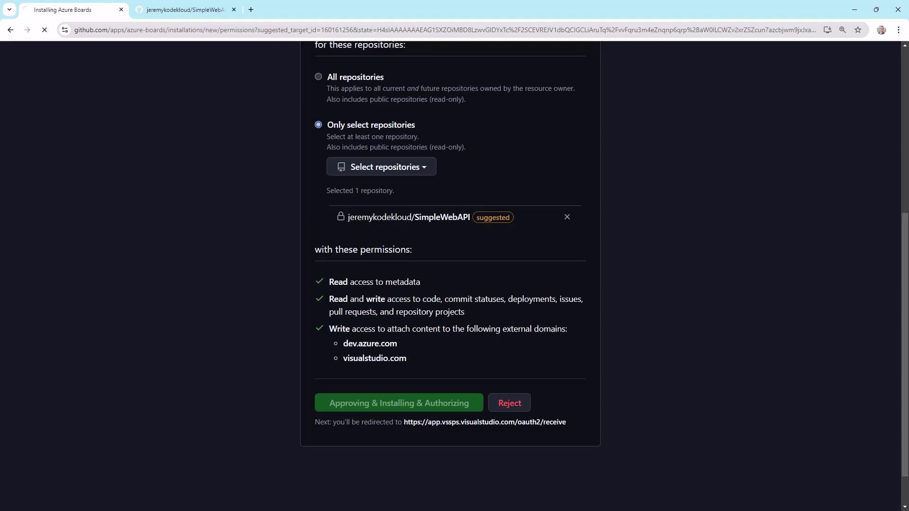

***

## 2. Generate a Personal Access Token (PAT)

You’ll need a PAT with permissions to queue builds. In Azure DevOps:

1. Click your user icon → **Personal Access Tokens** → **New Token**.
2. Give it a name, expiration date, and select scopes:
   * **Build (read & execute)**
   * **Token administration (read & manage)**
3. Create the token and copy it immediately.

> **triangle-alert** You will **only** see the PAT value once. Store it securely in your password manager.

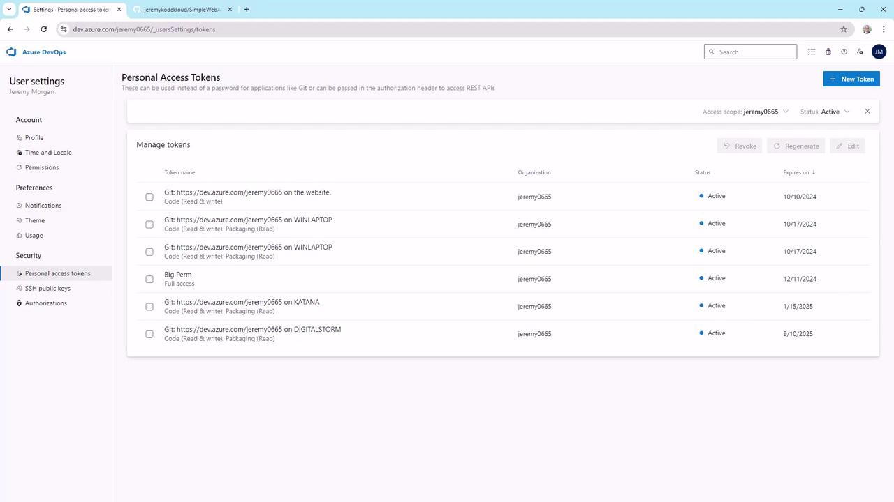

***

## 3. Create an Azure Pipeline

1. In **SimpleWebAPI**, select **Pipelines** → **Create Pipeline**.
2. Choose **GitHub** and pick **SimpleWebAPI**. Approve the Azure Pipelines app if prompted.
3. Opt for **Starter Pipeline** to get a minimal YAML template.

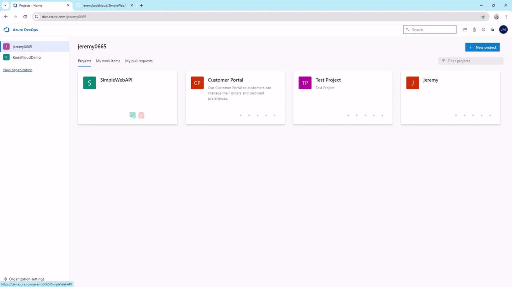


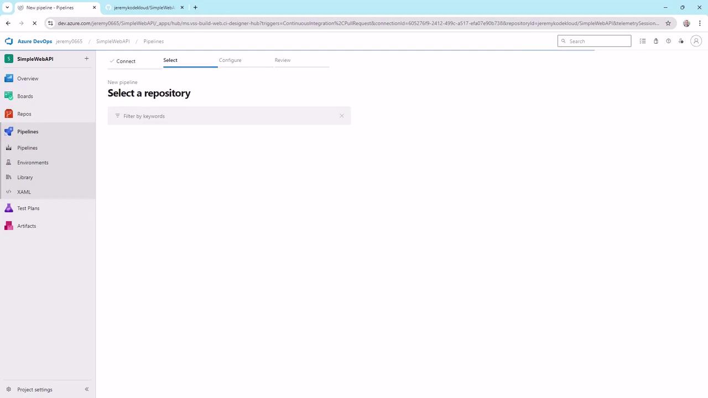

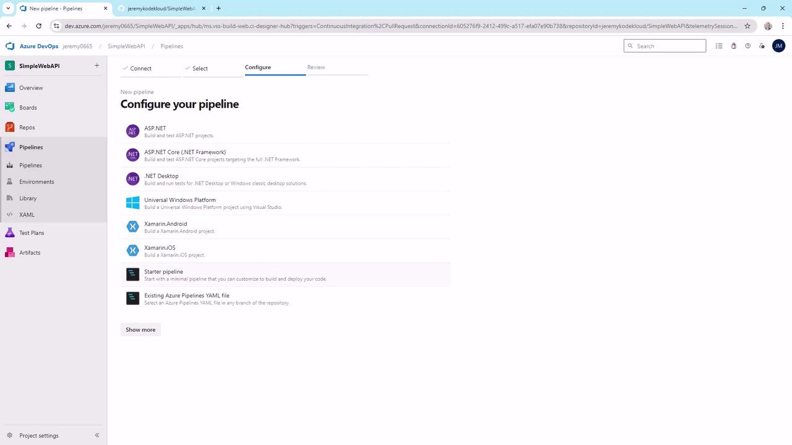

```yaml theme={null}
