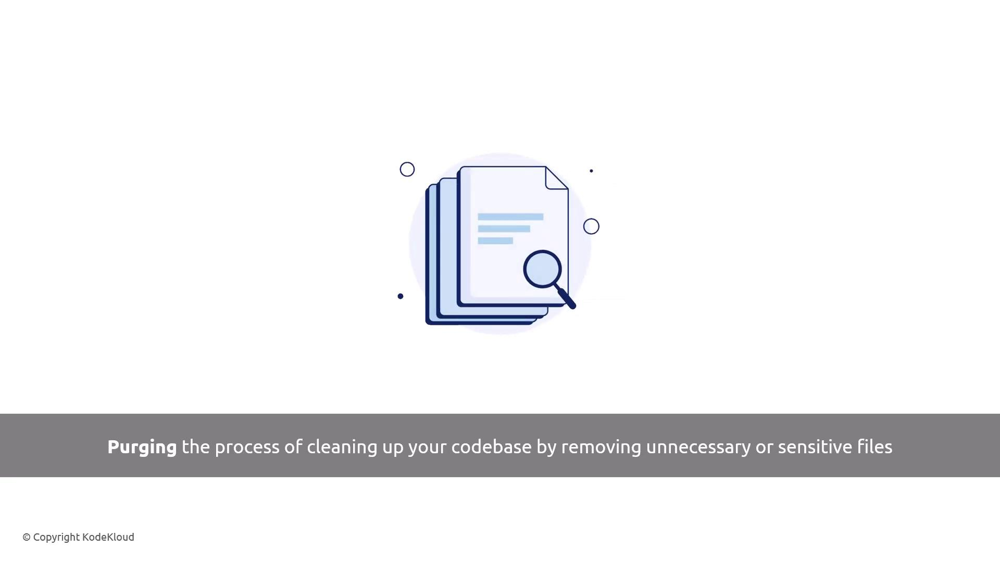
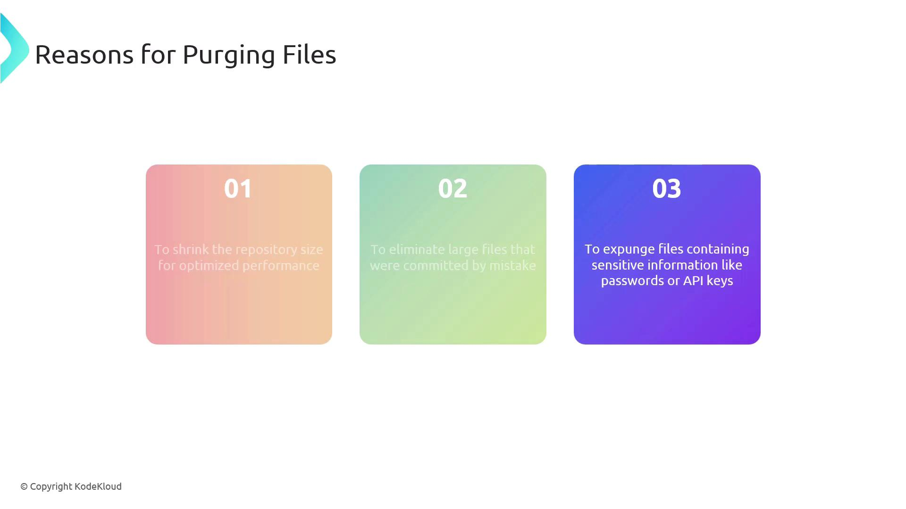
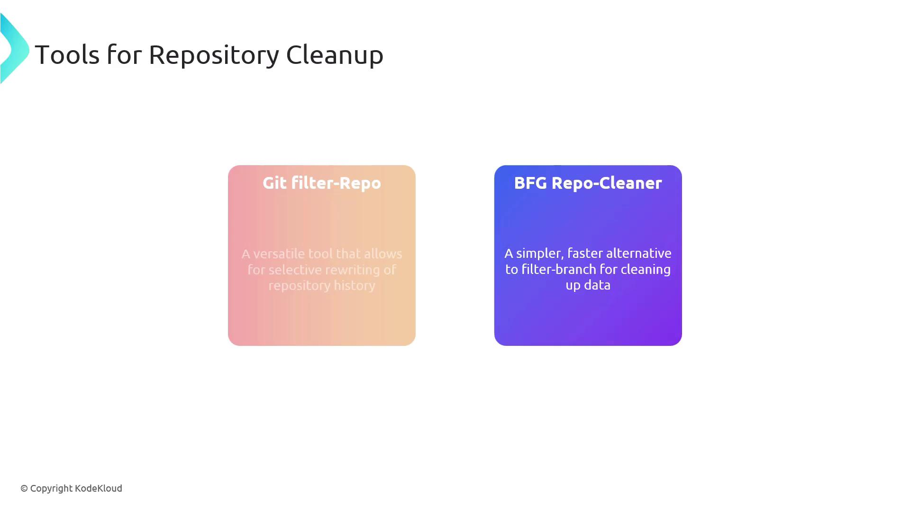

# Purge Data from Source Control

Source: https://notes.kodekloud.com/docs/AZ-400-Designing-and-Implementing-Microsoft-DevOps-Solutions/Configuring-and-Managing-Repositories/Purge-Data-from-Source-Control/page

This guide explains purging data from Git repositories, its importance, tools for cleanup, and practical examples for maintaining a secure codebase.

Purging data from source control is essential for maintaining a clean, efficient, and secure codebase. In this guide, we’ll define purging in the context of Git repositories, explain why it matters, compare the top tools, and walk through hands-on examples.

## What Is Purging?

Purging a repository means removing unwanted or sensitive files from its commit history. This process helps you:

* Reclaim disk space
* Eliminate accidental commits
* Protect secrets from exposure



## Why Purge Files?

By cleaning up your Git history, you can:

* **Optimize Performance:** Smaller repos clone and checkout faster.
* **Eliminate Mistakes:** Remove large or accidental commits.
* **Protect Secrets:** Expunge API keys, passwords, and other sensitive data.



> **lightbulb** Always back up your repository before rewriting history. Purging is irreversible.

## Repository Cleanup Tools

Here’s a quick comparison of the two leading Git history-rewriting tools:

| Tool             | Use Case                                     | Documentation                                                  |
| ---------------- | -------------------------------------------- | -------------------------------------------------------------- |
| Git filter-repo  | Official, highly configurable, fine-grained  | [Git filter-repo](https://github.com/newren/git-filter-repo)   |
| BFG Repo-Cleaner | Fast, simple syntax for common cleanup tasks | [BFG Repo-Cleaner](https://rtyley.github.io/bfg-repo-cleaner/) |



## Practical Examples

### 1. Deleting Large or Unwanted Files

Remove a file named `archive.tar.gz`:

```bash theme={null}
