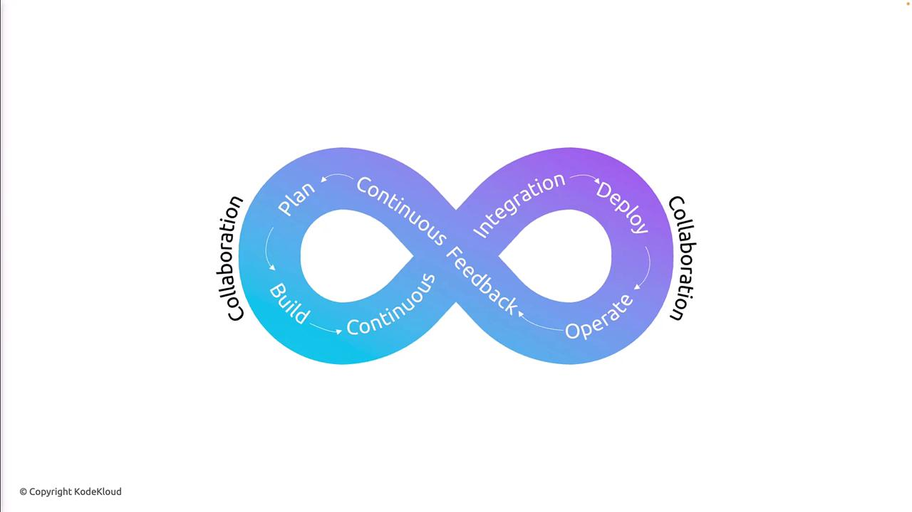

# Unifying People Process and Technology

Source: https://notes.kodekloud.com/docs/AZ-400-Designing-and-Implementing-Microsoft-DevOps-Solutions/Introduction/Unifying-People-Process-and-Technology/page

This guide explores the importance of DevOps, core frameworks, and best practices for enhancing software delivery through collaboration and automation.

DevOps has transformed software delivery by fostering collaboration between Development (Dev) and Operations (Ops) teams. In this guide, you’ll learn why DevOps is essential, explore core frameworks like the Infinity Loop and OODA Loop, and discover best practices for accelerating cycle time and validated learning.

## Why You Need DevOps

DevOps isn’t just about merging two teams—it’s a cultural shift powered by automation, continuous feedback, and shared responsibility. Organizations that embrace DevOps can:

| Benefit                         | Description                                                                  |
| ------------------------------- | ---------------------------------------------------------------------------- |
| Faster Time-to-Market           | Deliver new features and updates more quickly through automated pipelines.   |
| Improved Collaboration          | Break down silos between Dev, Ops, QA, and business stakeholders.            |
| Higher Quality & Reliability    | Implement continuous integration and testing to catch issues early.          |
| Greater Agility                 | Respond to customer feedback and market changes with shorter release cycles. |
| Enhanced Performance Monitoring | Leverage real-time insights to optimize system health and user experience.   |

<Callout icon="lightbulb">
  DevOps success relies on aligning people, processes, and tools around shared goals—speed, quality, and continuous improvement.
</Callout>

## The DevOps Infinity Loop

At the core of DevOps is the Infinity Loop, illustrating an unbroken lifecycle of software delivery:

<Frame>
  
</Frame>

### Phases of the Infinity Loop

1. **Plan**\
   Define objectives, identify value streams, and gather requirements.

2. **Build**\
   Write code, use version control, and automate unit tests to produce a deployable artifact.

3. **Continuous Integration**\
   Merge changes frequently into a shared repository; automated builds detect issues immediately.

4. **Deploy**\
   Automate deployments to staging or production for consistent, repeatable releases.

5. **Operate**\
   Monitor system health, performance metrics, and uptime in production.

6. **Continuous Feedback**\
   Collect telemetry and user feedback to inform the next planning cycle.

Collaboration and automation bridge each phase, ensuring that improvements flow seamlessly from development to operations and back again.

## The OODA Loop in DevOps

The OODA Loop—Observe, Orient, Decide, Act—is a decision-making framework that complements the Infinity Loop by emphasizing rapid, data-driven cycles:

| Stage   | Activity                                              |
| ------- | ----------------------------------------------------- |
| Observe | Gather market trends, user behavior, and metrics.     |
| Orient  | Analyze data, identify patterns, and explore options. |
| Decide  | Select the best approach based on evidence.           |
| Act     | Implement changes and deploy updates.                 |

This loop repeats continuously, driving responsiveness and adaptability in every sprint.

## Validated Learning and Cycle Time

Validated learning relies on real-world data to guide product decisions rather than intuition. Typical outcomes include:

* One-third of initiatives may underperform
* One-third may exceed expectations
* One-third often deliver moderate impact

Reducing **cycle time**—the duration of a full DevOps or OODA loop—is critical for pivoting quickly when experiments fail and scaling successes.

### Strategies to Reduce Cycle Time

| Strategy                         | Impact                                                |
| -------------------------------- | ----------------------------------------------------- |
| Work in Smaller Batches          | Deliver incremental value and gather feedback faster. |
| Automate Build, Test, and Deploy | Eliminate manual steps and speed up releases.         |
| Enhance Telemetry and Monitoring | Gain real-time insights to detect issues immediately. |
| Deploy Frequently                | Increase opportunities for validated learning.        |

<Callout icon="triangle-alert">
  Neglecting security and compliance in fast-moving pipelines can introduce vulnerabilities. Integrate automated security scans and audits into every stage.
</Callout>

## Implementing DevOps Practices

Adopting DevOps involves more than tools—it’s about culture, collaboration, and continuous improvement. Focus on:

* **Cross-functional Teams**: Encourage shared ownership of code and infrastructure.
* **CI/CD Pipelines**: Automate integration, delivery, and deployment workflows.
* **Infrastructure as Code**: Manage environments with version-controlled configurations.
* **Continuous Monitoring**: Use logging and analytics to drive real-time decisions.
* **Feedback Loops**: Incorporate user and stakeholder feedback into every sprint.

Organizations that master these practices achieve higher velocity, reliability, and innovation—and stay ahead in today’s competitive landscape.

## Links and References

* [What Is DevOps? (Wikipedia)](https://en.wikipedia.org/wiki/DevOps)
* [Continuous Integration (CI) Documentation](https://www.atlassian.com/continuous-delivery/continuous-integration)
* [Continuous Delivery (CD) Guide](https://www.redhat.com/en/topics/devops/what-is-continuous-delivery)
* [Azure DevOps Solutions](https://docs.microsoft.com/azure/devops/)
* [Terraform Registry](https://registry.terraform.io/)

<CardGroup>
  <Card title="Watch Video" icon="video" href="https://learn.kodekloud.com/user/courses/az-400/module/9eab326b-2560-4fcc-a30a-52c97d042247/lesson/5aaa9c8e-ab54-4a3f-9910-f1e2007d3d32" />
</CardGroup>
