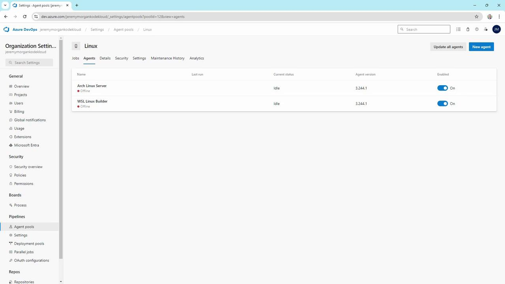
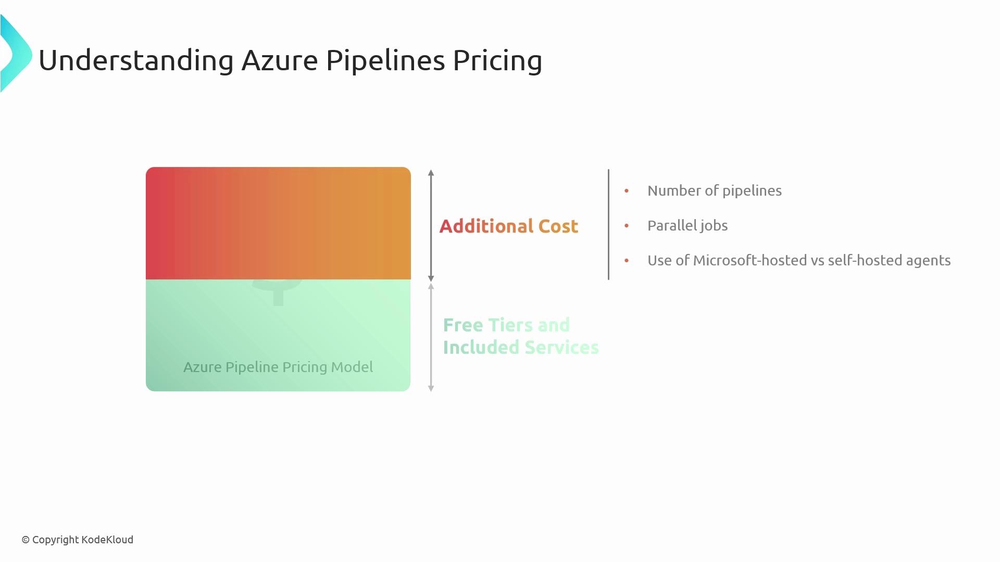
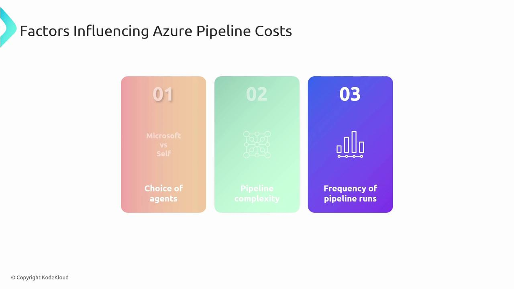
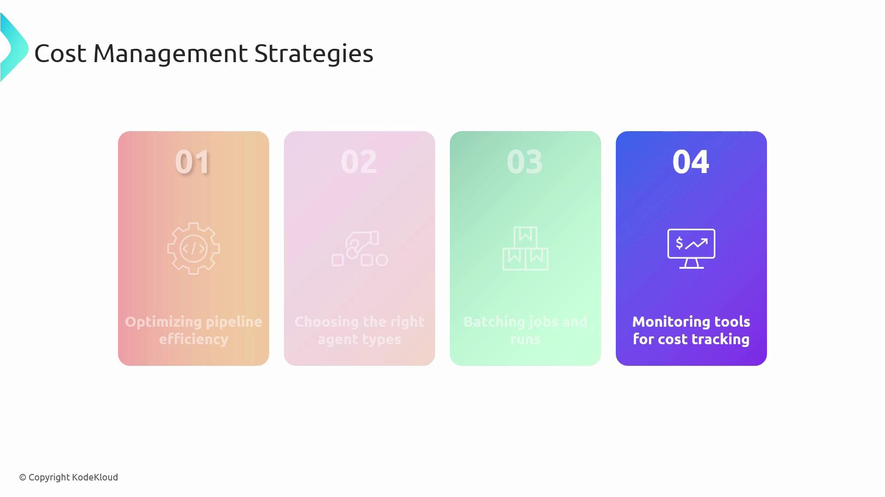
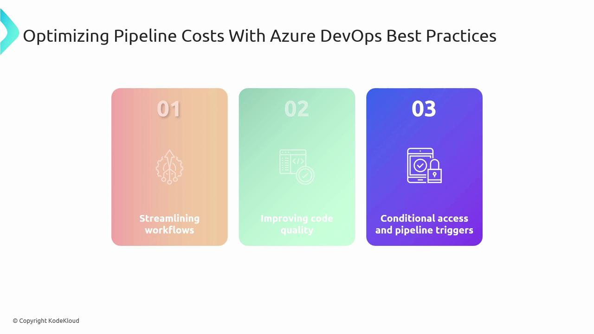
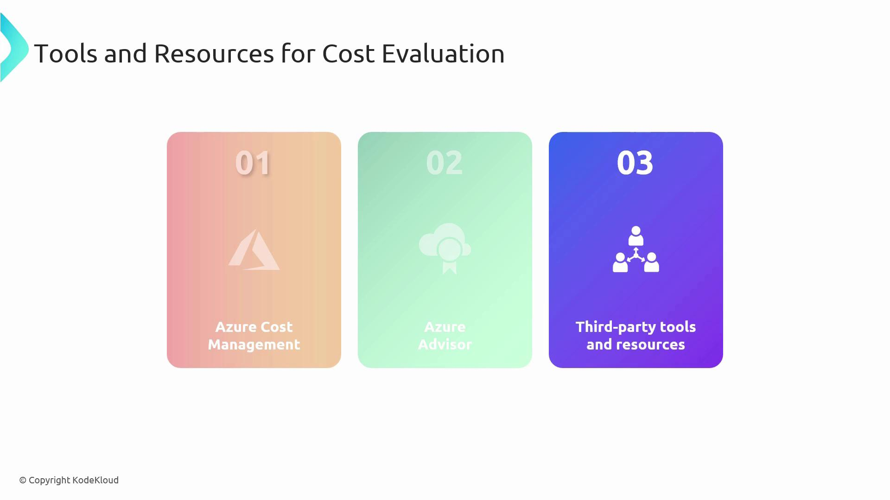

# Change into your agent folder
cd C:\agent

# Run the agent service
.\run.cmd
```

Sample output:

```text theme={null}
Scanning for tool capabilities.
Connecting to the server.
2024-09-26 17:57:45Z: Listening for Jobs
```

The agent is now online and ready to accept jobs.

> **triangle-alert** Keep your `AZP_TOKEN` secure. Never commit it to source control or share publicly.

### 2. Docker-Based Agent

Containerize your agent for easier scaling and reproducibility:

```bat theme={null}
REM File: start.bat in your project’s azpbuild folder
docker run `
  -e AZP_URL="%AZP_URL%" `
  -e AZP_TOKEN="%AZP_TOKEN%" `
  -e AZP_POOL="Default" `
  -e AZP_AGENT_NAME="Docker Agent - Windows" `
  --name azp-agent-windows `
  azp:agent
```

Run it:

```bat theme={null}
cd C:\Projects\agents\azpbuild
start.bat
```

Now both your native Windows agent and the containerized agent will appear online.

### 3. Linux Agents

In the **Linux** pool you may have agents for WSL or standalone servers:



#### WSL Agent

On Windows with WSL installed:

```bash theme={null}
cd ~/myagent
./run.sh
```

You’ll see:

```text theme={null}
Scanning for tool capabilities.
Connecting to the server.
2024-09-26 17:57:45Z: Listening for Jobs
```

#### Standalone Linux Server

On a dedicated Linux VM (e.g., Arch, Ubuntu):

```bash theme={null}
cd ~/myagent
./run.sh
```

Output is identical—just toggle the agent on or off as needed.

### 4. macOS Agent

SSH into your Mac build host and start the agent:

```bash theme={null}
ssh jeremy@Jeremys-Mac-Studio
cd ~/myagent
./run.sh
```

```text theme={null}
Scanning for tool capabilities.
Connecting to the server.
2024-09-26 17:57:45Z: Listening for Jobs
```

The macOS agent will show up under the **Mac** pool.

> **lightbulb** Containerized agents simplify upgrades and scaling. Consider using Kubernetes to auto-scale your Docker-based agents.

## Choosing the Right Infrastructure

When architecting your agent setup, evaluate:

* **Target OS**: Windows, Linux, macOS
* **Management overhead**: Hosted zero-touch vs. self-hosted control
* **Customization needs**: Specific SDKs, Docker images, hardware
* **Scaling strategy**: Manual scaling, Kubernetes, or VM auto-scaling

Containerized, self-hosted agents strike a strong balance for most teams—offering full customization with industry-standard orchestration tools like [Kubernetes][kubernetes].

***

## Links and References

* [Azure DevOps Services][azure-devops]
* [Azure Pipelines][azure-pipelines]
* [Docker Official Site][docker]
* [Kubernetes Documentation][kubernetes]

[azure-devops]: https://azure.microsoft.com/services/devops/

[azure-pipelines]: https://azure.microsoft.com/services/devops/pipelines/

[docker]: https://www.docker.com/

[kubernetes]: https://kubernetes.io/

- [Watch Video](https://learn.kodekloud.com/user/courses/az-400/module/55cf24db-89bc-4b93-bb75-7350d1593073/lesson/1ce91322-9996-4a39-ad43-e2d326dcc79a)


# Evaluating Cost

Source: https://notes.kodekloud.com/docs/AZ-400-Designing-and-Implementing-Microsoft-DevOps-Solutions/Design-and-Implement-Pipelines/Evaluating-Cost/page

This article explains how to evaluate, manage, and optimize costs associated with Azure Pipelines for efficient CI/CD processes.

In this lesson, we’ll walk through how to **evaluate**, **manage**, and **optimize** your expenses with [Azure Pipelines](https://learn.microsoft.com/azure/devops/pipelines/). By understanding pricing tiers and cost drivers, you can scale your CI/CD processes efficiently and avoid unexpected bills.

> **lightbulb** Azure Pipelines includes free build minutes and a free self-hosted agent for open-source projects. Leverage these allowances to experiment before moving to paid plans.



## Cost Factors

Azure Pipelines charges are driven by three primary factors. Knowing how each one affects your bill helps you plan capacity and cut unnecessary spend.

| Factor              | Description                                                 | Key Considerations                                       |
| ------------------- | ----------------------------------------------------------- | -------------------------------------------------------- |
| Agent Type          | Microsoft-hosted vs. self-hosted worker instances           | Setup complexity, scaling limits, maintenance overhead   |
| Pipeline Complexity | Number of steps, tasks, tools, and resource-intensive ops   | Container usage, test suites, build artifacts            |
| Run Frequency       | How often pipelines execute (CI, scheduled, or manual runs) | Trigger rules, parallel jobs, scheduled batch processing |

> **triangle-alert** Self-hosted agents require you to provision, secure, and maintain VMs or hardware. Underestimate this at your own risk.



## Cost Management Strategies

Optimize your Azure Pipelines spending by adopting these proven strategies:

| Strategy                | Action Items                                                                    |
| ----------------------- | ------------------------------------------------------------------------------- |
| Streamline Pipelines    | Remove redundant tasks, combine steps, and cache dependencies                   |
| Choose the Right Agent  | Mix Microsoft-hosted for burst workloads and self-hosted for steady volume      |
| Batch and Schedule Runs | Group related jobs or schedule off-peak builds to smooth out agent consumption  |
| Monitor Usage           | Use Azure Cost Management dashboards and alerts to identify spikes and outliers |



## Best Practices for Cost Optimization

Embed cost-efficient practices directly into your DevOps workflows:

* **Streamline workflows** by eliminating idle waits and parallelizing only critical steps.
* **Improve code quality** early with linting, static analysis, and unit tests to reduce build failures.
* **Use conditional triggers** (`paths`, `branches`) and **pipeline caching** to run jobs only when necessary.



## Tools and Resources

Leverage these native and third-party tools to track, analyze, and optimize your Azure Pipelines spend:

* [Azure Cost Management](https://learn.microsoft.com/azure/cost-management/): Comprehensive dashboards, budgets, and alerts for all Azure services.
* [Azure Advisor](https://learn.microsoft.com/azure/advisor): Personalized recommendations to improve performance and efficiency.
* Third-party analytics platforms (e.g., CloudHealth, Harness) for deeper pipeline-specific insights.



## Summary

In this article, you learned how to:

* Interpret the **Azure Pipelines pricing model** and free-tier grants.
* Identify **key cost drivers**: agent types, pipeline complexity, and run frequency.
* Apply **strategies** to streamline, batch, and monitor pipeline runs.
* Implement **best practices** for efficient, failure-resilient workflows.
* Use **tools and resources** for continuous cost analysis and optimization.

By balancing performance needs against budget constraints, you can maintain a robust DevOps pipeline that scales without breaking the bank.

***

## Links and References

* [Azure Pipelines Pricing](https://azure.microsoft.com/pricing/details/devops/azure-devops-services/)
* [Kubernetes on Azure DevOps](https://learn.microsoft.com/azure/aks/)
* [Terraform Best Practices](https://learn.hashicorp.com/terraform)
* [Azure DevOps Documentation](https://learn.microsoft.com/azure/devops/)

- [Watch Video](https://learn.kodekloud.com/user/courses/az-400/module/55cf24db-89bc-4b93-bb75-7350d1593073/lesson/00d48fed-3d01-4895-9514-c1f7cd5dabf7)
