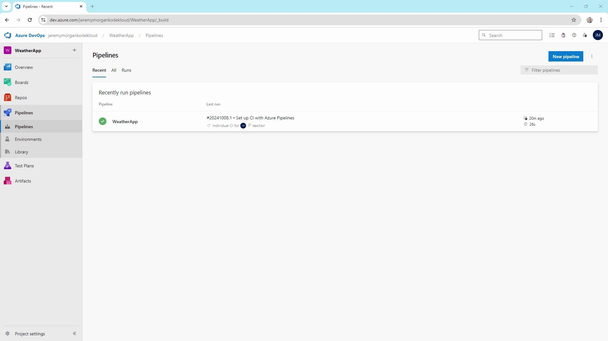

# Using Build Trigger Rules

Source: https://notes.kodekloud.com/docs/AZ-400-Designing-and-Implementing-Microsoft-DevOps-Solutions/Design-and-Implement-Pipelines/Using-Build-Trigger-Rules/page

This guide demonstrates configuring trigger rules in Azure Pipelines to automate CI/CD workflows using a Blazor WebAssembly application.

In this guide, we’ll demonstrate how to configure trigger rules in Azure Pipelines using a Blazor WebAssembly application. You’ll learn to automate your CI/CD workflows with continuous integration, pull request validation, scheduled runs, tag-based triggers, and pipeline-resource dependencies.

## Table of Contents

1. [Basic Trigger Types](#basic-trigger-types)
2. [Refining CI Triggers with Branch & Path Filters](#refining-ci-triggers-with-branch--path-filters)
3. [Example: Updating `launchsettings.json`](#example-updating-launchsettingsjson)
4. [Pull Request Triggers](#pull-request-triggers)
5. [Scheduled Triggers](#scheduled-triggers)
6. [Tag-Based Triggers](#tag-based-triggers)
7. [Pipeline Resource Triggers](#pipeline-resource-triggers)
8. [Managing YAML in Azure Repos](#managing-yaml-in-azure-repos)
9. [Summary](#summary)
10. [Links and References](#links-and-references)

## Basic Trigger Types

Azure Pipelines supports several trigger rules to automate builds and deployments. The key types are:

| Trigger Type                | Purpose                              | Example Snippet                   |
| --------------------------- | ------------------------------------ | --------------------------------- |
| Continuous Integration (CI) | Run on every code push               | `trigger: - master`               |
| Pull Request (PR)           | Validate PRs before merging          | `pr: branches: include: - master` |
| Scheduled                   | Run on a defined cron schedule       | `schedules: - cron: "0 2 * * *"`  |
| Tag-Based                   | Trigger when a version tag is pushed | `trigger: tags: include: - 'v*'`  |
| Pipeline Resource           | Run after another pipeline completes | `resources: pipelines: ...`       |

### 1. Continuous Integration (CI)

A CI trigger automatically starts a build when code is pushed to specified branches.

```yaml theme={null}
trigger:
  - master

pool:
  vmImage: ubuntu-latest

variables:
  buildConfiguration: 'Release'

steps:
  - script: dotnet build --configuration $(buildConfiguration)
    displayName: 'dotnet build $(buildConfiguration)'
```

### 2. Pull Request (PR)

PR triggers validate changes in pull requests before they’re merged into the target branch.

```yaml theme={null}
pr:
  branches:
    include:
      - master
```

### 3. Scheduled

Schedule pipelines using cron syntax to run at regular intervals.

```yaml theme={null}
schedules:
  - cron: "0 2 * * *"
    displayName: Nightly build
    branches:
      include:
        - master
    always: true
```

### 4. Tag-Based

Trigger builds when Git tags matching a pattern are pushed.

```yaml theme={null}
trigger:
  tags:
    include:
      - 'v*'
```

### 5. Pipeline Resource

Chain pipelines by triggering one when another succeeds.

```yaml theme={null}
resources:
  pipelines:
    - pipeline: BlazorAPI
      source: BlazorAPISource
      trigger:
        branches:
          include:
            - master
```

***

## Refining CI Triggers with Branch & Path Filters

By default, a CI trigger on `master` fires for any change. You can target multiple branches and restrict file paths:

```yaml theme={null}
trigger:
  branches:
    include:
      - master
      - feature/*
  paths:
    include:
      - 'Properties/**'
    exclude:
      - '**/*.md'

pool:
  vmImage: ubuntu-latest

variables:
  buildConfiguration: 'Release'

steps:
  - script: dotnet build --configuration $(buildConfiguration)
    displayName: 'dotnet build $(buildConfiguration)'
```

This configuration builds on commits to `master` or any `feature/*` branch **only** when files under `Properties/` change (ignoring Markdown updates).



## Example: Updating `launchsettings.json`

Let’s make a change inside the monitored `Properties` folder:

```json theme={null}
{
  "$schema": "http://json.schemastore.org/launchsettings.json",
  "iisSettings": {
    "windowsAuthentication": false,
    "anonymousAuthentication": true,
    "iisExpress": {
      "applicationUrl": "http://localhost:58347",
      "sslPort": 44367
    }
  },
  "profiles": {
    "http": {
      "commandName": "Project",
      "dotnetRunMessages": true,
      "launchBrowser": true,
      "inspectUri": "{wsProtocol}://{url.hostname}:{url.port}/_framework/debug/ws-proxy?browser={browserInspectPort}",
      "applicationUrl": "http://localhost:5047",
      "environmentVariables": {
        "ASPNETCORE_ENVIRONMENT": "Development"
      }
    },
    "https": {
      "commandName": "Project",
      "dotnetRunMessages": true,
      "launchBrowser": true,
      "inspectUri": "{wsProtocol}://{url.hostname}:{url.port}/_framework/debug/ws-proxy?browser={browserInspectPort}",
      "applicationUrl": "https://localhost:7143;http://localhost:5047"
    }
  }
}
```

Then commit and push your changes:

```bash theme={null}
git add Properties/launchsettings.json
git commit -m "Update Properties/launchsettings.json"
git push
```

Since the file is in `Properties/`, the CI pipeline triggers again.

## Pull Request Triggers

To enforce code quality before merging, add a PR trigger in your YAML:

```yaml theme={null}
trigger:
  branches:
    include:
      - master
      - feature/*
  paths:
    exclude:
      - '**/*.md'

pr:
  branches:
    include:
      - master
  paths:
    include:
      - '**/*'
```

### Testing Feature Branch Builds

```bash theme={null}
git pull
git checkout -b feature/my-new-feature
