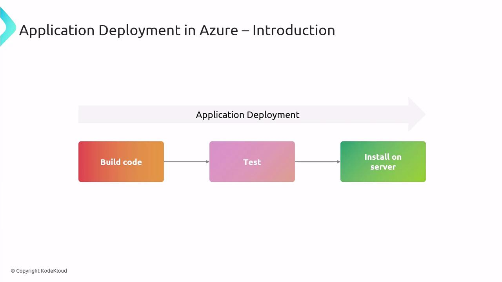
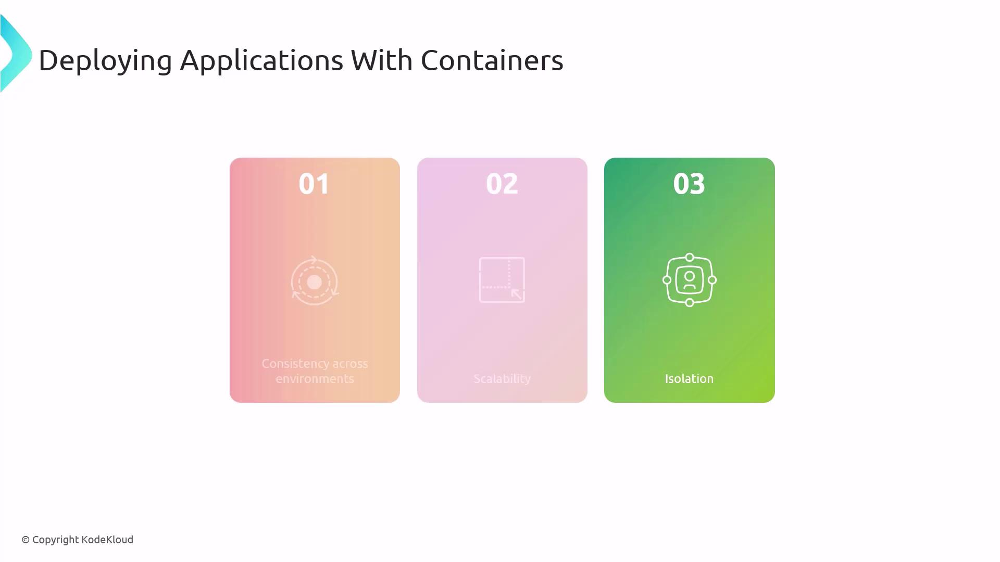
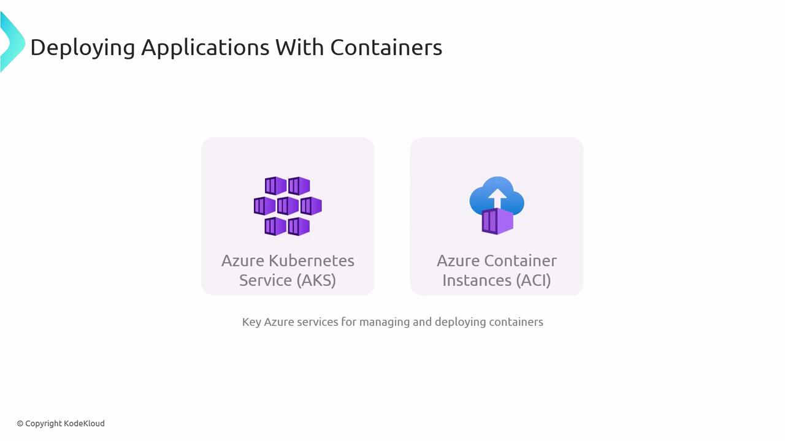
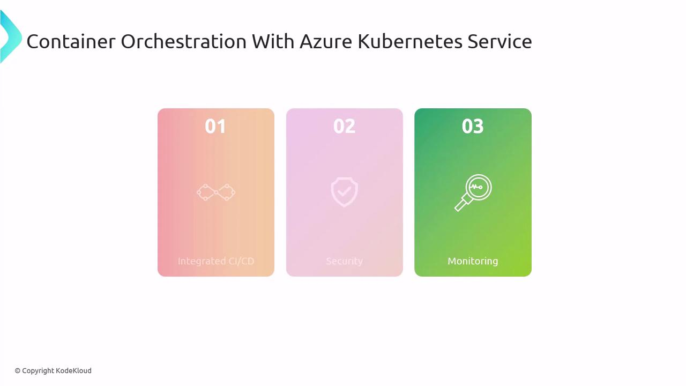
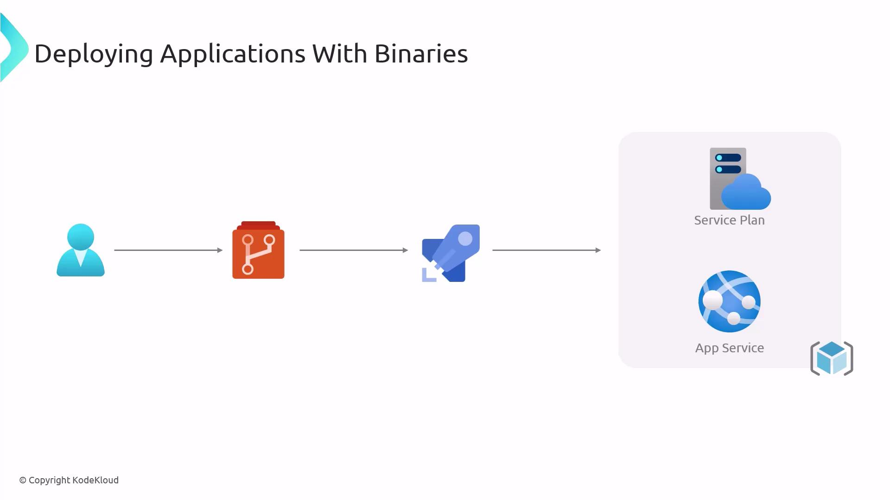
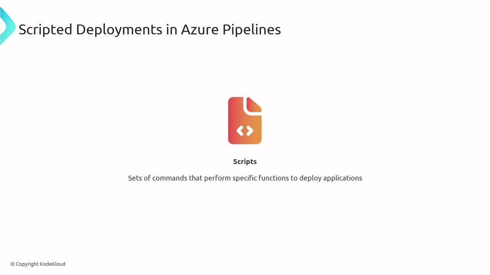

# Application deployment using Containers Binaries and Scripts

Source: https://notes.kodekloud.com/docs/AZ-400-Designing-and-Implementing-Microsoft-DevOps-Solutions/Design-and-Implement-Deployments/Application-deployment-using-Containers-Binaries-and-Scripts/page

This guide covers methods for deploying applications in Azure using containers, binaries, and scripts for reliable and repeatable deployments.

In this guide, you’ll learn three primary methods for deploying applications in Azure—containers, binaries, and scripts. Whether you’re preparing for the AZ-400 exam or optimizing production pipelines, understanding these strategies ensures reliable, repeatable deployments.

## What Is Application Deployment in Azure?

Application deployment means packaging and configuring your code so it runs reliably in Azure. Core tasks include:

* Managing dependencies
* Configuring environment settings
* Integrating with services like networking, databases, and monitoring

### Deployment Workflow

Every deployment pipeline typically follows three stages:

1. **Build**\
   Compile source code, bundle libraries, and generate artifacts.
2. **Test**\
   Execute automated tests to validate functionality and catch regressions.
3. **Install**\
   Deploy artifacts to your Azure environment (e.g., App Service, Kubernetes, VMs).



Understanding this three-step flow is essential for both exam success and real-world delivery.

## Deploying with Containers

Containers package your application code, dependencies, and configuration into lightweight, portable units. This approach guarantees consistent behavior across every environment.

### Key Benefits

* **Consistency Across Environments**\
  Identical runtime from local dev to production.
* **Scalability**\
  Spin up multiple container instances on demand.
* **Isolation**\
  Processes run in separate namespaces, reducing conflicts.



### Azure Container Services

Azure offers two main container hosting options:

| Service                         | Description                                           | Ideal Scenario                                  |
| ------------------------------- | ----------------------------------------------------- | ----------------------------------------------- |
| Azure Kubernetes Service (AKS)  | Managed Kubernetes cluster for advanced orchestration | Production microservices with high availability |
| Azure Container Instances (ACI) | Serverless containers without VM management           | On-demand tasks, dev/test environments          |



> **lightbulb** Use ACI for simple, burstable workloads and prototyping. Choose AKS for production-grade orchestration, autoscaling, and complex networking.

### Azure Kubernetes Service (AKS)

AKS simplifies Kubernetes deployment in Azure. Key features include:

* **Integrated CI/CD**\
  Connect with [Azure DevOps](https://azure.microsoft.com/services/devops/) or GitHub Actions for automated pipelines.
* **Security**\
  Leverage network policies, Azure Active Directory integration, and role-based access control.
* **Monitoring**\
  Built-in support for [Azure Monitor](https://learn.microsoft.com/azure/azure-monitor/) and [Log Analytics](https://learn.microsoft.com/azure/azure-monitor/logs/).



Mastering AKS fundamentals is critical for the [AZ-400 exam](https://learn.microsoft.com/certifications/exams/az-400) and for running resilient container workloads.

## Deploying with Binaries

Binaries are compiled executables that run directly on the host OS. Azure App Service abstracts infrastructure so you can deploy these executables as a Platform-as-a-Service (PaaS).

### Typical Binary Deployment Flow

1. Developer commits code to a Git repository.
2. CI pipeline compiles source into binaries.
3. Deployment pipeline pushes binaries to Azure App Service.
4. App Service host runs the application.



### App Service Deployment Methods

| Method           | Description                                               |
| ---------------- | --------------------------------------------------------- |
| FTP / Web Deploy | Upload binaries or web projects directly to the server.   |
| Docker Container | Host container images on App Service for PaaS simplicity. |

> **lightbulb** For Linux-based executables, consider Docker deployment on App Service to leverage container isolation and portability.

## Scripted Deployments

Automating Azure resource provisioning and application deployment with scripts guarantees repeatable, versioned environments.



Azure supports two primary scripting tools:

* [Azure PowerShell](https://learn.microsoft.com/powershell/azure/)
* [Azure CLI](https://learn.microsoft.com/cli/azure/)

Both integrate seamlessly into CI/CD pipelines for full infrastructure-as-code workflows.

### Sample Azure CLI Deployment Script

```bash theme={null}
#!/usr/bin/env bash
