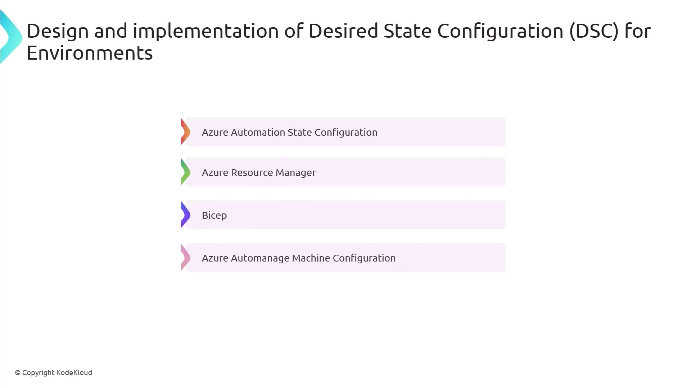
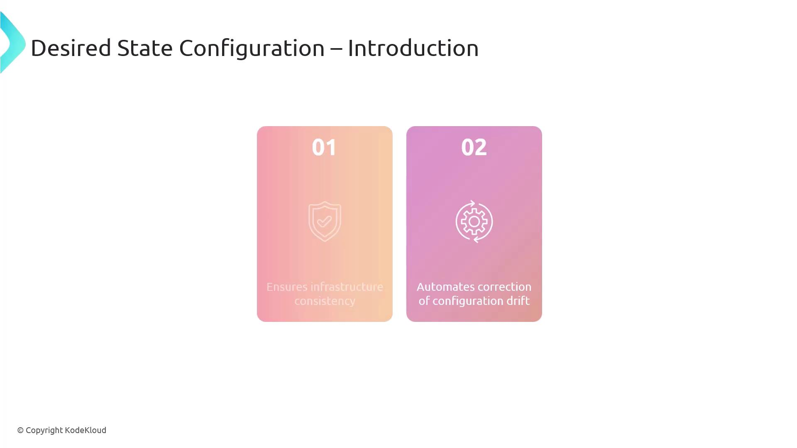

# Design and implement desired state configuration for environments

Source: https://notes.kodekloud.com/docs/AZ-400-Designing-and-Implementing-Microsoft-DevOps-Solutions/Design-and-Implement-Infrastructure-as-Code-IaC/Design-and-implement-desired-state-configuration-for-environments/page

This article explains Desired State Configuration (DSC) for managing infrastructure consistency and automating configuration drift remediation using Azure tools.

In this lesson, we’ll dive into **Desired State Configuration (DSC)**—a declarative framework that enforces and maintains your infrastructure’s configuration. Azure offers several DSC tools to help you achieve a consistent, drift-free environment, including:

* Azure Automation State Configuration
* Azure Resource Manager
* Bicep
* Azure Automanage Machine Configuration



***

## What Is Desired State Configuration?

Desired State Configuration (DSC) is a Windows PowerShell management platform designed to:

* Ensure infrastructure consistency by applying identical configurations across all nodes
* Automatically detect and remediate configuration drift to keep systems in the defined “blueprint”



***

## Example: PowerShell DSC for a Windows Web Server

Below is a step-by-step demonstration on how to deploy IIS and configure the Default Web Site in a stopped state using PowerShell DSC.

### Step 1: Define the DSC Configuration

```powershell theme={null}
Configuration WebServerSetup {
    # Import the built-in DSC resource for Windows features and the IIS module
    Import-DscResource -ModuleName PSDesiredStateConfiguration, xWebAdministration

    Node "localhost" {
        # Install the IIS (Web-Server) role
        WindowsFeature IIS {
            Ensure = "Present"
            Name   = "Web-Server"
        }

        # Create or update Default Web Site and ensure it is stopped
        xWebsite DefaultSite {
            Ensure       = "Present"
            Name         = "Default Web Site"
            State        = "Stopped"
            PhysicalPath = "C:\inetpub\wwwroot"
            DependsOn    = "[WindowsFeature]IIS"
        }
    }
}
```

> **lightbulb** You need **administrator privileges** to install roles/features and apply DSC configurations on Windows Server.

### Step 2: Compile the Configuration

Run the configuration script to generate a Managed Object Format (MOF) file:

```powershell theme={null}
