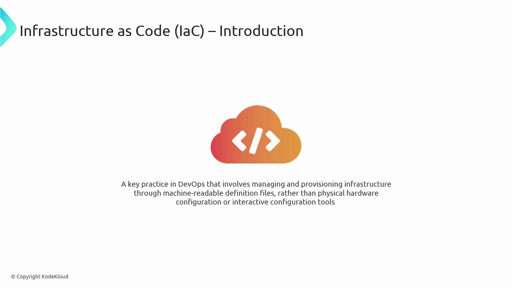
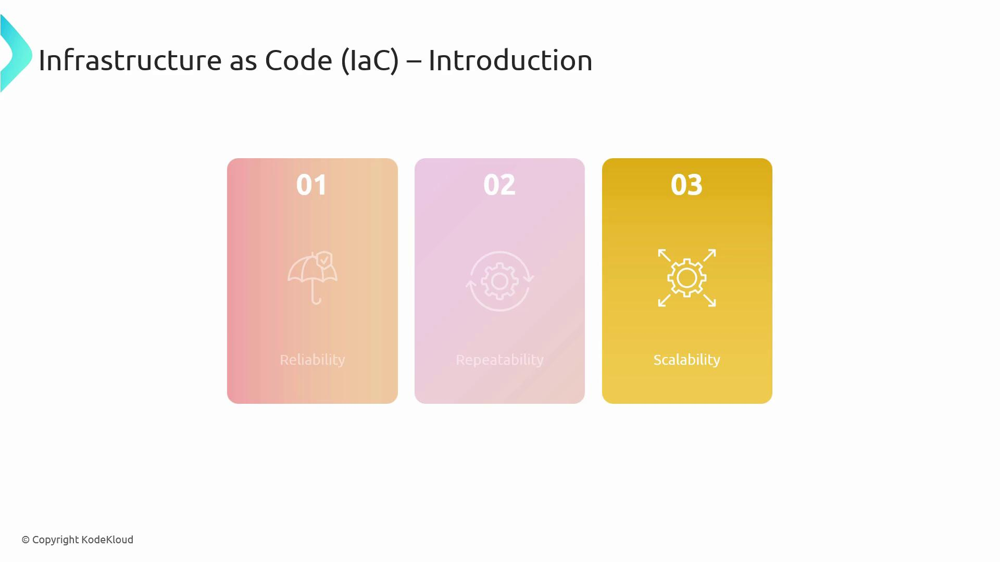
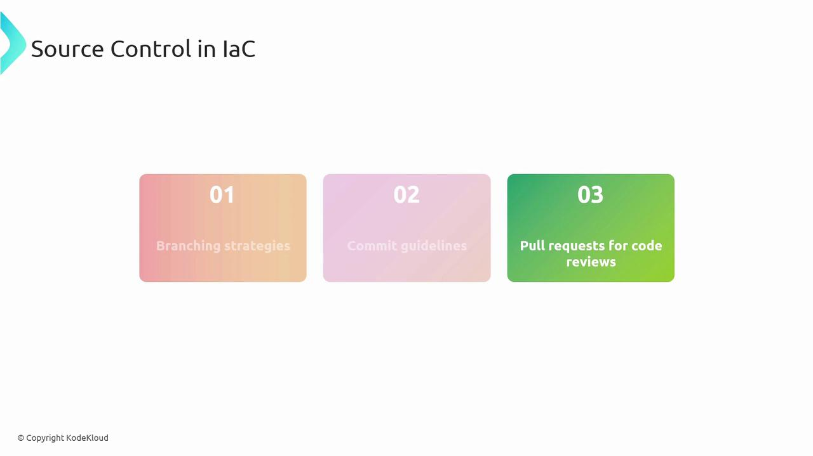
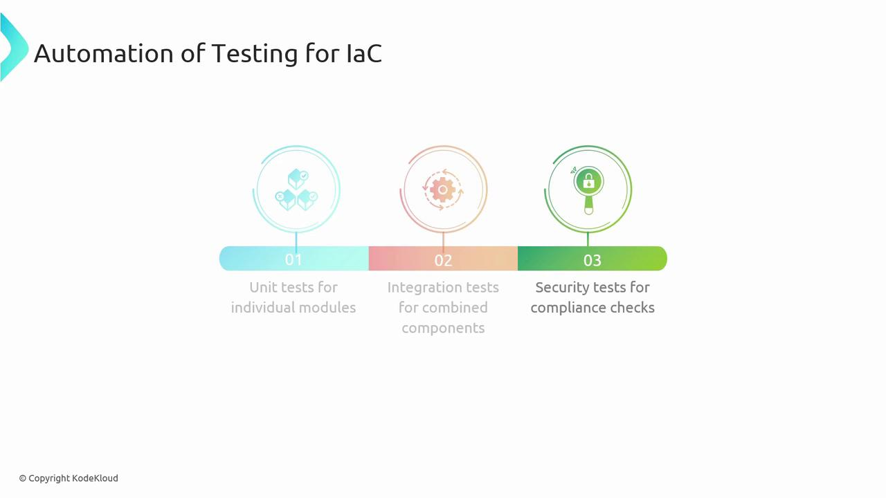
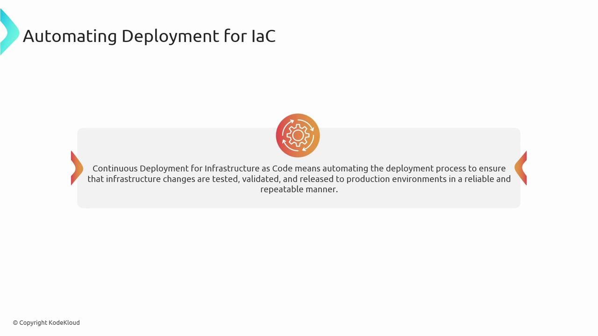
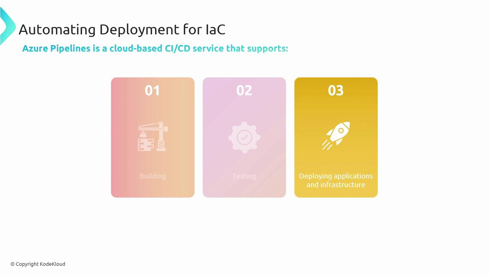

# Define an IaC strategy

Source: https://notes.kodekloud.com/docs/AZ-400-Designing-and-Implementing-Microsoft-DevOps-Solutions/Design-and-Implement-Infrastructure-as-Code-IaC/Define-an-IaC-strategy/page

This article explores building a robust Infrastructure as Code strategy for Azure, covering fundamentals, benefits, and integration into DevOps workflows.

In this lesson, we’ll explore how to build a robust Infrastructure as Code (IaC) strategy for Azure. You’ll learn the fundamentals of IaC, its benefits, and how it integrates into DevOps workflows to automate, version, and scale your cloud infrastructure.

## What Is Infrastructure as Code?

Infrastructure as Code (IaC) refers to managing and provisioning computing resources through machine-readable definition files rather than manual processes. Treating infrastructure configurations as code enables you to:

* Deploy resources consistently
* Version-control all changes
* Scale environments reliably

<Frame>
  
</Frame>

### Key Benefits of IaC

| Benefit       | Description                                                 |
| ------------- | ----------------------------------------------------------- |
| Reliability   | Automates provisioning to reduce human error                |
| Repeatability | Ensures identical environment setups across deployments     |
| Scalability   | Simplifies management of large, distributed infrastructures |

<Frame>
  
</Frame>

## How IaC Works in Azure

A streamlined Azure IaC workflow typically follows these steps:

1. Write infrastructure definitions (ARM templates, Terraform `.tf` files, etc.).
2. Store all scripts in a source code repository.
3. Validate and plan changes using an IaC engine (Azure Resource Manager, Terraform, Ansible).
4. Integrate definitions into a CI/CD pipeline for automated testing.
5. Apply or update Azure resources automatically.

## Source Control for IaC

Version control underpins every high-performing IaC pipeline by providing:

* **Change tracking**: Maintain a history of every modification.
* **Collaboration**: Multiple engineers can safely work on the same infrastructure code.

<Callout icon="triangle-alert">
  Always enforce pull request reviews and branch protection rules. Unreviewed infrastructure changes can lead to unexpected outages.
</Callout>

Best practices:

* Adopt a branching strategy (feature, release, hotfix).
* Write clear, descriptive commit messages.
* Use pull requests for peer review and policy enforcement.

| Platform    | Use Case                                          | Integration     |
| ----------- | ------------------------------------------------- | --------------- |
| GitHub      | Public and private repositories with community CI | GitHub Actions  |
| Azure Repos | Enterprise-grade Git with built-in Azure security | Azure Pipelines |

<Frame>
  
</Frame>

## Automated Testing for IaC

Incorporating automated tests into your IaC workflow catches issues early and enforces compliance. Common test types include:

| Test Type         | Purpose                                       | Example Tool        |
| ----------------- | --------------------------------------------- | ------------------- |
| Unit Tests        | Validate individual modules or scripts        | Pester (PowerShell) |
| Integration Tests | Verify interactions among multiple components | Terratest (Go)      |
| Security Tests    | Enforce security and policy compliance        | InSpec, Checkov     |

<Frame>
  
</Frame>

## Automating IaC Deployments

Continuous deployment for IaC ensures that every infrastructure change is automatically tested, validated, and applied in a consistent manner.

<Frame>
  
</Frame>

### Principles of Continuous Deployment

1. Automation: Eliminate manual steps to reduce errors.
2. Version Control: Version every change to your definitions.
3. Continuous Testing: Catch defects as early as possible.
4. Continuous Monitoring: Track health and performance of resources.
5. Idempotency: Ensure repeated runs yield identical states.
6. Rapid Feedback: Integrate team feedback loops for ongoing improvements.

<Callout icon="lightbulb">
  Idempotent scripts guarantee that running the same definition multiple times won’t produce drift. This is critical for repeatable and reliable deployments.
</Callout>

## Azure Pipelines for IaC

Azure Pipelines provides a cloud-hosted CI/CD service for both application and infrastructure code. With Azure Pipelines, you can:

* Build and validate IaC scripts (ARM, Terraform, Bicep).
* Run automated tests to enforce quality and compliance.
* Deploy resource changes safely and at scale in Azure.

<Frame>
  
</Frame>

## Links and References

* [Azure Resource Manager (ARM) templates](https://docs.microsoft.com/azure/azure-resource-manager/templates/overview)
* [Terraform Registry](https://registry.terraform.io/)
* [Pester Documentation](https://pester.dev/)
* [Azure Pipelines Documentation](https://docs.microsoft.com/azure/devops/pipelines/)
* [Kubernetes Basics](https://kubernetes.io/docs/concepts/overview/what-is-kubernetes/)

<CardGroup>
  <Card title="Watch Video" icon="video" href="https://learn.kodekloud.com/user/courses/az-400/module/75eafabe-1911-4a4e-a7fb-277f6aa6e2d0/lesson/cfa96e39-0f0e-4db6-ae19-9f7a62e4853a" />
</CardGroup>
