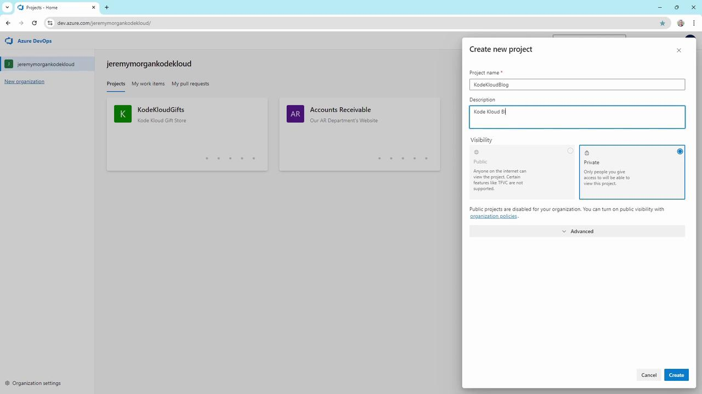
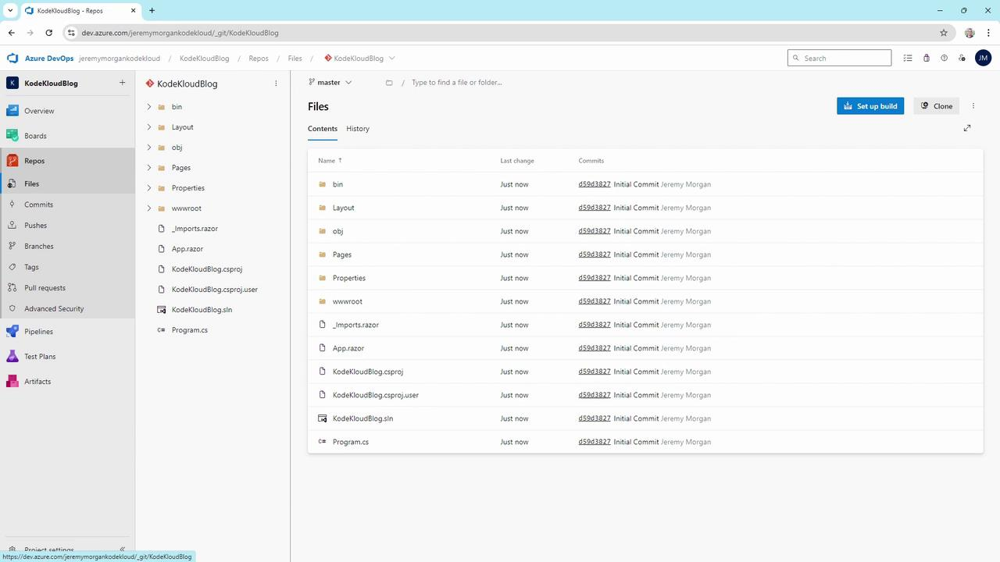
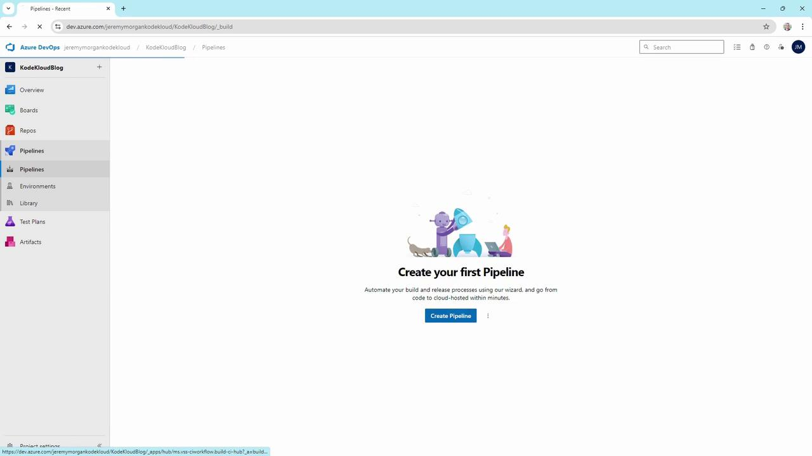
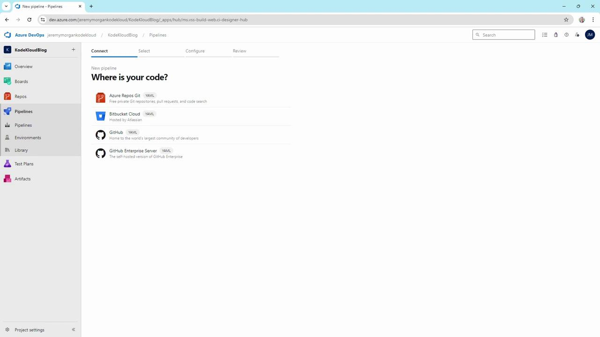
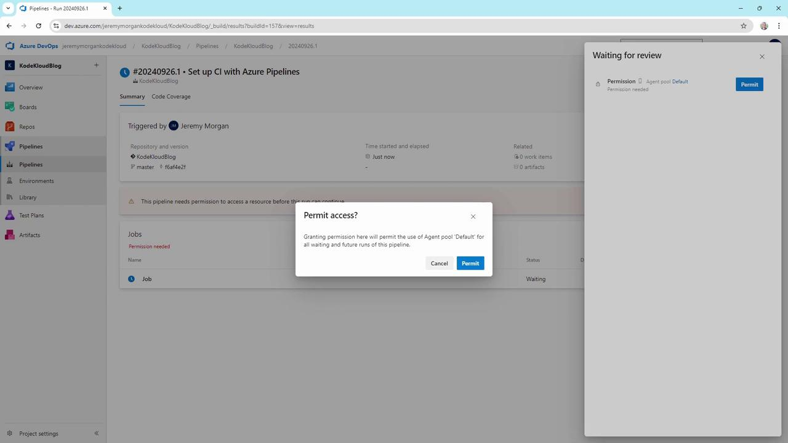
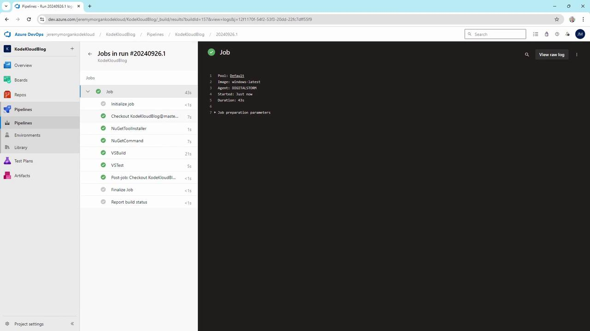
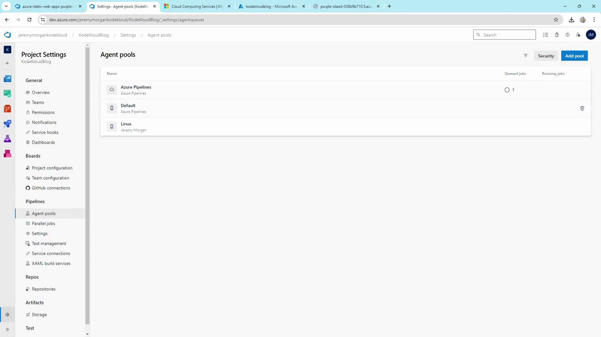
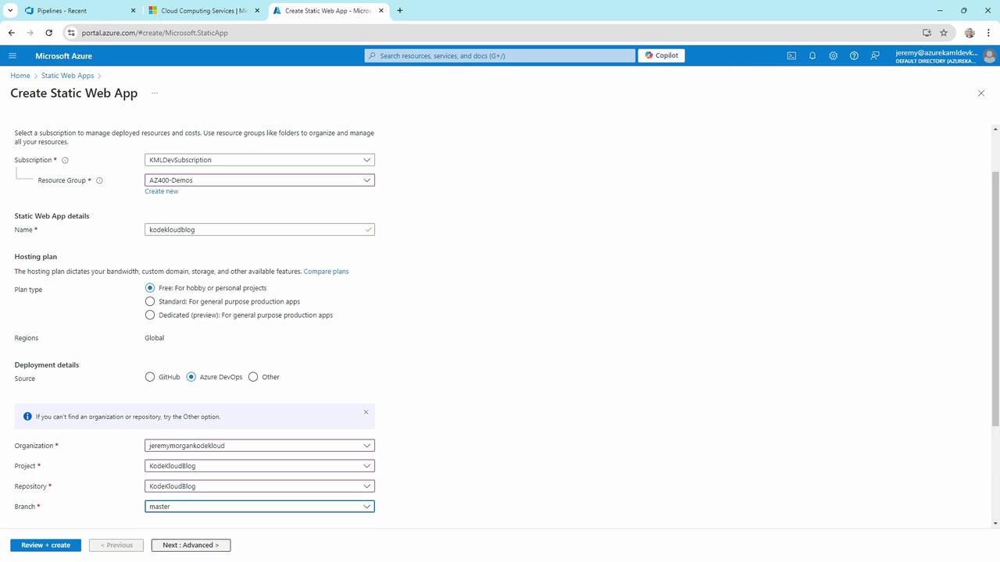
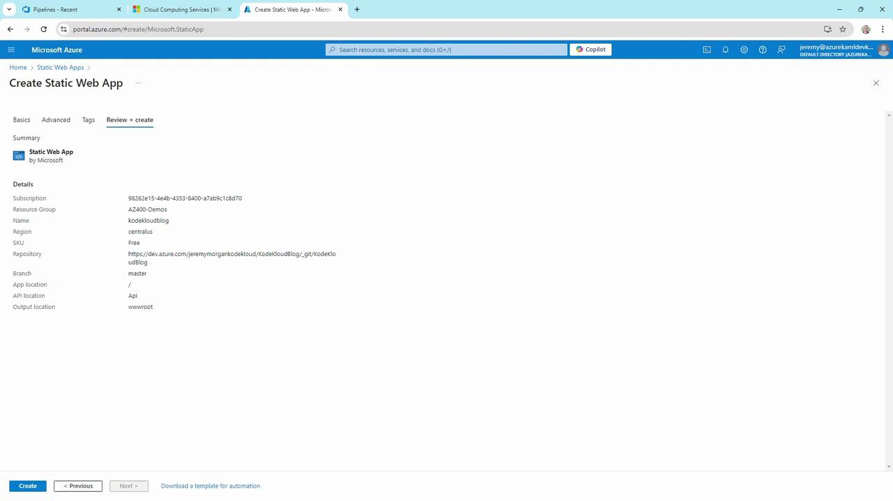
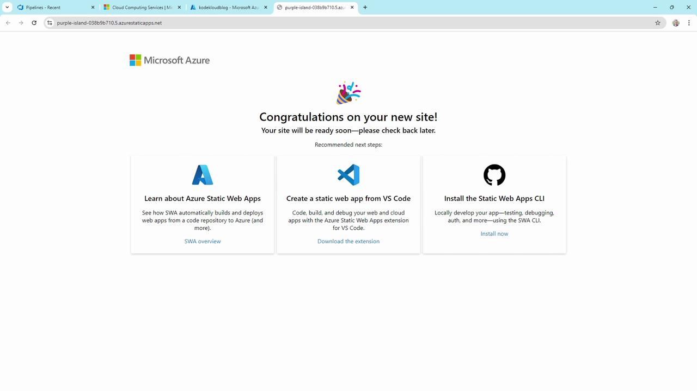

# Demo Azure Pipelines

Source: https://notes.kodekloud.com/docs/AZ-400-Designing-and-Implementing-Microsoft-DevOps-Solutions/Design-and-Implement-Pipelines/Demo-Azure-Pipelines/page

This tutorial builds a CI/CD workflow for a Blazor WebAssembly app using Azure Pipelines and deploys it to Azure Static Web Apps.

In this tutorial, we’ll build a complete CI/CD workflow for a Blazor WebAssembly app using **Azure Pipelines** and deploy it to **Azure Static Web Apps**. By the end, code changes pushed to Git will automatically build, test, and publish your site.

## 1. Create an Azure DevOps Project

1. Sign in to [Azure DevOps](https://dev.azure.com/).
2. Click **New project**, name it **KodeKloudBlog**, and create.

<Frame>
  
</Frame>

## 2. Initialize the Repository

1. In your new project, go to **Repos** and create a Git repository.

2. Clone it locally:

   ```bash theme={null}
   git clone https://jeremymorgankodekloud@dev.azure.com/jeremymorgankodekloud/KodeKloudBlog/_git/KodeKloudBlog
   cd KodeKloudBlog
   ```

3. Copy your Blazor WebAssembly app into this folder.

4. Commit and push:

   ```bash theme={null}
   git add .
   git commit -m "Initial commit"
   git push -u origin master
   ```

<Frame>
  
</Frame>

Now your code is versioned:

<Frame>
  
</Frame>

## 3. Create the Build Pipeline

### 3.1 Scaffold the Pipeline

1. Navigate to **Pipelines** > **Create Pipeline**.

<Frame>
  
</Frame>

2. Select **Azure Repos Git** as the source.

<Frame>
  
</Frame>

3. Choose the **ASP.NET Core** template and review the YAML:

   ```yaml theme={null}
   # azure-pipelines.yml
   trigger:
     branches:
       include:
         - master

   pool:
     vmImage: 'windows-latest'

   variables:
     solution: '**/*.sln'
     buildPlatform: 'Any CPU'
     buildConfiguration: 'Release'

   steps:
     - task: NuGetToolInstaller@1
       displayName: 'Install NuGet'

     - task: NuGetCommand@2
       inputs:
         restoreSolution: '$(solution)'

     - task: VSBuild@1
       inputs:
         solution: '$(solution)'
         msbuildArgs: '/p:DeployOnBuild=true /p:WebPublishMethod=Package /p:PackageAsSingleFile=true /p:SkipInvalidConfigurations=true'
         configuration: '$(buildConfiguration)'

     - task: VSTest@2
       inputs:
         platform: '$(buildPlatform)'
         configuration: '$(buildConfiguration)'
   ```

### 3.2 YAML Variables

| Variable           | Description                           |
| ------------------ | ------------------------------------- |
| solution           | Path to your `.sln` file (`**/*.sln`) |
| buildPlatform      | Target platform (`Any CPU`)           |
| buildConfiguration | Build mode (`Release`)                |

<Callout icon="lightbulb">
  Ensure your project has access to either Microsoft-hosted agents or self-hosted agents. Check **Project settings** > **Agent pools** to verify availability.
</Callout>

### 3.3 Run and Inspect

* Save and run the pipeline.
* If prompted to grant permissions for the agent pool, approve to continue.

<Frame>
  
</Frame>

* After completion, click the build to see each step’s logs:

<Frame>
  
</Frame>

Review your agent pool:

<Frame>
  
</Frame>

## 4. Deploy to Azure Static Web Apps

1. In the [Azure portal](https://portal.azure.com/), search **Static Web Apps** > **Create**.
2. Configure subscription, resource group, and name (e.g., **KodeKloudBlog**).
3. Choose **Free** plan.
4. Under **Deployment Details**, select **Azure DevOps**, then your organization, project, repo, and branch.

<Frame>
  
</Frame>

On **Advanced**, pick region and API settings if needed:

<Frame>
  
</Frame>

Review and **Create**:

<Frame>
  
</Frame>

Once provisioned, you’ll see this confirmation:

<Frame>
  
</Frame>

Azure DevOps automatically creates a second pipeline for the Static Web App.

## 5. Adjust the Static Web App Pipeline

Edit the generated YAML to ensure the right VM image and paths:

```yaml theme={null}
