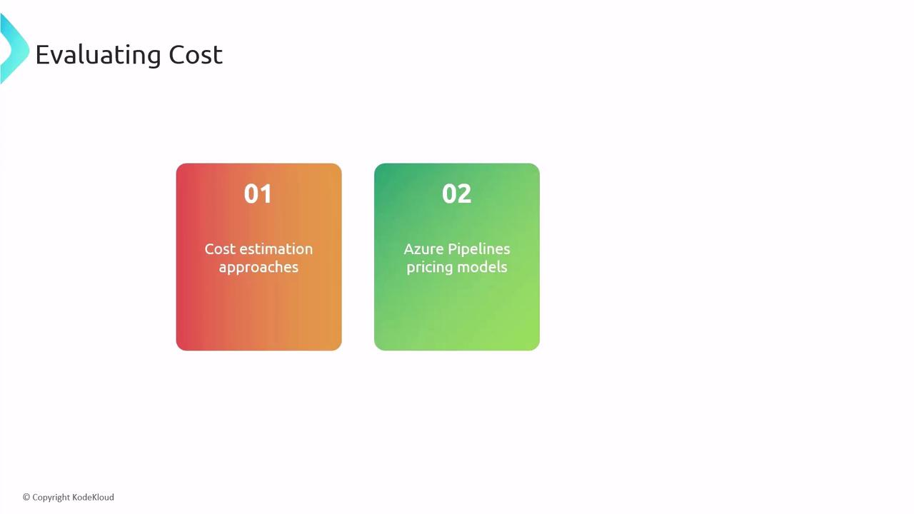
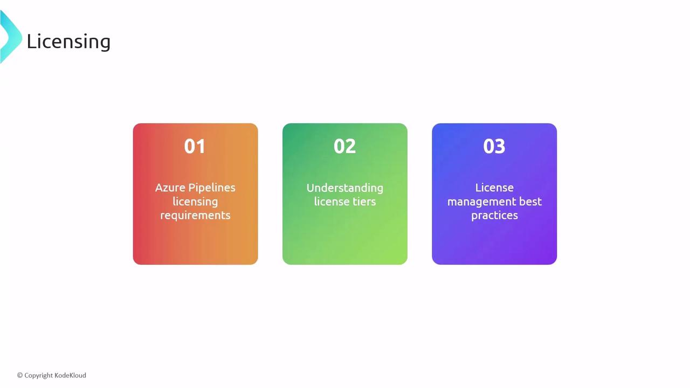
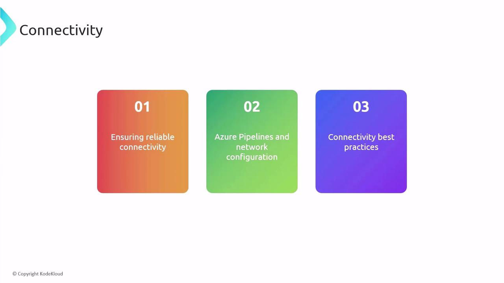
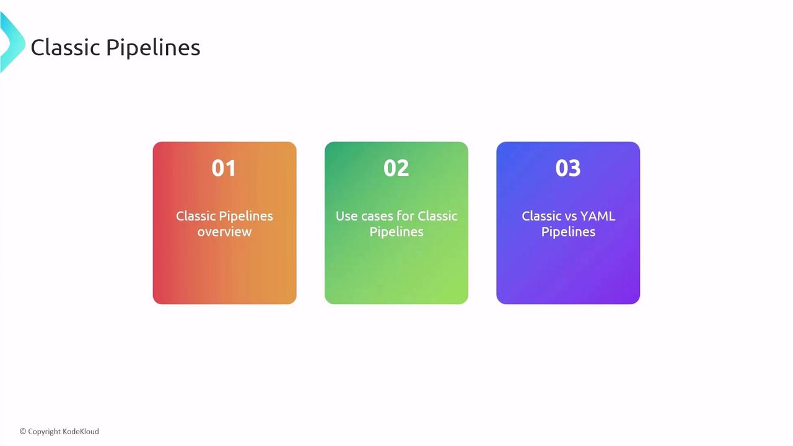
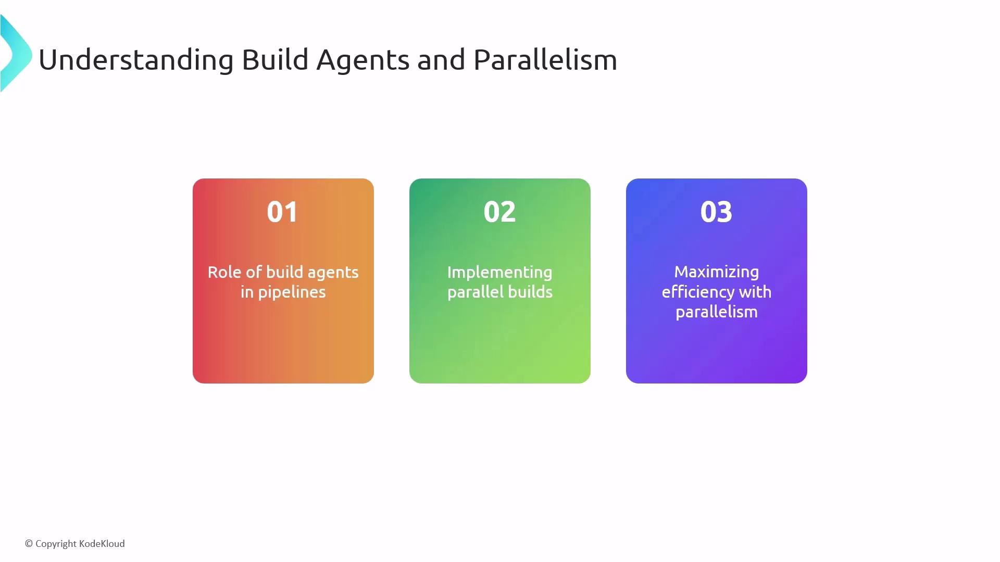

# Summary Designing and Implementing Pipelines

Source: https://notes.kodekloud.com/docs/AZ-400-Designing-and-Implementing-Microsoft-DevOps-Solutions/Design-and-Implement-Pipelines/Summary-Designing-and-Implementing-Pipelines/page

This guide covers building and releasing pipelines with Azure DevOps, focusing on best practices for CI/CD workflows to enhance delivery speed and quality.

Welcome to this comprehensive guide on building and releasing pipelines with Azure DevOps. By reinforcing best practices and key concepts, you’ll streamline your CI/CD workflows for faster delivery and higher quality.

## Azure Pipelines Overview

Azure Pipelines is a fully managed CI/CD service that automates builds, tests, and deployments. With cloud-hosted agents and support for containers, it scales to meet teams’ needs—delivering consistent results and accelerating time to market.

## Initial Pipeline Configuration

To kick off your CI/CD journey, follow these steps:

1. **Create an Azure DevOps account** and set up your project.
2. **Integrate source control** using [Git](https://git-scm.com), [GitHub](https://github.com), or [Azure Repos](https://learn.microsoft.com/azure/devops/repos/?view=azure-devops).
3. **Define your pipeline** via the Classic editor or a YAML file.

Proper setup lays the foundation for repeatable, reliable pipelines.

<Callout icon="lightbulb">
  Cache dependencies (e.g., NuGet, npm) to reduce build times and save costs.
</Callout>

## Cost Management

Azure Pipelines billing factors:

* **Concurrent jobs** – number of parallel executions
* **Agent type** – Microsoft-hosted vs. self-hosted
* **Parallelism level** – maximum simultaneous runs

Optimize costs by:

* Caching dependencies between builds
* Limiting parallel jobs to critical workflows
* Leveraging self-hosted agents for predictable workloads

<Frame>
  
</Frame>

## Tool Selection

Choose the right tools by evaluating:

| Consideration           | Details                           | Example                                     |
| ----------------------- | --------------------------------- | ------------------------------------------- |
| Project requirements    | Frameworks, languages             | .NET, Node.js, Python                       |
| Azure DevOps extensions | Marketplace integrations          | Test plans, SonarCloud, Slack notifications |
| Scalability             | Community support, plugin updates | Active GitHub repos, frequent releases      |

Align your toolchain with project goals for end-to-end visibility.

## Licensing

Azure Pipelines offers:

* **Free tier**: Ideal for open-source projects and small teams
* **Paid tiers**: Additional parallel jobs, self-hosted agents, advanced features

Best practices for license management:

* Conduct regular usage audits
* Match license counts to team size and workload
* Scale license tiers on demand to avoid over-provisioning

<Callout icon="triangle-alert">
  Exceeding free tier limits can incur unexpected charges. Monitor job usage in the Azure DevOps portal.
</Callout>

<Frame>
  
</Frame>

## Connectivity

Network reliability is crucial for pipeline triggers and service hooks:

* Use **dedicated networks** for build traffic
* Configure **firewalls** and **VNet integration** for secure access
* Monitor **latency** and **throughput** to detect bottlenecks

<Frame>
  
</Frame>

## Triggers

Pipeline triggers automate runs based on events:

| Trigger Type          | Description            | Example                              |
| --------------------- | ---------------------- | ------------------------------------ |
| Push trigger          | Launch on code commit  | `trigger: branches: include: - main` |
| PR validation trigger | Validate pull requests | `pr: branches: include: - develop`   |
| Scheduled trigger     | Run at specified times | Cron: `0 2 * * *`                    |

Fine-tune triggers with path filters and conditions to avoid unnecessary builds.

## Classic Pipelines

The Classic (GUI) editor provides a visual, drag-and-drop experience:

* Quick setup for simple workflows
* Access to built-in tasks and marketplace extensions
* Limited version control compared to YAML

Use when your team prefers a graphical interface and rapid prototyping.

<Frame>
  
</Frame>

## YAML Pipelines

Version pipelines as code for full control, reuse, and auditing:

```yaml theme={null}
trigger:
  branches:
    include:
      - main

jobs:
  - job: Build
    pool:
      vmImage: 'ubuntu-latest'
    steps:
      - script: echo "Building application..."
      - task: PublishBuildArtifacts@1
        inputs:
          pathToPublish: '$(Build.ArtifactStagingDirectory)'
```

YAML pipelines excel in complex, multi-stage deployments and infrastructure-as-code scenarios.

## Build Agents and Parallelism

Build agents execute your CI/CD jobs—choose between:

* **Microsoft-hosted agents** for out-of-the-box convenience
* **Self-hosted agents** for custom environments and compliance

Parallelism strategies:

* Configure **parallel jobs** in pipeline settings
* Use **matrix builds** for multiple OS and framework combinations
* Optimize job dependencies to reduce idle time

<Frame>
  
</Frame>

***

For more details, visit the [Azure Pipelines documentation](https://learn.microsoft.com/azure/devops/pipelines/) and explore best practices for CI/CD on the [Microsoft Learn portal](https://learn.microsoft.com/).

Thank you for following along!

<CardGroup>
  <Card title="Watch Video" icon="video" href="https://learn.kodekloud.com/user/courses/az-400/module/55cf24db-89bc-4b93-bb75-7350d1593073/lesson/50846773-4115-4629-9ac5-9037d05c8c59" />
</CardGroup>
