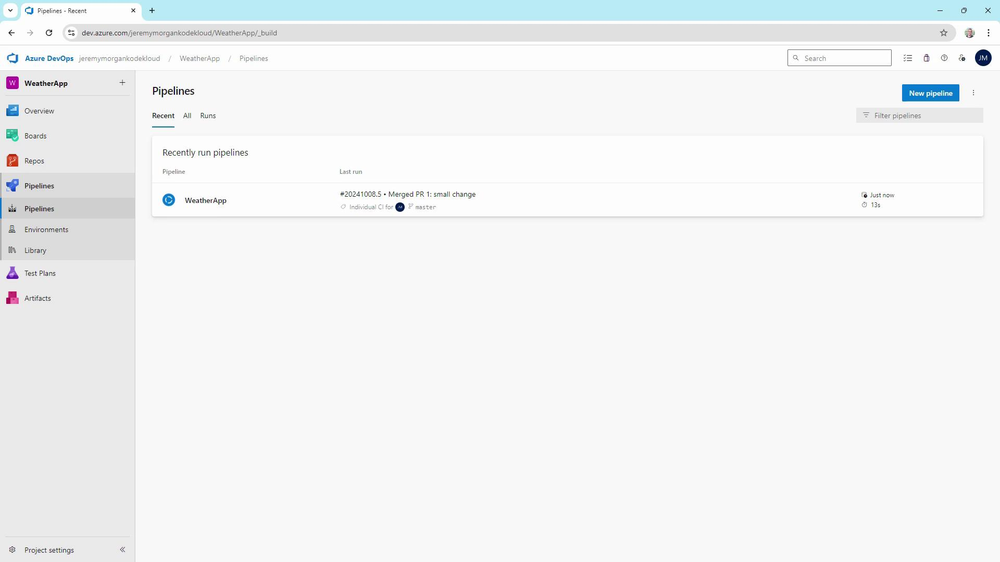
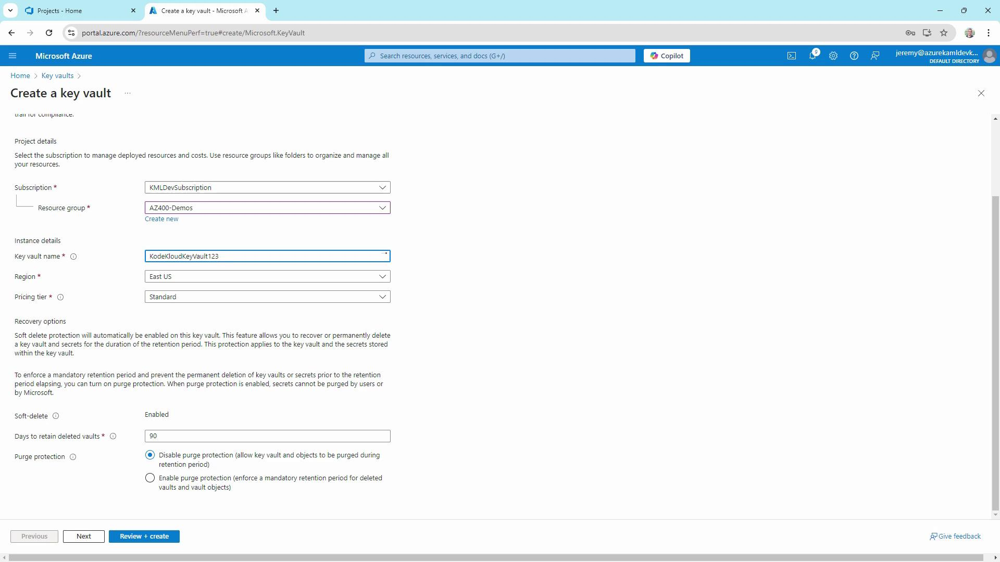
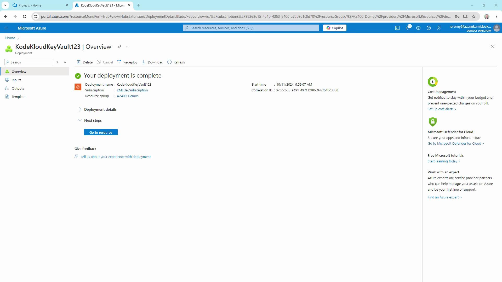
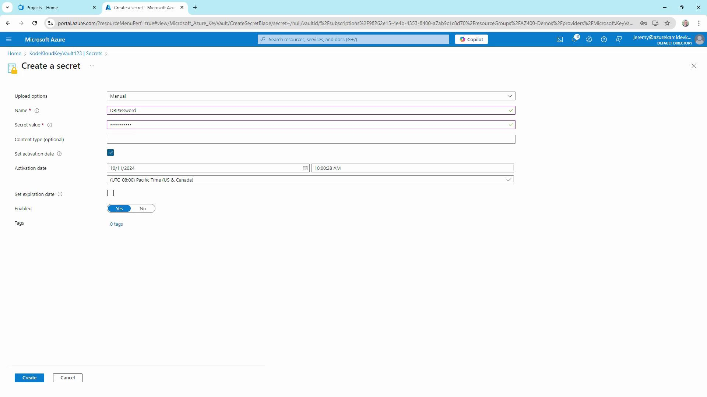
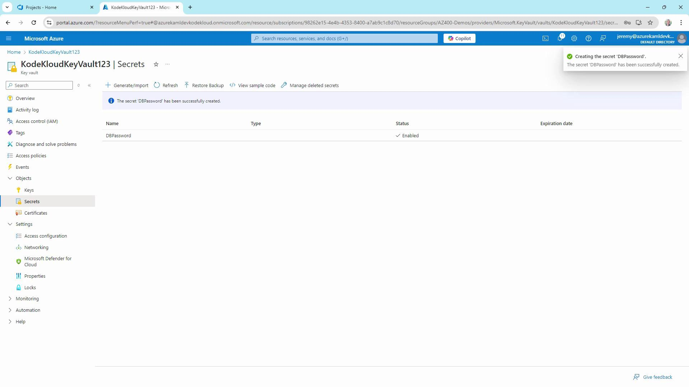

# Modify Program.cs
git add Program.cs
git commit -m "Small change in Program.cs"
git push --set-upstream origin feature/my-new-feature
```

This push invokes the CI trigger on your feature branch.

### Validating Pull Requests

When you open a PR against `master` in Azure Repos, the pipeline runs against the merged commit, ensuring no regressions slip through.

<Frame>
  
</Frame>

<Callout icon="lightbulb">
  Use PR triggers to run tests, deploy to staging, or produce artifacts **before** merging.
</Callout>

## Scheduled Triggers

Nightly or hourly builds help catch issues that arise over time:

```yaml theme={null}
schedules:
  - cron: "0 2 * * *"
    displayName: Nightly build
    branches:
      include:
        - master
    always: true
```

<Callout icon="lightbulb">
  The setting `always: true` ensures the pipeline runs regardless of code changes.
</Callout>

## Tag-Based Triggers

Create a build when you tag a release (e.g., `v1.0.0`), but only if source or test files changed:

```yaml theme={null}
trigger:
  tags:
    include:
      - 'v*'
  paths:
    include:
      - src/**
      - tests/**
```

## Pipeline Resource Triggers

Connect pipelines to build downstream artifacts automatically:

```yaml theme={null}
resources:
  pipelines:
    - pipeline: BlazorAPI
      source: BlazorAPISource
      trigger:
        branches:
          include:
            - master

trigger:
  branches:
    include:
      - master
```

This ensures your Blazor WebAssembly app always builds with the latest API changes.

## Managing YAML in Azure Repos

Maintaining `azure-pipelines.yaml` in source control provides:

* Versioned build definitions
* Easier peer review and auditing
* Consistent CI/CD behavior across environments

You can also define or override triggers via the Azure DevOps web interface, but YAML-as-code offers transparency and repeatability.

## Summary

By configuring CI, PR, scheduled, tag-based, and pipeline-resource triggers, you can:

* Accelerate feedback loops
* Enforce quality gates before merges
* Automate nightly or periodic builds
* Trigger releases on semantic version tags
* Orchestrate multi-pipeline workflows

Tailor these trigger rules to match your project’s requirements and boost your DevOps maturity.

## Links and References

* [Azure Pipelines Triggers Documentation](https://docs.microsoft.com/azure/devops/pipelines/yaml-schema/triggers)
* [Blazor WebAssembly Overview](https://docs.microsoft.com/aspnet/core/blazor/?view=aspnetcore-6.0)
* [YAML Schema for Azure Pipelines](https://docs.microsoft.com/azure/devops/pipelines/yaml-schema)
* [GitHub CI/CD with Azure Pipelines](https://docs.microsoft.com/azure/devops/pipelines/repos/github)

<CardGroup>
  <Card title="Watch Video" icon="video" href="https://learn.kodekloud.com/user/courses/az-400/module/55cf24db-89bc-4b93-bb75-7350d1593073/lesson/f0784e8b-83a5-4abc-a99e-9ab8a9575f02" />
</CardGroup>


# Exploring Azure Pipelines Secrets with Azure Key Vault

Source: https://notes.kodekloud.com/docs/AZ-400-Designing-and-Implementing-Microsoft-DevOps-Solutions/Design-and-Implement-a-Strategy-for-Managing-Sensitive-Information-in-Automation/Exploring-Azure-Pipelines-Secrets-with-Azure-Key-Vault/page

This article guides on integrating Azure Key Vault with Azure Pipelines for secure secret management in CI/CD strategies.

Secure secret management is a cornerstone of any CI/CD strategy in Azure DevOps. By integrating Azure Key Vault with Azure Pipelines, you keep credentials out of code, streamline compliance, and prepare for certification exams like AZ-400. In this guide, we’ll walk through:

* Creating an Azure Key Vault
* Adding secrets
* Configuring an Azure DevOps service connection
* Building and running a pipeline that fetches Key Vault secrets

## 1. Creating an Azure Key Vault

1. In the Azure Portal, search for **Key Vaults** and click **+ Create**.
2. Select your subscription and resource group.
3. Enter a globally unique vault name (e.g., `KodeKloudKeyVault123`).
4. Choose **East US** as the region and **Standard** pricing tier.
5. Leave **Soft delete** enabled (90-day retention) and configure **Purge protection** as needed.

<Frame>
  
</Frame>

<Callout icon="lightbulb">
  Soft delete is enabled by default to prevent accidental data loss. If you need stricter protection, enable **Purge protection**.
</Callout>

6. Click **Next** until you reach **Access policy**, choose the **Vault access policy** model for granular permissions, and grant yourself **Get**, **List**, **Create**, and **Delete** rights.
7. Review and select **Create**. After deployment, click **Go to resource**.

<Frame>
  
</Frame>

## 2. Adding a Secret

1. In your vault’s blade, select **Secrets** → **+ Generate/Import**.
2. Name the secret `DBPassword`, enter a value (e.g., `Password123`), and optionally set activation/expiration dates.
3. Click **Create** and confirm the secret appears enabled in the list.

<Frame>
  
</Frame>

<Frame>
  
</Frame>

## 3. Setting Up a Service Connection

1. In your Azure DevOps project, go to **Project Settings** → **Pipelines** → **Service Connections**.
2. Click **New service connection** → **Azure Resource Manager**.
3. Select **Service Principal (automatic)**, choose your subscription and resource group (e.g., `AZ-400-DevOps`), then name it `KodeKloud Key Vault Connection`.
4. Enable **Grant access permission to all pipelines** and save.

<Callout icon="triangle-alert">
  Make sure this service principal has **Get** and **List** permissions on your Key Vault. Otherwise, Azure Pipelines won’t be able to fetch secrets.
</Callout>

## 4. Creating a Starter Pipeline

Under **Pipelines**, click **New pipeline** and use a starter template. Set the trigger to `none` for manual execution, then run it to verify the build agent.

```yaml theme={null}
