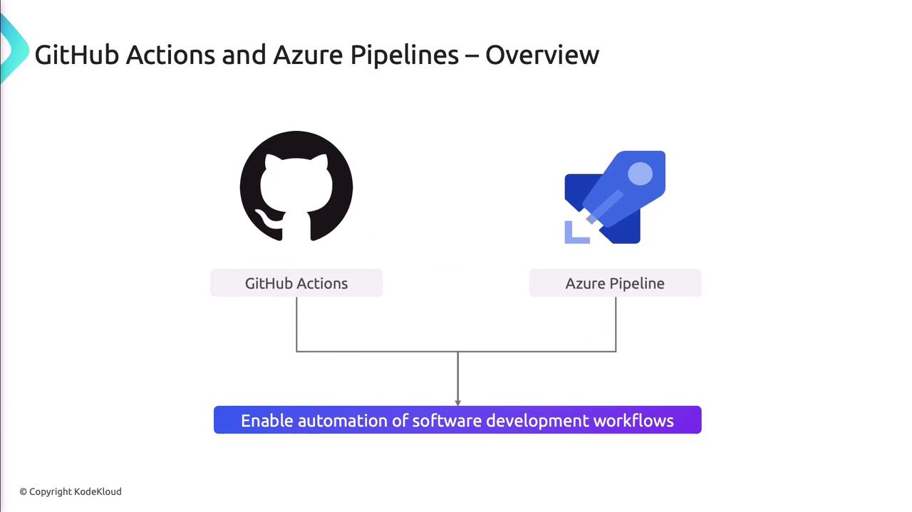
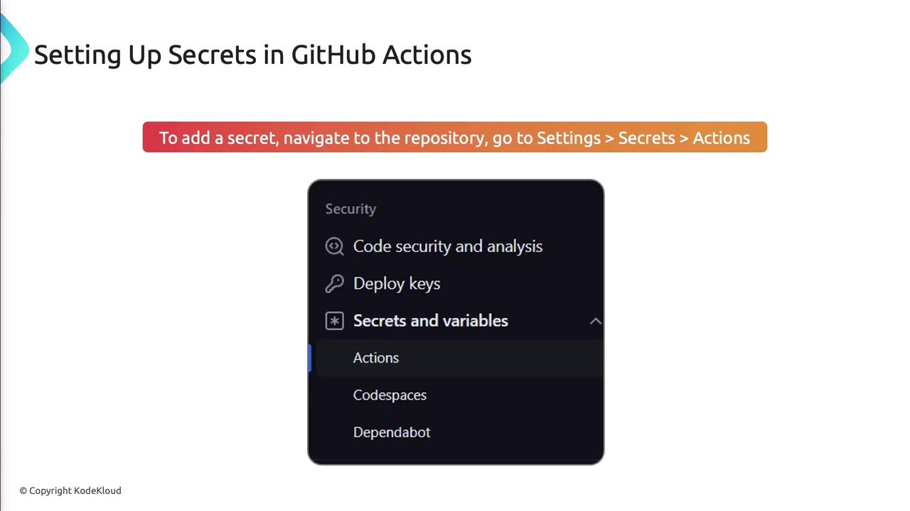
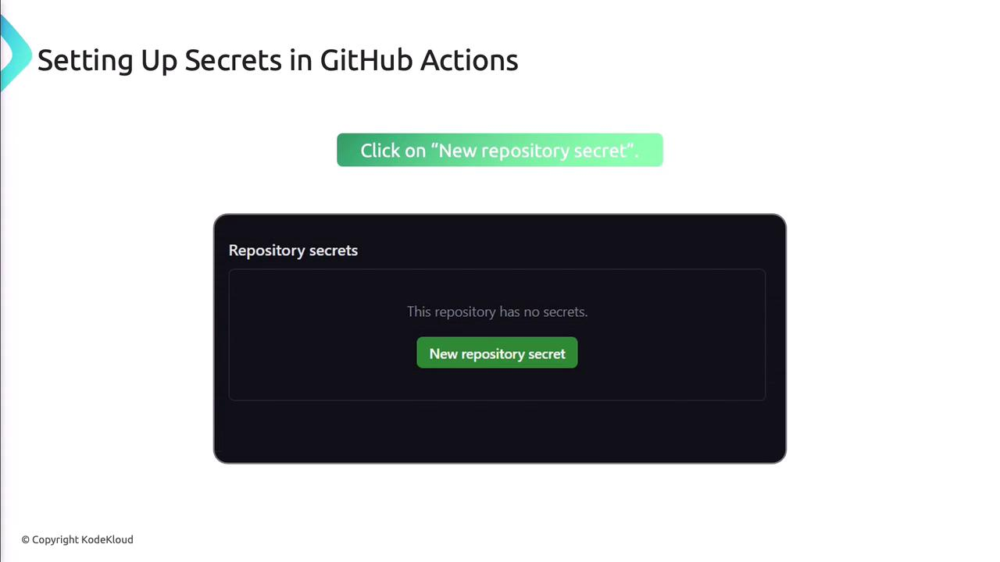

# Implement and manage secrets in GitHub Actions and Azure Pipelines

Source: https://notes.kodekloud.com/docs/AZ-400-Designing-and-Implementing-Microsoft-DevOps-Solutions/Design-and-Implement-a-Strategy-for-Managing-Sensitive-Information-in-Automation/Implement-and-manage-secrets-in-GitHub-Actions-and-Azure-Pipelines/page

This article covers secure storage, access, and best practices for managing secrets in GitHub Actions and Azure Pipelines.

Secrets—like API keys, passwords, and tokens—are critical for accessing protected resources in your CI/CD pipelines. Mishandling these credentials can expose your infrastructure to unauthorized access and data breaches. This article covers secure storage, access, and best practices for secrets in GitHub Actions and Azure Pipelines, plus integration with Azure Key Vault.


Both GitHub Actions and Azure Pipelines provide built-in secret management to keep sensitive data out of your code and logs.



## Secrets Management Comparison

| Feature                    | GitHub Actions                             | Azure Pipelines                       |
| -------------------------- | ------------------------------------------ | ------------------------------------- |
| Storage Location           | Repository > Settings > Secrets            | Pipeline Variables (Secret-enabled)   |
| Syntax in Workflow         | `${{ secrets.SECRET_NAME }}`               | `$(VARIABLE_NAME)`                    |
| Integration with Key Vault | Via Actions (e.g., azure/keyvault-secrets) | `UseKeyVault@1` task                  |
| Secret Rotation            | Manual/API                                 | Manual/API or automated via Key Vault |

## Managing Secrets in GitHub Actions

Store secrets in your repo settings:

1. Go to **Settings** > **Secrets** > **Actions** in your repository.
2. Click **New repository secret**.
3. Enter a descriptive name and the secret value.
4. Save.



Access secrets in workflows:

> **triangle-alert** Never print secrets in plain text. Always reference them using `${{ secrets.NAME }}` to keep them masked in logs.



```yaml theme={null}
