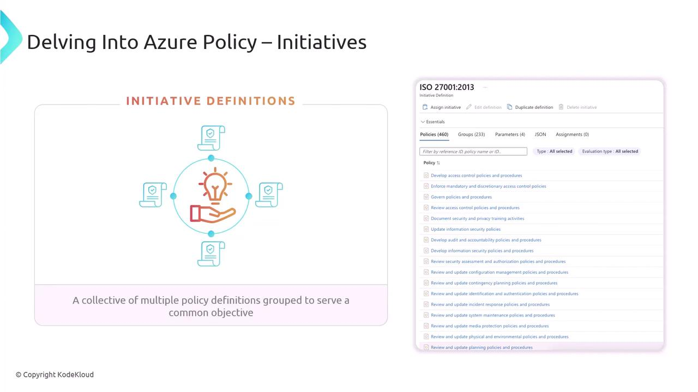
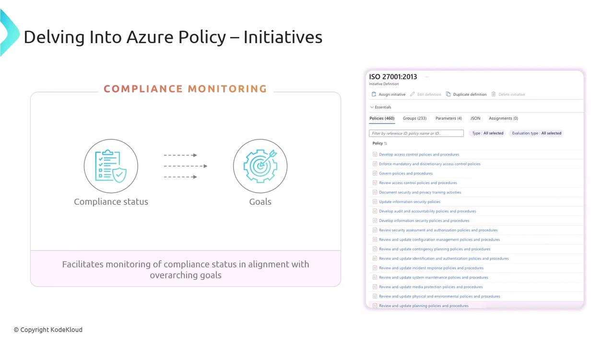
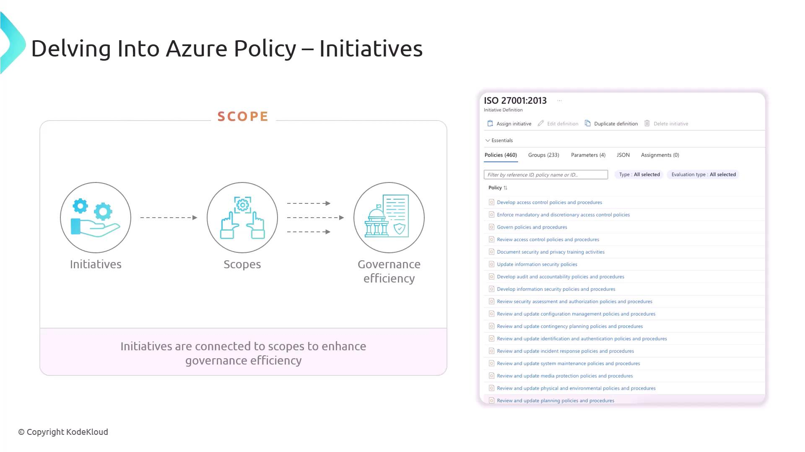
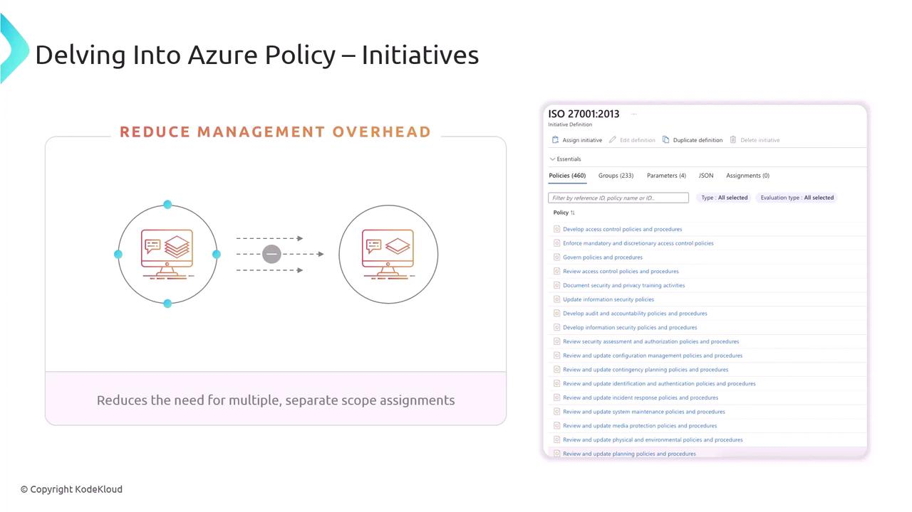

# Delving into Azure Policy

Source: https://notes.kodekloud.com/docs/AZ-400-Designing-and-Implementing-Microsoft-DevOps-Solutions/Implement-Security-and-Validate-Code-Bases-for-Compliance/Delving-into-Azure-Policy/page

Azure Policy helps enforce standards, assess compliance, and remediate drift in cloud environments for governance and security.

Azure Policy is a core pillar of Azure governance that helps you enforce standards, assess compliance, and remediate drift across your cloud environment. Whether you’re preparing for the [AZ-400 exam](https://learn.microsoft.com/en-us/certifications/exams/az-400/) or architecting a production workload, mastering Azure Policy ensures consistent, automated enforcement of your organizational requirements.

## Key Features of Azure Policy

| Feature               | Description                                                                   | Example                                               |
| --------------------- | ----------------------------------------------------------------------------- | ----------------------------------------------------- |
| Policy Enforcement    | Apply rules at scale to enforce resource configuration and naming conventions | Deny public IPs on virtual machines                   |
| Compliance Assessment | Continuously scan resources and generate compliance reports                   | Audit VMs without Azure Security Center extensions    |
| Policy Library        | Browse built-in definitions and initiative templates                          | ISO 27001:2013 initiative template                    |
| DevOps Integration    | Embed policies in CI/CD pipelines using Azure DevOps or GitHub Actions        | Enforce tagging policy during ARM template deployment |

<Callout icon="lightbulb">
  Use the Policy Library to accelerate adoption—start with Microsoft-managed definitions and customize parameters as needed.
</Callout>

***

## Policy Definitions

A **policy definition** declares the conditions to evaluate (`if` block) and the action to take (`then` block). Definitions are expressed in JSON, making them easy to version and review.

### Basic Policy Definition

```json theme={null}
{
  "policyRule": {
    "$schema": "http://schema.management.azure.com/schemas/2019-09-01/policyDefinition.json#",
    "if": {
      "allOf": [
        {
          "field": "type",
          "in": "[parameters('listOfResourceTypesNotAllowed')]"
        }
      ]
    },
    "then": {
      "effect": "[parameters('effect')]"
    }
  },
  "parameters": {
    "listOfResourceTypesNotAllowed": {
      "type": "Array",
      "metadata": {
        "description": "Resource types to block",
        "displayName": "Not allowed resource types"
      }
    },
    "effect": {
      "type": "String",
      "allowedValues": [ "Deny", "Audit", "Disabled" ],
      "defaultValue": "Deny",
      "metadata": {
        "description": "Policy enforcement action",
        "displayName": "Effect"
      }
    }
  },
  "version": "1.0.0"
}
```

* **`if` block**\
  Defines the condition to evaluate on resource properties.
* **`then` block**\
  Specifies the enforcement action (e.g., *Deny*, *Audit*, *Disabled*).
* **`parameters`**\
  Allow you to customize values at assignment time without editing the definition.

<Callout icon="lightbulb">
  Always reference the latest schema URL to leverage new capabilities and metadata fields.
</Callout>

***

## Compliance Remediation

Azure Policy can automatically remediate non-compliant resources. The following rule adds an existence check before enforcing the effect:

```json theme={null}
{
  "policyRule": {
    "$schema": "http://schema.management.azure.com/schemas/2019-09-01/policyDefinition.json#",
    "if": {
      "allOf": [
        {
          "field": "type",
          "in": "[parameters('listOfResourceTypesNotAllowed')]"
        },
        {
          "field": "type",
          "exists": true
        }
      ]
    },
    "then": {
      "effect": "[parameters('effect')]"
    }
  },
  "parameters": {
    "listOfResourceTypesNotAllowed": {
      "type": "Array"
    },
    "effect": {
      "type": "String"
    }
  },
  "version": "2.0.0"
}
```

This enhanced rule ensures that drifted resources are detected and remediated only when they indeed exist.

***

## Policy Assignment

You can scope policy assignments at the management group, subscription, or resource group level. Use the Azure Portal, Azure CLI, or Azure PowerShell:

| Scope            | Azure CLI                                                                                  | PowerShell                                                                                                               |
| ---------------- | ------------------------------------------------------------------------------------------ | ------------------------------------------------------------------------------------------------------------------------ |
| Management Group | `az policy assignment create --name TAG_RG --mg mtg1 --policy ...`                         | `New-AzPolicyAssignment -Name TAG_RG -Scope /providers/Microsoft.Management/managementGroups/mtg1 -PolicyDefinition ...` |
| Subscription     | `az policy assignment create --name SEC_AUDIT --scope /subscriptions/{subId} --policy ...` | `New-AzPolicyAssignment -Name SEC_AUDIT -Scope /subscriptions/{subId} -PolicyDefinition ...`                             |
| Resource Group   | `az policy assignment create --name TAG_VM --resource-group rg1 --policy ...`              | `New-AzPolicyAssignment -Name TAG_VM -Scope /subscriptions/{subId}/resourceGroups/rg1 -PolicyDefinition ...`             |

<Callout icon="triangle-alert">
  Be careful when assigning **Deny** policies at high-level scopes to avoid unintended disruptions in your production environment.
</Callout>

***

## Azure Policy Initiatives

An **initiative** (also called a policy set) bundles multiple policy definitions to achieve a broader compliance objective—such as ISO 27001:2013 or PCI DSS. Initiatives simplify management by grouping related policies and tracking their combined compliance status.

<Frame>
  
</Frame>

<Frame>
  
</Frame>

<Frame>
  
</Frame>

<Frame>
  
</Frame>

***

## Next Steps and References

Mastering Azure Policy definitions, assignments, remediation, and initiatives is key to enforcing governance at scale and maintaining compliance. Dive deeper with these resources:

* [Azure Policy Documentation](https://learn.microsoft.com/azure/governance/policy/)
* [Azure Governance Overview](https://learn.microsoft.com/azure/governance/)
* [AZ-400 Exam Details](https://learn.microsoft.com/en-us/certifications/exams/az-400/)

By embedding Azure Policy into your DevOps pipelines and resource lifecycles, you’ll ensure a secure, compliant, and well-managed Azure environment.

<CardGroup>
  <Card title="Watch Video" icon="video" href="https://learn.kodekloud.com/user/courses/az-400/module/1bd9c8cc-efae-414c-b4be-838e767634f6/lesson/8225c50d-69f8-4eca-9664-9cadfa1a6340" />
</CardGroup>
