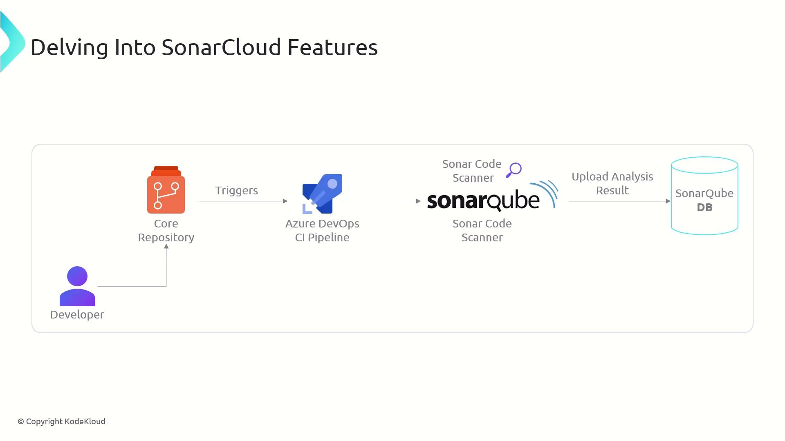
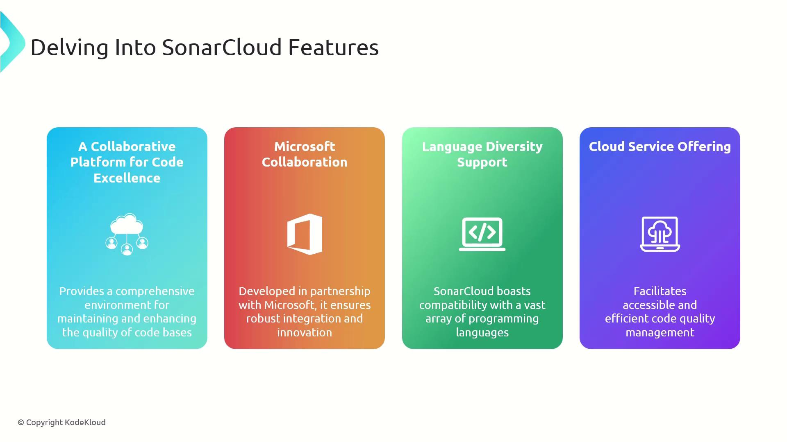

# Create a Cannot Delete lock via Azure CLI
az lock create \
  --name BlockDeletion \
  --lock-type CanNotDelete \
  --resource-group MyResourceGroup \
  --resource-name MyVM \
  --resource-type Microsoft.Compute/virtualMachines
```

> **lightbulb** Apply locks at the highest possible scope (subscription or resource group) to cover all child resources automatically.

### Read Only Lock

The **Read Only** lock restricts a resource to read-only mode:

* Only **GET** operations are permitted.
* All **PUT**, **PATCH**, **POST**, and **DELETE** actions are blocked.

This lock is ideal for archival assets or environments where changes must be fully prohibited.

```bash theme={null}
# Create a Read Only lock via Azure CLI
az lock create \
  --name ViewOnly \
  --lock-type ReadOnly \
  --resource-group MyResourceGroup
```

> **triangle-alert** Applying a Read Only lock will prevent even administrative updates. Always verify you won’t need to modify the resource before locking.

## Managing Locks in Azure

You can manage locks in multiple ways:

| Method           | Command / Action                                                |
| ---------------- | --------------------------------------------------------------- |
| Azure Portal     | Navigate to **Resource > Locks** and **Add** new lock           |
| Azure CLI        | `az lock create` / `az lock delete`                             |
| Azure PowerShell | `New-AzResourceLock` / `Remove-AzResourceLock`                  |
| ARM Template     | Use `"Microsoft.Authorization/locks"` under `resources` in JSON |

### Sample ARM Template Snippet

```json theme={null}
{
  "$schema": "https://schema.management.azure.com/schemas/2019-04-01/deploymentTemplate.json#",
  "resources": [
    {
      "type": "Microsoft.Authorization/locks",
      "apiVersion": "2016-09-01",
      "name": "BlockDeletion",
      "properties": {
        "level": "CanNotDelete",
        "notes": "Prevent accidental deletion"
      }
    }
  ]
}
```

## Integration with RBAC and Governance

Resource locks complement Azure Role-Based Access Control (RBAC) and policies:

* **RBAC** defines *who* can perform operations.
* **Locks** define *which* operations are blocked, regardless of RBAC rights.
* Combine both for granular governance across subscriptions.

### Key Points

* Locks are inherited by child resources.
* You need **Microsoft.Authorization/locks/delete** permission to remove a lock.
* Policy-based locks can enforce organizational standards at scale.

## Exam and Real-World Scenarios

For the AZ-400 certification and practical deployments, be prepared to:

* Differentiate between **Cannot Delete** and **Read Only** locks.
* Choose the appropriate lock type based on business requirements.
* Explain how locks interact with RBAC roles and Azure Policy.

Master resource locks to safeguard your Azure workloads and ensure uninterrupted operations.

***

## Links and References

* [Azure Role-Based Access Control (RBAC)](https://learn.microsoft.com/en-us/azure/role-based-access-control/)
* [AZ-400: Designing and Implementing Microsoft DevOps Solutions](https://learn.microsoft.com/en-us/certifications/exams/az-400/)
* [Azure CLI Lock Documentation](https://learn.microsoft.com/en-us/cli/azure/lock)

- [Watch Video](https://learn.kodekloud.com/user/courses/az-400/module/1bd9c8cc-efae-414c-b4be-838e767634f6/lesson/492d6353-2ae8-4308-8311-07d0a709632b)


# Exploring SonarCloud Features

Source: https://notes.kodekloud.com/docs/AZ-400-Designing-and-Implementing-Microsoft-DevOps-Solutions/Implement-Security-and-Validate-Code-Bases-for-Compliance/Exploring-SonarCloud-Features/page

SonarCloud empowers teams to monitor and improve code quality through automated analysis integrated into CI/CD pipelines, providing real-time feedback on issues.

SonarCloud empowers development teams to continuously monitor and improve code quality by integrating automated analysis into your existing CI/CD pipeline. With real-time feedback on bugs, vulnerabilities, and code smells, you can enforce quality gates on every build without disrupting your workflow.

## SonarCloud in Your CI/CD Workflow

1. Developers commit and push code to an Azure Repos Git repository.
2. An Azure Pipelines build triggers the SonarCloud Scanner during the CI stage.
3. The Scanner analyzes source code and uploads metrics to SonarCloud.
4. SonarCloud’s dashboard visualizes issues, coverage, duplication, and technical debt.
5. Feedback loops back into Azure DevOps work items and Pull Requests for quick triage.



This end-to-end integration ensures every merge respects your quality standards and keeps your codebase healthy.

> **lightbulb** Enable **Pull Request Decoration** in SonarCloud to surface quality issues directly inside Azure DevOps PRs, speeding up reviews.

## Key SonarCloud Features

SonarCloud offers a comprehensive suite of tools designed to maintain high code standards across teams and languages:

| Feature                              | Benefit                                                | Details                                                                       |
| ------------------------------------ | ------------------------------------------------------ | ----------------------------------------------------------------------------- |
| Collaborative Code Quality Dashboard | Unified view of bugs, vulnerabilities, and code smells | Teams can assign, track, and resolve issues together in one central platform. |
| Native Azure DevOps Integration      | One-click setup with Repos, Pipelines, and Boards      | Leverages Azure AD for authentication and syncs issues to Azure Boards.       |
| Broad Language Support               | Analyze 30+ languages in a single service              | Includes Java, C#, JavaScript, Python, Go, and more with consistent rules.    |
| Fully-Managed Cloud Service          | Zero infrastructure overhead                           | Automatic scaling, upgrades, and high availability handled by SonarCloud.     |



These capabilities make SonarCloud a powerful choice for teams seeking continuous code quality, security, and transparency.

## Links and References

* [SonarCloud Documentation](https://sonarcloud.io/documentation)
* [Azure DevOps Services](https://azure.microsoft.com/services/devops/)
* [CI/CD Best Practices on Azure](https://docs.microsoft.com/azure/devops/guide/what-is-cicd)

- [Watch Video](https://learn.kodekloud.com/user/courses/az-400/module/1bd9c8cc-efae-414c-b4be-838e767634f6/lesson/c8f9d646-2ad9-4d10-97d5-7207b76a40ca)
