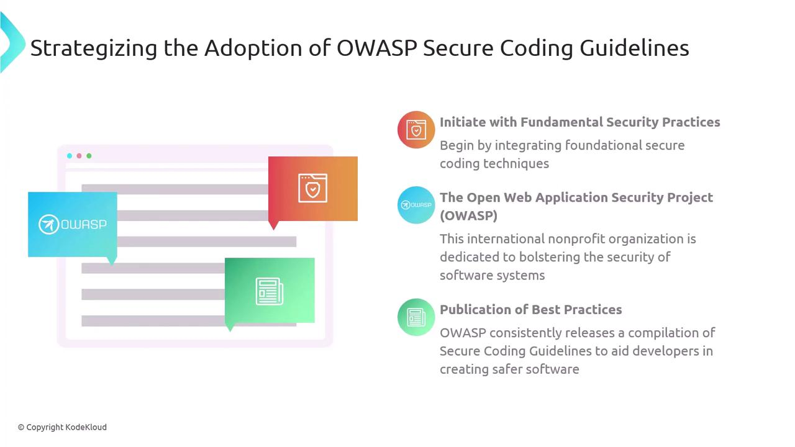

# Strategizing the Adoption of OWASP Secure Coding Guidelines

Source: https://notes.kodekloud.com/docs/AZ-400-Designing-and-Implementing-Microsoft-DevOps-Solutions/Implement-Security-and-Validate-Code-Bases-for-Compliance/Strategizing-the-Adoption-of-OWASP-Secure-Coding-Guidelines/page

This lesson discusses integrating OWASP Secure Coding Guidelines to enhance application security against common threats and vulnerabilities.

In this lesson, we will discuss how to integrate OWASP Secure Coding Guidelines effectively to strengthen your application against common threats and vulnerabilities.

## What Is OWASP?

[OWASP (Open Web Application Security Project)][2] is a global non-profit organization focused on enhancing software security. It offers a wealth of resources—from vulnerability research to developer training—that help teams build and maintain secure applications.

## Core Secure Coding Practices

OWASP’s [Secure Coding Guidelines][1] outline essential techniques that every development team should adopt. Start with these foundational controls:

| Practice                            | Description                                                                         | Example                                                                     |
| ----------------------------------- | ----------------------------------------------------------------------------------- | --------------------------------------------------------------------------- |
| Input Validation                    | Ensure all user inputs are sanitized and validated to prevent injection attacks.    | `filter_var($_POST['email'], FILTER_VALIDATE_EMAIL)`                        |
| Error Handling                      | Log errors securely and avoid exposing stack traces or sensitive data to end users. | Use custom error pages and server-side logging.                             |
| Authentication & Session Management | Implement strong authentication mechanisms and protect session tokens.              | Store passwords with `bcrypt` via `password_hash()` and use secure cookies. |

<Callout icon="lightbulb">
  Begin by embedding these core practices in new features. As your team gains proficiency, introduce more advanced OWASP recommendations—such as threat modeling and secure configuration management.
</Callout>

## Phased Adoption Strategy

1. **Foundation**: Integrate input validation, error handling, and authentication controls into your CI/CD pipeline.
2. **Scaling**: Enforce secure code reviews, adopt static application security testing (SAST), and configure automated dependency checks.
3. **Advanced**: Incorporate threat modeling, dynamic application security testing (DAST), and regular penetration tests.

<Callout icon="triangle-alert">
  Never rely solely on client-side validation. Always validate inputs on the server to defend against bypass and tampering.
</Callout>

## Continuous Improvement

Security is an ongoing process. To keep pace with evolving threats:

* Revisit and update your secure coding policies quarterly.
* Provide regular security training and capture lessons learned after incidents.
* Monitor threat intelligence feeds and OWASP updates for emerging vulnerabilities.

By iterating on these practices, your applications will remain resilient against new attack vectors.

<Frame>
  
</Frame>

## References

* [OWASP Secure Coding Guidelines][1]
* [OWASP Website][2]

[1]: https://owasp.org/www-project-secure-coding-practices/

[2]: https://owasp.org/

<CardGroup>
  <Card title="Watch Video" icon="video" href="https://learn.kodekloud.com/user/courses/az-400/module/1bd9c8cc-efae-414c-b4be-838e767634f6/lesson/396411c0-9533-4e6d-a821-909f5099b3e6" />
</CardGroup>
