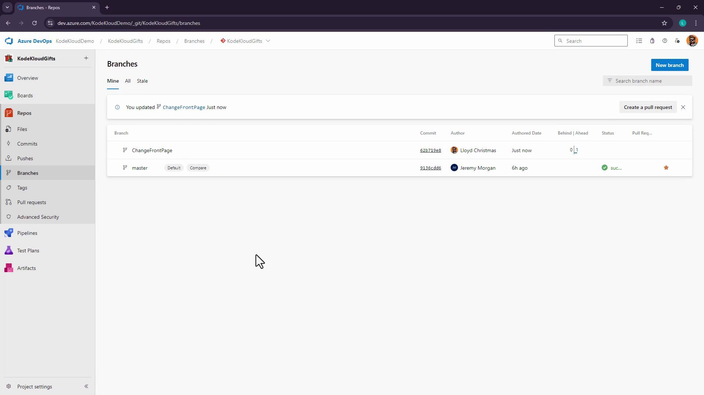
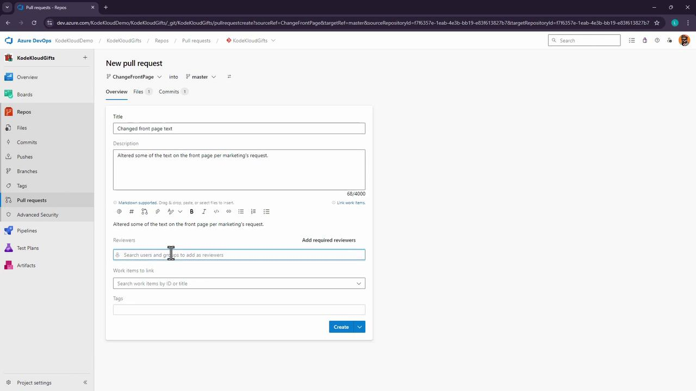
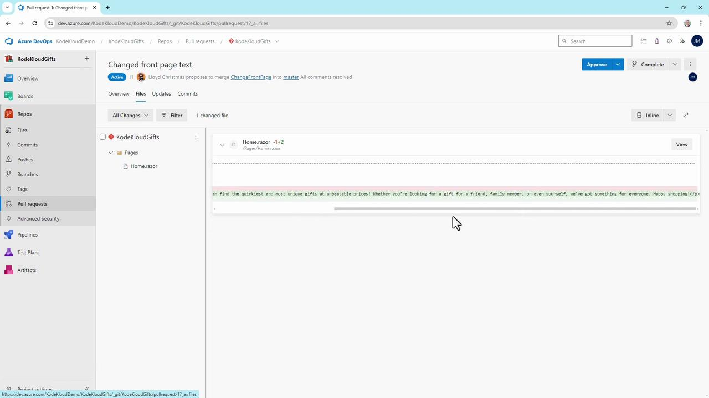
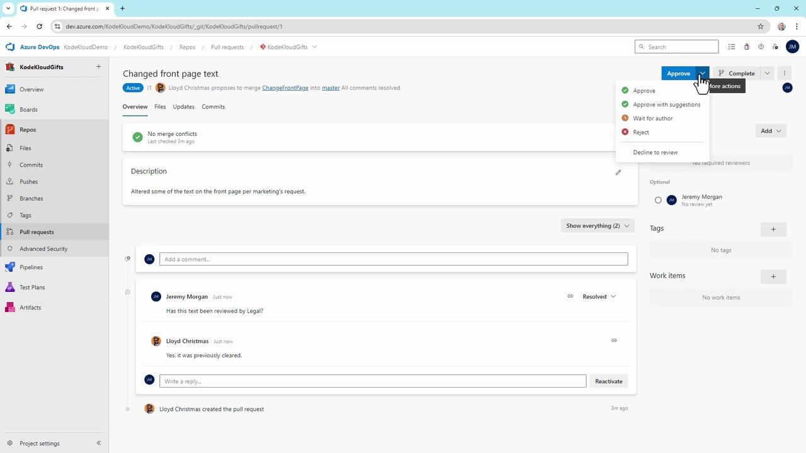
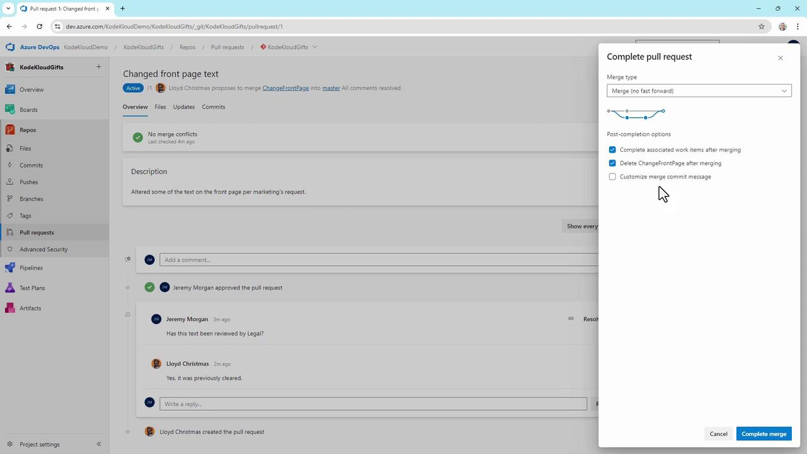

# Azure Repos collaborating with pull requests

Source: https://notes.kodekloud.com/docs/AZ-400-Designing-and-Implementing-Microsoft-DevOps-Solutions/Branching-Strategies-for-Source-Code/Azure-Repos-collaborating-with-pull-requests/page

Learn to streamline code collaboration using Azure Repos pull requests, covering feature branches, code reviews, and merging strategies.

Streamline your team’s code collaboration with Azure Repos pull requests. In this guide, you’ll learn how to:

* Create a feature branch
* Push changes
* Open a pull request
* Review code
* Complete the merge

Whether you’re preparing for AZ-400 certification labs or improving your CI/CD workflow, this end-to-end pull request process will keep your repository clean and your team in sync.

***

## 1. Create a Feature Branch and Push Changes

Start by branching off **master** so your changes remain isolated.

```bash theme={null}
cd ~/mnt/c/Users/jeremy/Projects/KodeKloudGifts
git checkout -b ChangeFrontPage     # Create a feature branch
```

Open `Pages/Home.razor` in your editor and update the marketing copy:

```razor theme={null}
@page "/"

<PageTitle>Home</PageTitle>

<h1>Kode Kloud Gift Shop</h1>
<p>
  Welcome to the Kode Kloud Gift Shop, 
  where you can find the quirkiest and most unique gifts 
  at unbeatable prices! Whether you’re looking for a gift 
  for a friend, family member, or yourself, we’ve got you covered.
</p>
```

Stage, commit, and push your branch to Azure Repos:

```bash theme={null}
git add Pages/Home.razor
git commit -m "Update front page marketing text"
git push -u origin ChangeFrontPage
```

<Callout icon="lightbulb">
  If you don’t see the new branch right away, have your collaborator refresh the **Branches** view.
</Callout>

<Frame>
  
</Frame>

***

## 2. Open a Pull Request

Now that your feature branch is pushed, initiate a pull request (PR) to merge into **master**:

1. Navigate to **Repos > Pull requests > New pull request**.
2. Set **Source** to `ChangeFrontPage` and **Target** to `master`.
3. Add a descriptive title, e.g., *Change front page text*, and a clear description.
4. Assign **Jeremy Morgan** (or the appropriate reviewer).
5. Click **Create** to open the PR.

<Frame>
  
</Frame>

***

## 3. Review and Complete the Pull Request

### 3.1 Review Code Changes

As a reviewer, check for:

* Correct **source → target**
* No merge conflicts
* Clean diffs and concise commit messages

Leave comments or questions inline:

> **Jeremy**: Has this text been approved by legal?
>
> **Lloyd**: Yes, it’s already been cleared.\
> *(Mark as resolved)*

Inspect the diff for `Home.razor`:

<Frame>
  
</Frame>

### 3.2 Choose a Review Outcome

Azure DevOps supports multiple review decisions:

* Approve (with or without suggestions)
* Wait for author
* Reject
* Abandon

<Frame>
  
</Frame>

### 3.3 Merge Settings and Strategies

Once approved, click **Complete** and pick a merge strategy:

| Strategy                | Description                                    |
| ----------------------- | ---------------------------------------------- |
| Merge (no fast-forward) | Preserve all commits in a merge commit         |
| Squash commit           | Combine changes into a single commit           |
| Rebase and fast-forward | Apply commits directly on `master`             |
| Semi-linear merge       | Rebase then merge, preserving a linear history |

You can also:

* Edit the merge commit message
* Complete linked work items
* Delete the source branch automatically

<Callout icon="triangle-alert">
  Deleting the feature branch is irreversible. Ensure you won’t need any additional changes before confirming.
</Callout>

<Frame>
  
</Frame>

***

## Result and Next Steps

After merging:

* **master** now includes your updated `Home.razor`.
* Any branch policies (build, test, deploy) on **master** trigger automatically.
* Your team can continue developing new features without conflicts.

This pull request workflow is central to scalable DevOps practices in Azure Repos and is a key skill for the AZ-400 exam.

## Links and References

* [Azure Repos Pull Requests](https://docs.microsoft.com/azure/devops/repos/git/pull-requests)
* [Branch Policies in Azure DevOps](https://docs.microsoft.com/azure/devops/repos/git/branch-policies)
* [AZ-400 Certification Guide](https://docs.microsoft.com/learn/certifications/exams/az-400)

<CardGroup>
  <Card title="Watch Video" icon="video" href="https://learn.kodekloud.com/user/courses/az-400/module/8e033a7f-4740-4d37-9f97-54ebc9c54fd1/lesson/299530b5-4557-4c78-a3f9-e5ba6d9d08ef" />
</CardGroup>
