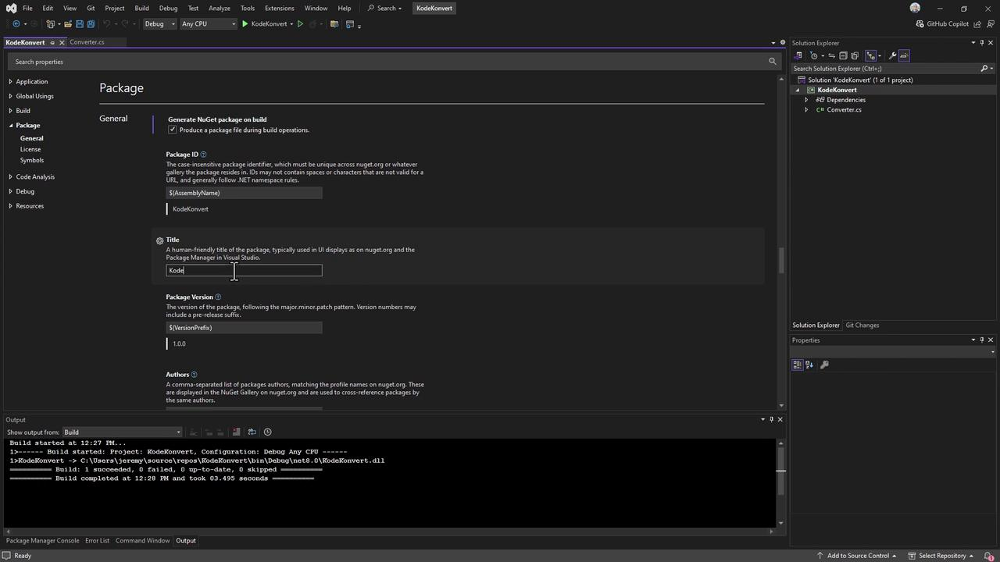
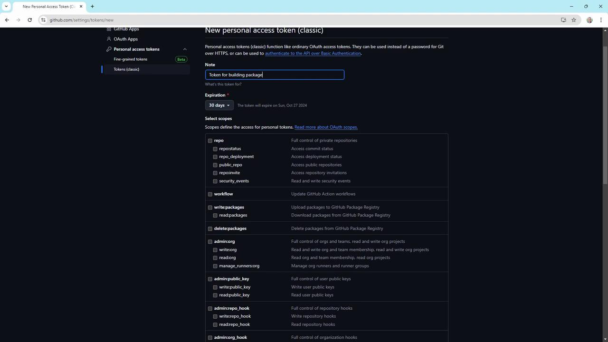
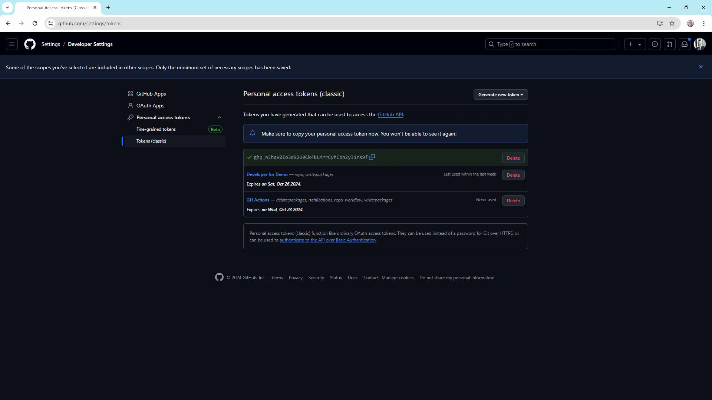
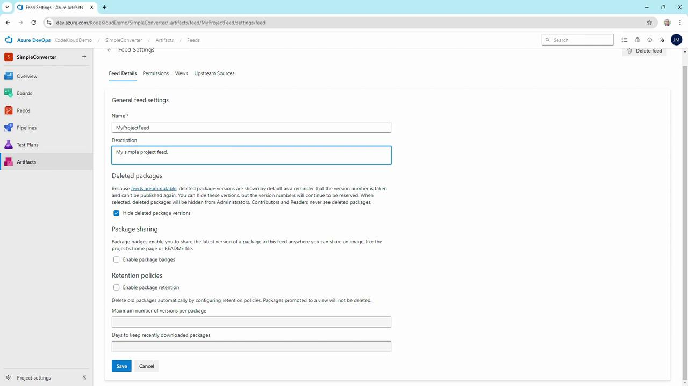
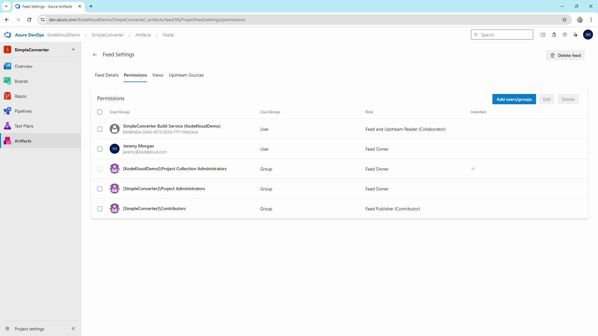
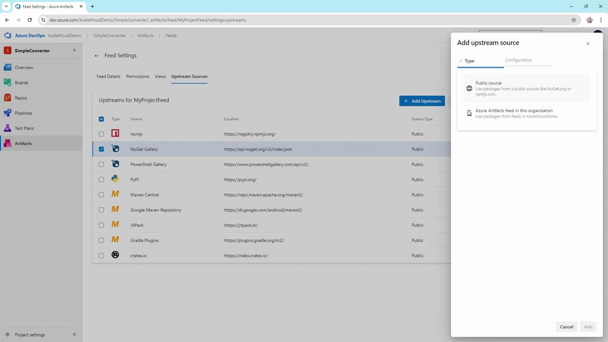
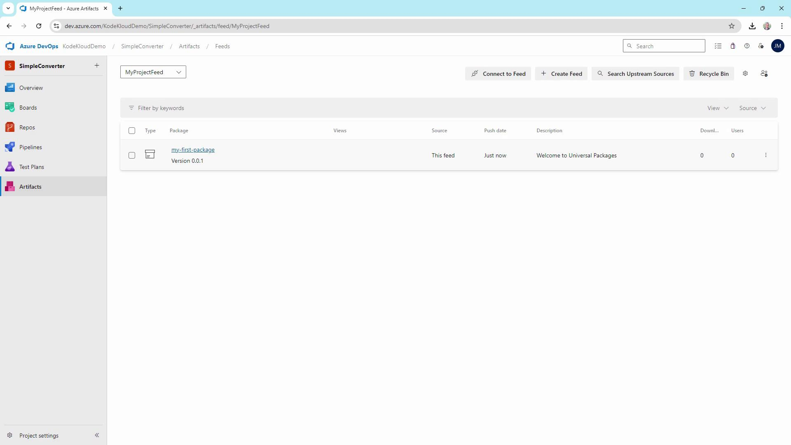

# success: 1 succeeded
```

***

## 2. Configure NuGet Package Metadata

In **Solution Explorer**, right-click **KodeKonvert** → **Properties** → **Package**. Set the following values:

| Property                        | Value                                 |
| ------------------------------- | ------------------------------------- |
| Package ID                      | KodeKonvert                           |
| Version                         | 1.0.0                                 |
| Authors                         | KodeKloud                             |
| Description                     | Simple library to convert temperature |
| Generate NuGet package on build | ✔ Enabled                             |

<Frame>
  
</Frame>

Save and close the Properties pane.

***

## 3. Build and Pack the Library

From your terminal:

```bash theme={null}
dotnet build --configuration Release
dotnet pack --configuration Release
```

You should see:

```bash theme={null}
Successfully created package "bin/Release/KodeKonvert.1.0.0.nupkg".
```

Remember the full path to the generated `.nupkg` file for later steps.

***

## 4. Generate a GitHub Personal Access Token

1. In GitHub, navigate to **Settings > Developer settings > Personal access tokens**.
2. Click **Generate new token** (classic or fine-grained).
3. Assign minimal scopes:
   * `read:packages`
   * `write:packages`
   * `repo` (only if you publish from a private repo)
4. Copy the token **once** when presented.

<Callout icon="lightbulb">
  Store your PAT securely; you’ll need it to authenticate your NuGet source and to push packages.
</Callout>

<Frame>
  
</Frame>

***

## 5. Register GitHub Packages as a NuGet Source

Add the GitHub Packages feed to your NuGet configuration:

```bash theme={null}
dotnet nuget add source \
  --username YOUR_GITHUB_USERNAME \
  --password YOUR_PERSONAL_ACCESS_TOKEN \
  --store-password-in-clear-text \
  --name github \
  https://nuget.pkg.github.com/YOUR_GITHUB_USERNAME/index.json
```

<Callout icon="triangle-alert">
  Using `--store-password-in-clear-text` will save your PAT in plain text. Ensure your machine is secure.
</Callout>

Verify the source:

```bash theme={null}
dotnet nuget list source
```

***

## 6. Publish the Package

Push the `.nupkg` to your GitHub Packages feed:

```bash theme={null}
dotnet nuget push bin/Release/KodeKonvert.1.0.0.nupkg \
  --source github \
  --api-key YOUR_PERSONAL_ACCESS_TOKEN
```

Expected output:

```bash theme={null}
Pushing KodeKonvert.1.0.0.nupkg to 'https://nuget.pkg.github.com/YOUR_GITHUB_USERNAME'...
OK https://nuget.pkg.github.com/YOUR_GITHUB_USERNAME/ 380ms
Your package was pushed.
```

<Frame>
  
</Frame>

Head over to your repository’s **Packages** section to confirm that `KodeKonvert` v1.0.0 is listed.

***

## 7. Consume the Package in a Blazor WASM App

1. Create a Blazor WebAssembly project:

```bash theme={null}
dotnet new blazorwasm -o testweb
cd testweb
```

2. Ensure the GitHub NuGet source is available:

```bash theme={null}
dotnet nuget list source
```

3. Add your package:

```bash theme={null}
dotnet add package KodeKonvert --version 1.0.0
```

Sample output:

```bash theme={null}
info : Adding PackageReference for package 'KodeKonvert' into project 'testweb.csproj'.
info : Installed KodeKonvert 1.0.0 from https://nuget.pkg.github.com/YOUR_GITHUB_USERNAME/...
```

You can now call `KodeKonvert` APIs in your Blazor components.

***

## References

* [GitHub Packages Documentation](https://docs.github.com/packages)
* [NuGet CLI Reference](https://learn.microsoft.com/nuget/reference/cli-reference/overview)
* [ASP.NET Core Blazor](https://docs.microsoft.com/aspnet/core/blazor/)

<CardGroup>
  <Card title="Watch Video" icon="video" href="https://learn.kodekloud.com/user/courses/az-400/module/54c26a08-243e-448b-bba5-3fbefddf9145/lesson/a3ab2927-dbe3-491f-a3f4-cf8458679e4f" />
</CardGroup>


# Implementing package feeds

Source: https://notes.kodekloud.com/docs/AZ-400-Designing-and-Implementing-Microsoft-DevOps-Solutions/Design-and-Implement-a-Package-Management-Strategy/Implementing-package-feeds/page

This guide explains how to set up and manage private package feeds in Azure DevOps Artifacts for various package types.

In this guide, you’ll learn how to set up, configure, and manage private package feeds using Azure DevOps Artifacts. By the end, you’ll have a secure feed for NuGet, npm, and Universal Packages, complete with permissions, upstream sources, and retention policies.

## 1. Create a New Feed

1. Navigate to your Azure DevOps project (e.g., **Simple Converter**).
2. Click **Artifacts** in the left-hand menu.
3. Select **Create Feed**.
4. Enter a descriptive name (e.g., **My Project Feed**).
5. Set visibility:
   * **Organization**: Available across all projects.
   * **Project**: Limited to the current project.
6. (Optional) Add upstream sources such as public NuGet, npmjs.com, or crates.io.
7. Click **Create**.

> Tip: Use consistent naming conventions for feeds to simplify management and automation.

## 2. Configure Feed Settings

After creating the feed, click **My Project Feed**, then the gear icon to open **Feed Settings**.

* **Hide deleted package versions**: Prevent re-use of deleted version numbers.
* **Package sharing**: Publish the latest version to a wiki or project homepage.
* **Retention policies**: Automatically remove old or unused packages.

<Frame>
  
</Frame>

<Callout icon="lightbulb">
  Once a package version is pushed to an immutable feed, its version number is permanently reserved. This ensures consistency for consumers who depend on that exact version.
</Callout>

## 3. Manage Permissions

Use the **Permissions** tab under **Feed Settings** to control who can view, publish, or manage the feed.

| Role         | Scope       | Capabilities                                    |
| ------------ | ----------- | ----------------------------------------------- |
| Feed Owner   | Project/Org | Full control: modify settings, upstream sources |
| Contributor  | Project     | Publish & consume packages                      |
| Collaborator | Project     | Read-only access to consume packages            |
| Reader       | Project     | Limited to listing and downloading              |

1. Click **Permissions**.
2. Select **Add users/groups**.
3. Assign the appropriate role (e.g., **Contributor** for package authors).

<Frame>
  
</Frame>

<Callout icon="triangle-alert">
  Grant the minimum required permissions. Avoid giving **Feed Owner** rights unless management tasks are necessary.
</Callout>

## 4. Add Upstream Sources

Upstream sources allow caching and proxying of public or internal feeds:

1. Go to **Upstream Sources**.
2. Select built-in public feeds such as [NuGet.org](https://www.nuget.org), [npmjs.com](https://www.npmjs.com), or [crates.io](https://crates.io).
3. (Optional) Add other Azure Artifacts feeds or custom registry URLs.
4. Click **Add**.

<Frame>
  
</Frame>

## 5. Publish a NuGet Package

### a) Create and Pack the Library

In Visual Studio:

1. Create a new **Class Library** project.
2. Add a calculator class:

```csharp theme={null}
// Kalculator/AddKalculator.cs
using System;

namespace Kalculator
{
    public class AddKalculator
    {
        public int Add(int x, int y)
        {
            return x + y;
        }
    }
}
```

3. Right-click the project → **Pack**.
4. Confirm `Kalculator.1.0.0.nupkg` is generated in `bin/Debug`.

### b) Connect Visual Studio to Your Feed

1. In Azure DevOps, click **Connect to feed** and copy the NuGet source URL.
2. In Visual Studio:
   * **Tools → Options → NuGet Package Manager → Package Sources**
   * Click **+**, name it **My Project Feed**, and paste the URL.
   * Click **Update** and **OK**.

### c) Push the Package

Use the [NuGet CLI](https://learn.microsoft.com/nuget/tools/cli-ref-nuget-exe):

```bash theme={null}
nuget push "bin\Debug\Kalculator.1.0.0.nupkg" \
  -Source "My Project Feed" \
  -ApiKey <Your-PAT>
```

<Callout icon="lightbulb">
  Replace `<Your-PAT>` with a valid Azure DevOps Personal Access Token that has **Packaging (Read & write)** scope.
</Callout>

## 6. Publish a Universal Package via Azure CLI

Universal Packages are ideal for scripts, binaries, or any non-NuGet artifacts.

1. Install the [Azure DevOps CLI extension](https://learn.microsoft.com/azure/devops/cli/?view=azure-devops).

2. Authenticate:

   ```bash theme={null}
   az devops login --organization https://dev.azure.com/KodeKloudDemo/
   ```

3. Publish the package:

   ```bash theme={null}
   az artifacts universal publish \
     --organization https://dev.azure.com/KodeKloudDemo/ \
     --project SimpleConverter \
     --scope project \
     --feed MyProjectFeed \
     --name my-first-package \
     --version 0.0.1 \
     --description "Welcome to Universal Packages" \
     --path .
   ```

During the process, Azure CLI will download the necessary tooling automatically:

```text theme={null}
Downloading Universal Packages tooling (ArtifactTool_win-x64_0.2.364): 47.12%
Downloading Universal Packages tooling (ArtifactTool_win-x64_0.2.364): 87.71%
Publishing ..
```

## 7. Verify Your Feed

Return to **Artifacts → My Project Feed**. You should see:

* `Kalculator` **1.0.0** (NuGet package)
* `my-first-package` **0.0.1** (Universal Package)

<Frame>
  
</Frame>

***

By following these steps, you now have a fully functional private feed in Azure DevOps Artifacts. Use it to securely share reusable libraries and assets across your teams.

## Links and References

* [Azure DevOps Artifacts Documentation](https://learn.microsoft.com/azure/devops/artifacts/)
* [NuGet CLI Reference](https://learn.microsoft.com/nuget/tools/cli-ref-nuget-exe)
* [Azure DevOps CLI Extension](https://learn.microsoft.com/azure/devops/cli/?view=azure-devops)

<CardGroup>
  <Card title="Watch Video" icon="video" href="https://learn.kodekloud.com/user/courses/az-400/module/54c26a08-243e-448b-bba5-3fbefddf9145/lesson/9f7b7055-e1b6-4a29-b6b6-d7025b9c1a78" />
</CardGroup>
