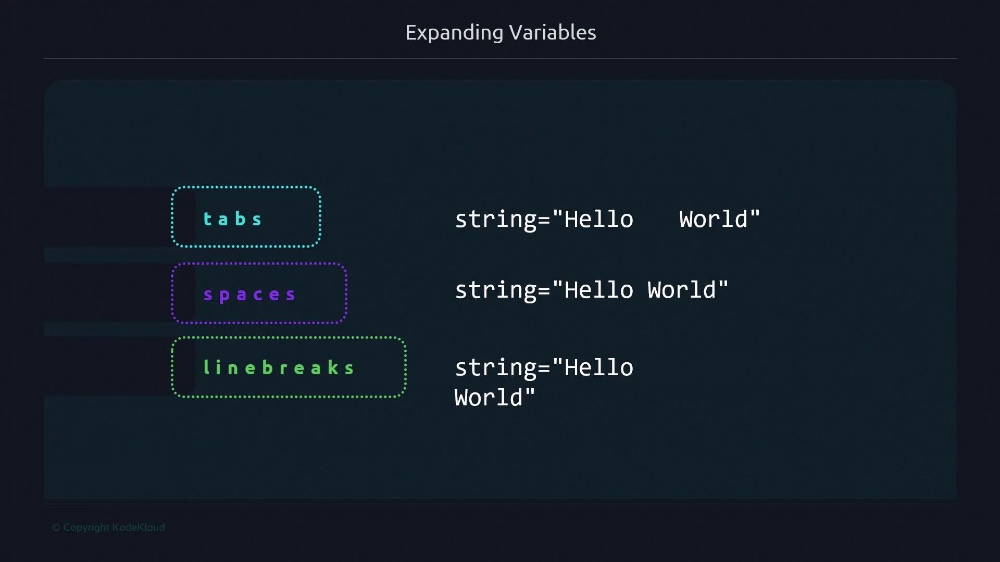

# Incorrect: $heightcm is undefined
echo "Your height is = $heightcm"

# Correct: ${height}cm expands properly
echo "Your height is = ${height}cm"
```

```bash theme={null}
$ ./height.sh
Your height is = 
Your height is = 170cm
```

## Quoting and Word Splitting

By default, unquoted expansions are split on whitespace defined by `IFS` (space, tab, newline). Use quotes to preserve the exact value.



### Unquoted Expansion

```bash theme={null}
#!/bin/bash
string="One Two Three"

# Splits into words
for element in ${string}; do
  echo "${element}"
done
```

### Quoted Expansion

```bash theme={null}
#!/bin/bash
string="One Two Three"

# Preserves the entire string as one element
for element in "${string}"; do
  echo "${element}"
done
```

```bash theme={null}
$ ./string.sh
One
Two
Three

$ ./string2.sh
One Two Three
```

> **lightbulb** Always quote expansions when dealing with filenames, paths, or URLs to prevent unintended splitting.

### Intentional Splitting

Sometimes you want to iterate over each word in a list:

```bash theme={null}
#!/bin/bash
readonly SERVERS="server1 server2 server3"

for server in ${SERVERS}; do
  echo "${server}.example.com"
done
```

```bash theme={null}
$ ./expanding.sh
server1.example.com
server2.example.com
server3.example.com
```

Quoting the variable in this case treats the entire list as one element:

```bash theme={null}
#!/bin/bash
readonly SERVERS="server1 server2 server3"

for server in "${SERVERS}"; do
  echo "${server}.example.com"
done
```

```bash theme={null}
$ ./expanding2.sh
server1 server2 server3.example.com
```

## Best Practices

Use this quick reference to decide when to quote or brace variables:

| Scenario                           | Quoting     | Braces   | Example                          |
| ---------------------------------- | ----------- | -------- | -------------------------------- |
| Simple expansion                   | Optional    | Optional | `echo $var`                      |
| Appending text to a variable       | Optional    | Required | `echo "${var}suffix"`            |
| File paths and filenames           | Recommended | Optional | `ls "${directory}/file.txt"`     |
| URLs and complex strings           | Recommended | Optional | `curl "${URL}?id=123&name=abc"`  |
| Iterating over words intentionally | Optional    | Optional | `for x in ${list}; do ...; done` |
| Preventing word splitting          | Required    | Optional | `read -r line <<< "${input}"`    |


> **triangle-alert** Never rely on unquoted variable expansions for user input or file names—they can introduce security risks or unexpected behavior.

## Further Reading

* [Bash Parameter Expansion](https://www.gnu.org/software/bash/manual/html_node/Shell-Parameter-Expansion.html)
* [Advanced Bash-Scripting Guide](https://tldp.org/LDP/abs/html/)
* [POSIX Shell Command Language](https://pubs.opengroup.org/onlinepubs/9699919799/utilities/V3_chap02.html)

- [Watch Video](https://learn.kodekloud.com/user/courses/advanced-bash-scripting/module/06219b3e-dc63-404c-a9df-3ea035628308/lesson/dac7a664-61de-4b86-a73e-0275fdc4f204)


# Functions

Source: https://notes.kodekloud.com/docs/Advanced-Bash-Scripting/Conventions/Functions/page

Functions are essential for writing clean, modular shell scripts, covering best practices for naming, defining, and styling functions in Bash.

## Overview

Functions are essential for writing clean, modular shell scripts. They help you:

* Reuse code and avoid duplication
* Improve readability and maintainability
* Handle complex tasks in a structured way

This guide covers best practices for naming, defining, and styling functions in Bash.

## Naming Conventions

Adopt consistent naming to make your functions self-documenting. Follow these rules:

| Guideline                     | Recommendation            | Example           |
| ----------------------------- | ------------------------- | ----------------- |
| Lowercase names               | Enhances uniformity       | `calculate_area`  |
| Descriptive identifiers       | Conveys purpose instantly | `backup_database` |
| Underscores between words     | Improves readability      | `get_user_info`   |
| No single-letter or CamelCase | Prevents ambiguity        | `process_files`   |

> **lightbulb** Descriptive, lowercase names with underscores help developers and automation tools understand your code at a glance.

## Defining Functions

Use this standard syntax for declaring functions:

```bash theme={null}
function_name() {
    # function body
}
```

Key style guidelines:

1. Include parentheses `()` after the name.
2. Place the opening brace `{` on the same line, preceded by one space.
3. Align the closing brace `}` with the function declaration (no extra indentation).

### Example Definitions

```bash theme={null}
calculate_area() {
    local radius=$1
    echo "Area: $(( 3 * radius * radius ))"
}

get_name() {
    local user_id=$1
    # Retrieve the user’s name from a data source
    echo "User Name for ID $user_id"
}

clone_repo() {
    local repo_url=$1
    git clone "$repo_url"
}
```

> **triangle-alert** Misplacing braces or omitting parentheses leads to syntax errors and unexpected behavior.

## Advanced Function Patterns

In upcoming sections, you’ll learn how to:

* Define functions without the `function` keyword
* Use `local` variables to prevent global namespace pollution
* Return status codes and handle errors gracefully
* Parse command-line options using `getopts`

## Further Reading

* [Advanced Bash-Scripting Guide](https://tldp.org/LDP/abs/html/)
* [Bash Reference Manual](https://www.gnu.org/software/bash/manual/bash.html)
* [getopts Bash Builtin](https://www.gnu.org/software/bash/manual/html_node/Bash-Builtins.html#index-getopts)

- [Watch Video](https://learn.kodekloud.com/user/courses/advanced-bash-scripting/module/06219b3e-dc63-404c-a9df-3ea035628308/lesson/0cf92c1d-2397-4d91-8070-2136a7cc610b)
