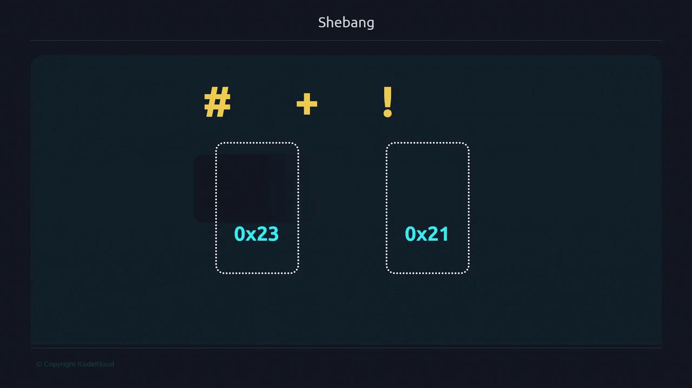
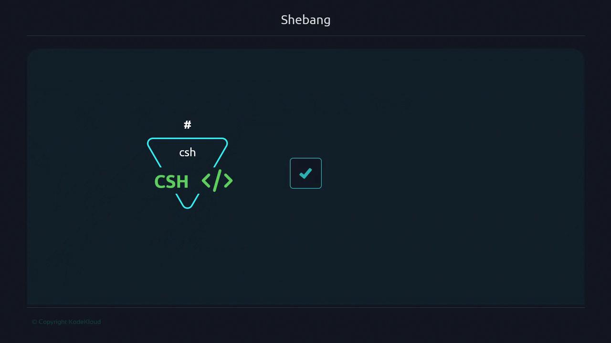

# noshebang.sh
WORDS="I don't have a shebang and I still run"
for word in ${WORDS}; do
  if [[ 2 < 3 ]]; then
    echo "${word}"
  fi
done
```

Make it executable and run:

```bash theme={null}
chmod +x noshebang.sh
./noshebang.sh
# Each word prints because Bash (your login shell) interprets it
echo $SHELL
# /bin/bash
```

Relying on the parent shell works locally but isn't portable—other environments may default to `/bin/sh`, which lacks Bash-specific features.

## Tracing Kernel Execution with strace

Compare a script without and with a shebang:

```bash theme={null}
# shebang.sh
#!/bin/bash
WORDS="I don't have a shebang and I still run"
for word in ${WORDS}; do
  if [[ 2 < 3 ]]; then
    echo "${word}"
  fi
done
```

Trace your shell’s PID (`$$`) in the background:

```bash theme={null}
sudo strace -Tfp $$ 2>&1 | grep -E 'execve' &
```

Run both scripts:

```bash theme={null}
./noshebang.sh
./shebang.sh
# [pid …] execve("./shebang.sh", ["./shebang.sh"], …) = 0
# Script runs successfully under /bin/bash
```

When the kernel detects `#!` followed by a valid interpreter, it invokes that program directly.



## Using a Different Shell: C Shell Example

C shell (`csh`) syntax is distinct. Running a C shell script under Bash without a shebang will fail:

```csh theme={null}
# is_csh.sh
set x = 'a'
if ($x == 'a') then
    echo "running on a c shell csh"
endif
```

```bash theme={null}
chmod +x is_csh.sh
./is_csh.sh
# -bash: ./is_csh.sh: /bin/csh: syntax error: unexpected end of file
```

Add the correct shebang:

```csh theme={null}
#!/bin/csh
set x = 'a'
if ($x == 'a') then
    echo "running on a c shell csh"
endif
```

```bash theme={null}
./is_csh.sh
# running on a c shell csh
```



## Modern, Portable Shebang

Hardcoding interpreter paths can break across systems. Instead, use:

```bash theme={null}
#!/usr/bin/env bash
```

This invokes `env` to locate `bash` via your `PATH`, enhancing cross-platform compatibility.

> **lightbulb** Using `#!/usr/bin/env bash` avoids assumptions about interpreter locations, but it relies on `env` being in `/usr/bin`.

| Shebang Line        | Description                    | Pros & Cons                                                       |
| ------------------- | ------------------------------ | ----------------------------------------------------------------- |
| #!/bin/bash         | Direct path to Bash            | Fast invocation, but not portable if Bash is installed elsewhere. |
| #!/usr/bin/env bash | Finds Bash in `PATH` via `env` | Portable across environments, depends on a correct `PATH`.        |

### Demo: Bash Version Features

Create `bash_versions.sh`:

```bash theme={null}
#!/usr/bin/env bash
echo "Current Unix timestamp (integer): ${EPOCHSECONDS}"
echo "Current Unix timestamp (floating-point): ${EPOCHREALTIME}"
```

On macOS default Bash (v3):

```bash theme={null}
bash --version
./bash_versions.sh
# Current Unix timestamp (integer):
# Current Unix timestamp (floating-point):
```

After upgrading to Bash 5.2 (e.g., via Homebrew) and updating your `PATH`:

```bash theme={null}
bash --version
./bash_versions.sh
# Current Unix timestamp (integer): 1679282700
# Current Unix timestamp (floating-point): 1679282700.176761
```

By leveraging `#!/usr/bin/env bash`, you automatically use the most appropriate Bash installed on your system.

## Caveats & Recommendations

* Minimal environments (e.g., BusyBox) may not include `bash`. Verify available interpreters in `/etc/shells`:

  ```bash theme={null}
  cat /etc/shells
  # /bin/sh
  # /bin/bash
  # /sbin/nologin
  …
  ```

> **triangle-alert** If `/usr/bin/env` or your chosen shell isn’t available, scripts will fail. Always confirm interpreter paths before deployment.

* Select a shebang that aligns with your target environment and installed shells.

For all remaining course examples, we’ll use:

```bash theme={null}
#!/usr/bin/env bash
```

Adjust this line if your system requires a different interpreter path.

## Links and References

* [GNU Bash Manual](https://www.gnu.org/software/bash/manual/)
* [Shebang (Wikipedia)](https://en.wikipedia.org/wiki/Shebang_\(Unix\))
* [strace Documentation](https://strace.io/)
* [env Command Help](https://man7.org/linux/man-pages/man1/env.1.html)

- [Watch Video](https://learn.kodekloud.com/user/courses/advanced-bash-scripting/module/397a2175-a186-4a6d-916e-d688c8def203/lesson/cd207fbe-5cc5-4e9c-b347-f2dbf1d15c2f)

  - [Practice Lab](https://learn.kodekloud.com/user/courses/advanced-bash-scripting/module/397a2175-a186-4a6d-916e-d688c8def203/lesson/17e69321-d174-4ad5-a7cb-2a79e66a0075)


# pid

Source: https://notes.kodekloud.com/docs/Advanced-Bash-Scripting/Refresher/pid/page

Explains process IDs in shell scripting including parent and child processes, TTYs, background jobs, builtins versus external commands, inspecting processes, signals and detaching with nohup

A shell script is a file containing shell commands and programming constructs that automate tasks. When a new process starts, the kernel assigns a unique process ID (PID) that you can use to inspect, control, or terminate that process.

How many PIDs are created while a shell script runs? Think of the parent shell as a chef in a kitchen; each command the chef issues is a worker (a process) with its own unique identifier (PID). The parent shell spawns child processes for the commands it runs, and those children can in turn spawn their own children.

In an interactive terminal session the parent shell is the session’s shell process. Commands you type spawn child processes; each child has its own PID and a PPID (parent PID) pointing back to the shell that launched it.

<Frame>
  
</Frame>

Each instruction the chef gives consumes a worker (a process). Each worker receives a unique identifier—just like each process gets a PID. The chef (the parent shell) can check, stop, or restart any worker; likewise, you can inspect and control processes from the command line.

Terminal sessions are attached to a TTY (teletypewriter). The session leader (the parent shell process) manages that TTY. Child processes spawned by the shell normally remain associated with the same TTY and appear in process listings with that TTY name.

<Frame>
  
</Frame>

Quick commands to inspect your terminal and shell processes:

```bash theme={null}
