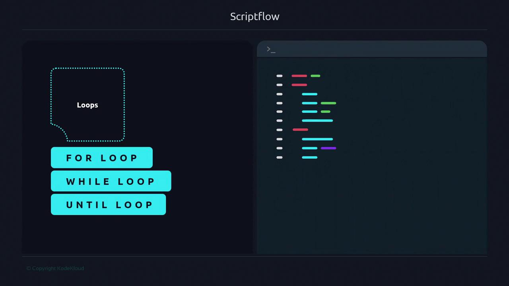
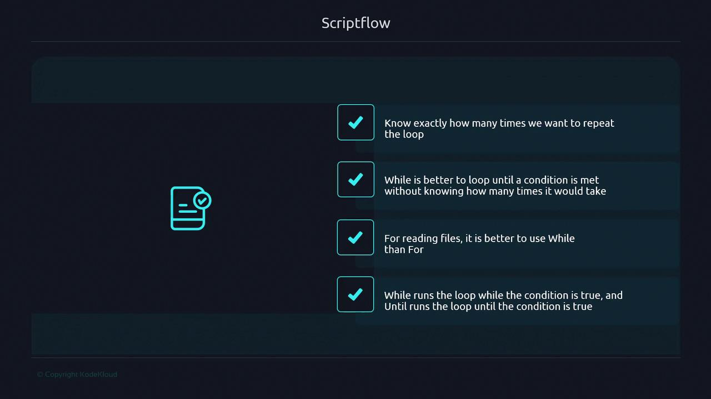
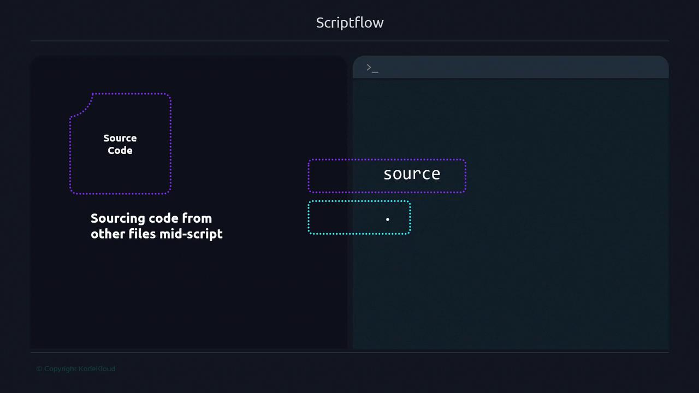
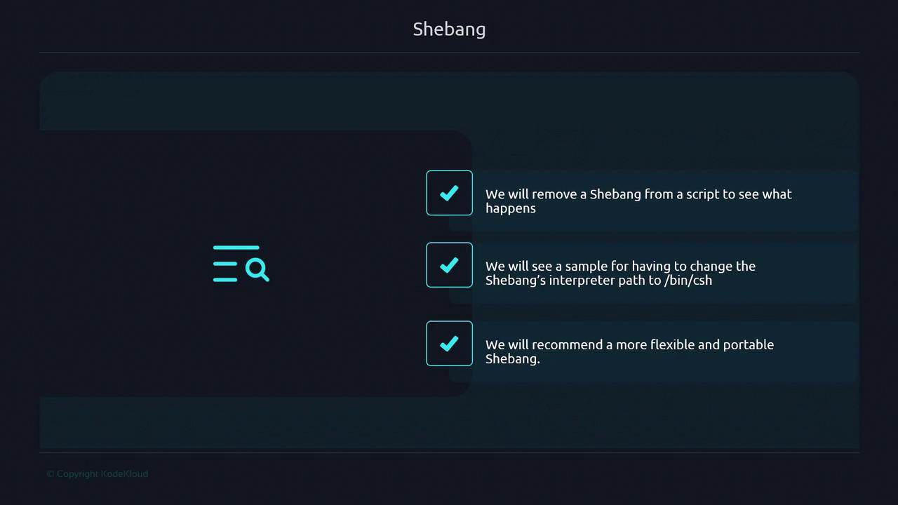

# This block never runs because 3 is not greater than 4
if [[ 3 -gt 4 ]]; then
    echo "This will never be printed"
fi
```

> **lightbulb** We recommend `[[ … ]]` over `[ … ]` for its support of pattern matching and logical operators.

### `case` Statement

Use `case` for clear branching when matching a variable against multiple patterns:

```bash theme={null}
#!/usr/bin/env bash
action="$1"

case "$action" in
  start)
    echo "Starting service";;
  stop)
    echo "Stopping service";;
  restart)
    echo "Restarting service";;
  *)
    echo "Usage: $0 {start|stop|restart}";;
esac
```

***

## Loops

Loops are ideal for executing commands multiple times, either a fixed count or until a condition changes.



Here are five versatile loop patterns:

1. **`while` loop with a counter**
   ```bash theme={null}
   #!/usr/bin/env bash
   i=1
   while [[ $i -le 3 ]]; do
       echo "Iteration $i"
       i=$(( i + 1 ))
   done
   ```
2. **`for` loop with brace expansion**
   ```bash theme={null}
   #!/usr/bin/env bash
   for i in {1..3}; do
       echo "Iteration $i"
   done
   ```
3. **`until` loop counting down**
   ```bash theme={null}
   #!/usr/bin/env bash
   i=3
   until [[ $i -eq 0 ]]; do
       echo "Iteration $i"
       i=$(( i - 1 ))
   done
   ```
4. **Piping `seq` into `while`**
   ```bash theme={null}
   #!/usr/bin/env bash
   seq 1 3 | while read -r i; do
       echo "Iteration $i"
   done
   ```
5. **Reading lines from a file**
   ```bash theme={null}
   #!/usr/bin/env bash
   while read -r line; do
       echo "Line: $line"
   done < fds.txt
   ```

> **lightbulb** Use `for` loops when the number of iterations is predetermined.

> **lightbulb** Choose `while` or `until` when waiting for a dynamic condition or external event.



***

## Sourcing External Files

You can import another script or configuration file mid-execution using `source` or the shorthand `.`. This merges the external content into your current shell environment.



### Example v1: Basic Sourcing

```bash theme={null}
# .conf content:
#!/usr/bin/env bash
source .conf
echo "${name}"
```

```bash theme={null}
$ ./conf_read-v1.sh
Bob Doe
```

### Example v2: Safe Sourcing with Fallback

```bash theme={null}
#!/usr/bin/env bash
readonly CONF_FILE=".conf"

if [[ -f "${CONF_FILE}" ]]; then
    source "${CONF_FILE}"
else
    name="Bob"
fi

echo "${name}"
exit 0
```

```bash theme={null}
$ ./conf_read-v2.sh
Bob
```

When `.conf` exists:

```bash theme={null}
$ echo 'name="Juan Carlos"' > .conf
$ ./conf_read-v2.sh
Juan Carlos
```

> **triangle-alert** Always verify or sanitize sourced files to avoid executing untrusted code.

***

## Next Steps

In the next section, we explore how **functions** can modularize your scriptflow, making your Bash scripts more maintainable and reusable.

## Links and References

* [Bash Reference Manual](https://www.gnu.org/software/bash/manual/bash.html)
* [Advanced Bash-Scripting Guide](https://tldp.org/LDP/abs/html/)
* [ShellCheck: Bash Linter](https://www.shellcheck.net/)

- [Watch Video](https://learn.kodekloud.com/user/courses/advanced-bash-scripting/module/397a2175-a186-4a6d-916e-d688c8def203/lesson/c095c98b-4326-4538-a2a7-702b1cf76cc5)


# Shebang

Source: https://notes.kodekloud.com/docs/Advanced-Bash-Scripting/Refresher/Shebang/page

This article explores the shebang directive, its impact on script execution, and best practices for portability across different shells.

In this lesson, we’ll explore how the **shebang** (`#!`) directive affects script execution and portability. You will learn to:

* Remove the shebang from a script and analyze its behavior.
* Trace system calls with `strace` to observe kernel execution.
* Demonstrate shebangs across different shells (e.g., Bash, C shell).
* Adopt a modern, portable shebang and avoid common pitfalls.



## The Shebang Analogy

Think of yourself as a polyglot translator facing an ancient manuscript. Each dialect (shell) has subtle differences. A shebang acts like a translator’s guide, ensuring your script is read by the intended interpreter. Without it, your login shell takes over, which may lead to unexpected behavior and portability issues.

Example of a classic shebang:

```bash theme={null}
#!/bin/bash
```

The term **shebang** blends “hash” (`#`, 0x23) with “bang” (`!`, 0x21), sometimes pronounced “shbang.”

## What Happens Without a Shebang?

Create `noshebang.sh` without a shebang:

```bash theme={null}
