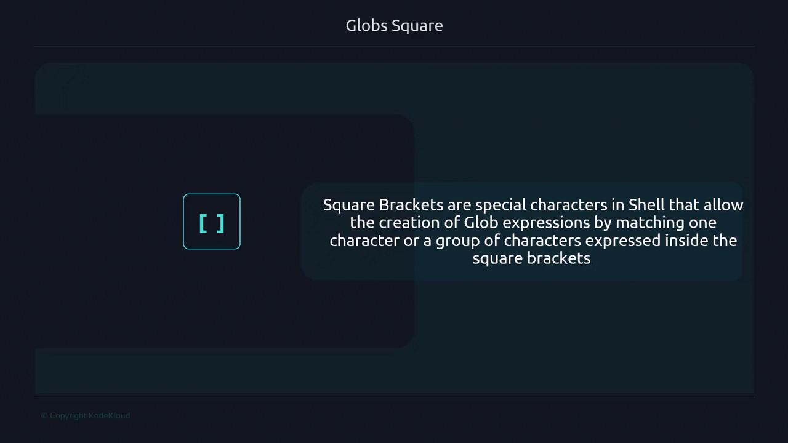

# Matches all .log files starting with "app"
ls app*.log
```

If the output aligns with your expectations, your glob is correct!

## Next Steps

In the following sections, we’ll apply these principles to real-world examples—filtering logs, batch-renaming files, and more. Let’s start by examining a directory of mixed files and crafting precise globs for each case.

## Links and References

* [Bash Reference Manual – Filename Expansion](https://www.gnu.org/software/bash/manual/html_node/Filename-Expansion.html)
* [Regular Expressions on Wikipedia](https://en.wikipedia.org/wiki/Regular_expression)
* [ShellCheck – Automated Shell Script Analysis](https://www.shellcheck.net/)

<CardGroup>
  <Card title="Watch Video" icon="video" href="https://learn.kodekloud.com/user/courses/advanced-bash-scripting/module/a9d9ba2b-0baf-4c13-b60b-f6ce9cf97abd/lesson/06c642fb-b311-4f69-9d9e-2d4d00f13fc3" />
</CardGroup>


# Square

Source: https://notes.kodekloud.com/docs/Advanced-Bash-Scripting/Globs/Square/page

This article explains square bracket globbing in Bash for matching filenames using character classes and ranges.

Shell globbing lets you match filenames using patterns. While `*` matches any string and `?` matches a single character, square brackets (`[ ]`) define *character classes*, enabling you to match one character from a specific set or range.

## Matching a Range of Characters

Given a directory:

```bash theme={null}
$ ls
fileA fileB fileC fileD fileE
```

You can match only `fileA`, `fileB`, and `fileC` by specifying a range inside brackets:

```bash theme={null}
$ ls file[A-C]
fileA fileB fileC
```

Here, `[A-C]` matches any uppercase letter from A through C. Note that the dash (`-`) defines a range and must go from lower to higher:

```bash theme={null}
$ ls file[C-A]
ls: cannot access 'file[C-A]': No such file or directory
```

### Common Examples

| Pattern    | Matches             | Description              |
| ---------- | ------------------- | ------------------------ |
| file\[A-C] | fileA, fileB, fileC | Uppercase A–C            |
| file\[a-c] | filea, fileb, filec | Lowercase a–c            |
| file\[1-3] | file1, file2, file3 | Numeric 1–3              |
| file\[ACE] | fileA, fileC, fileE | Specific letters A, C, E |

## Negated Character Classes

Prefix `!` or `^` inside brackets to exclude characters or ranges:

```bash theme={null}
$ ls
fileA fileB fileC fileD fileE

$ ls file[^A-C]
fileD fileE

$ ls file[!A-C]
fileD fileE
```

<Callout icon="lightbulb">
  In Bash both `!` and `^` work for negation. POSIX shells require `!` at the start of the class.
</Callout>

<Frame>
  
</Frame>

## Listing Specific Characters

To match non-consecutive filenames such as `fileA`, `fileC`, and `fileE`, simply list them:

```bash theme={null}
$ ls file[ACE]
fileA fileC fileE
```

## Case Sensitivity

Globbing in Bash is case sensitive. If you have both uppercase and lowercase files:

```bash theme={null}
$ touch filea fileb filec filed filee
$ ls
fileA fileB fileC fileD fileE filea fileb filec filed filee
```

To match only lowercase:

```bash theme={null}
$ ls file[a-c]
filea fileb filec
```

To remove both lowercase and uppercase `a–e`, combine ranges:

```bash theme={null}
$ rm file[a-eA-E]
$ ls
fileD fileE
```

<Callout icon="lightbulb">
  When mixing ranges, list them in the order you want matched: here `a-e` before `A-E`.
</Callout>

## Numeric Ranges and Negation

Numeric ranges behave the same way:

```bash theme={null}
$ touch file1 file2 file3 file4 file5
$ ls file[1-3]
file1 file2 file3

$ ls file[4-5]
file4 file5

$ ls file[^1-3]
file4 file5

$ ls file[!1-3]
file4 file5
```

## Multiple Character Classes

You can chain classes to match multiple positions. For example, to match `filea1`, `filea2`, `fileb1`, `fileb2`:

```bash theme={null}
$ touch filea1 filea2 filea3 fileb1 fileb2 fileb3

$ ls file[a-b][1-2]
filea1 filea2 fileb1 fileb2
```

Each `[a-b]` matches one letter, and `[1-2]` matches one digit. If you try only `[1-2]`, it won’t match because the letter is missing:

```bash theme={null}
$ ls file[1-2]
ls: cannot access 'file[1-2]': No such file or directory
```

## Literal Characters Inside Brackets

Inside character classes, special glob characters lose their meaning:

```bash theme={null}
$ ls file[a][*]
ls: cannot access 'file[a][*]': No such file or directory
```

To use `*` as a wildcard, place it outside the brackets:

```bash theme={null}
$ ls filea*
filea1 filea2 filea3
```

Or constrain both positions:

```bash theme={null}
$ ls file[a][1-3]
filea1 filea2 filea3
```

## Globbing vs. File Creation

Globs match existing filenames; they do **not** generate names. If you use a glob in a command like `touch` when no files match, the pattern is taken literally:

```bash theme={null}
$ touch ?ail
$ ls
'?ail'
```

To produce a series of filenames based on a pattern, consider using **brace expansion** instead of globs.

<Callout icon="triangle-alert">
  Globbing won’t create files—only match them. If you expect new files, use brace expansion or a loop.
</Callout>

## Links and References

* [Bash Pattern Matching](https://www.gnu.org/software/bash/manual/html_node/Pattern-Matching.html)
* [KornShell Globbing](https://www2.gnu.org/software/ksh/manual/html_node/Globbing.html)
* [Advanced Bash-Scripting Guide](https://tldp.org/LDP/abs/html/globbingref.html)

<CardGroup>
  <Card title="Watch Video" icon="video" href="https://learn.kodekloud.com/user/courses/advanced-bash-scripting/module/a9d9ba2b-0baf-4c13-b60b-f6ce9cf97abd/lesson/89ce15f2-0090-4dd1-bc97-1f4e002bfb97" />

  <Card title="Practice Lab" icon="installation" href="https://learn.kodekloud.com/user/courses/advanced-bash-scripting/module/a9d9ba2b-0baf-4c13-b60b-f6ce9cf97abd/lesson/79dcd2f2-5c1a-45e8-b7cc-fe7d7337df1f" />
</CardGroup>
