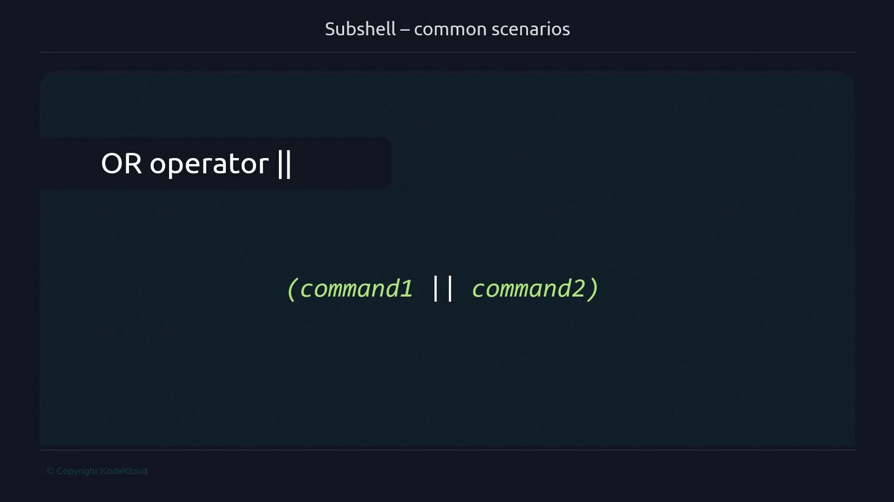
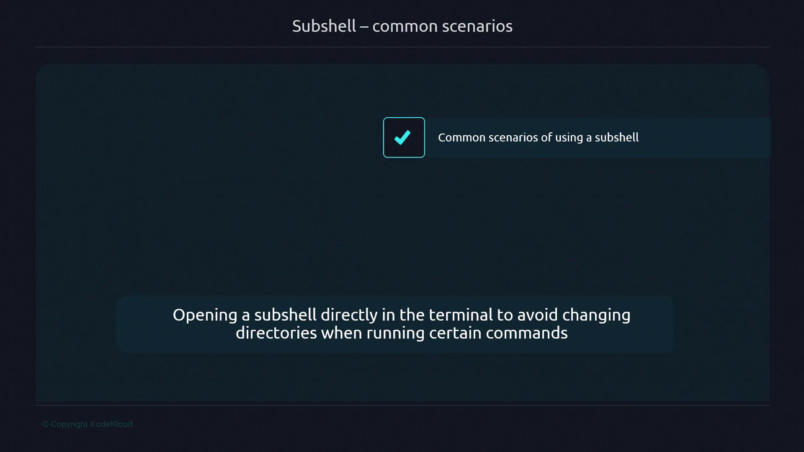

# Separate lines
(
  command1
  command2
  command3
)

# Semicolons
(command1; command2; command3)

# Pipes
(command1 | command2 | command3)

# AND operator
(command1 && command2 && command3)

# OR operator
(command1 || command2)
```



***

## 4. Common Subshell Scenarios

### 4.1 One-Liners to Change Directory Temporarily

Run commands in a different folder without affecting your current directory:



```bash theme={null}
#!/usr/bin/env bash
# Update and build inside /home/user/project
(cd /home/user/project && git pull && make)
```

Interactive example:

```bash theme={null}
$ pwd
/home/user/workspace
$ (cd /tmp && ls)
file_in_tmp
$ pwd
/home/user/workspace
```

### 4.2 Jenkins Pipeline Steps

In Jenkins Pipelines, each `sh` step executes in its own subshell. This isolation explains differences when scripts run in CI/CD environments.

***

## 5. Verifying Process IDs

Use `$$` and `$BASHPID` to compare parent and subshell PIDs:

| Variable  | Description                                            |
| --------- | ------------------------------------------------------ |
| \$\$      | PID of the parent shell                                |
| \$BASHPID | PID of the *current* Bash process (even in a subshell) |

```bash theme={null}
#!/usr/bin/env bash
parent_pid=$$

(
  echo "Inside subshell: PID=$BASHPID"
)

echo "Outside subshell: PID=$parent_pid"
```

```plaintext theme={null}
$ ./subshell-v5.sh
Inside subshell: PID=12345
Outside subshell: PID=12344
```

***

## 6. Propagating Values Back to the Parent Shell

Since subshells can’t modify parent variables directly, use a temporary file or another IPC mechanism:

```bash theme={null}
#!/usr/bin/env bash
tmpfile="/tmp/$$.tmp"
counter=1

# Initialize counter
echo "$counter" > "$tmpfile"

# Increment inside subshell
(
  new_count=$(( $(<"$tmpfile") + 1 ))
  echo "$new_count" > "$tmpfile"
)

# Read updated value
counter=$(<"$tmpfile")
echo "Counter after subshell: $counter"

# Clean up
rm "$tmpfile"
```

```plaintext theme={null}
$ ./subshell-v6.sh
Counter after subshell: 2
```

This pattern is useful in scripts, loops, and CI/CD jobs when you need to retrieve data from a subshell.

- [Watch Video](https://learn.kodekloud.com/user/courses/advanced-bash-scripting/module/3fde6601-133e-4f17-bea6-482a206dba5c/lesson/df0d10a6-d78f-497a-8d91-fe8b2c0d6220)


# Escape

Source: https://notes.kodekloud.com/docs/Advanced-Bash-Scripting/Globs/Escape/page

This article explains shell globbing, escape characters, and how to manage filename patterns using wildcards and literals.

When working in the shell, special characters like `?`, `*`, and `[ ]` are interpreted by the globbing engine for filename matching. Preceding these characters with a backslash (`\`) or quoting them forces the shell to treat them as literal characters.

> **lightbulb** Using an escape (`\`) or quotes disables globbing for the next character or entire string. This gives you precise control over filename creation and listing.

## 1. Creating Sample Files

First, generate files whose names differ only by the first letter:

```bash theme={null}
$ touch sail hail mail fail tail
$ ls
fail hail mail sail tail
```

## 2. Wildcard vs. Literal `?`

### 2.1 Using the `?` Wildcard

The `?` matches exactly one character. Attempting to create `?ail` without escaping:

```bash theme={null}
$ touch ?ail
$ ls
fail hail mail sail tail
```

No new file appears because `?ail` expanded to all existing matches (`fail`, `hail`, etc.).

### 2.2 Escaping `?` for Literal Filenames

To create a file literally named `?ail`:

```bash theme={null}
$ touch \?ail
$ ls
?ail fail hail mail sail tail
```

## 3. Listing Files with a Leading `?`

You can retrieve the `?ail` file by escaping or quoting the pattern:

```bash theme={null}
$ ls \?ail
?ail

$ ls "?ail"
?ail
```

Both methods disable globbing and match the literal filename.

## 4. Mixing Literals and Wildcards

Assume these files exist:

```bash theme={null}
$ touch hail fail mail \?ail
$ touch hailTwo failTwo mailTwo \?ailTwo
$ ls
?ail ?ailTwo fail failTwo hail hailTwo mail mailTwo
```

To list all files starting with a literal `?ail`:

```bash theme={null}
$ ls \?ail*
?ail  ?ailTwo
```

Here, `\?ail*` treats `\?` as literal `?` and `*` as the wildcard for any suffix.

> **triangle-alert** Be cautious: unescaped wildcards can match unintended files. Always check your patterns with `echo` or `ls` before running destructive commands.

## 5. Merging Globs into a Single Pattern

For files named `Pail`, `Pail*`, and `PailTwo`:

```bash theme={null}
$ touch Pail Pail* PailTwo
$ ls
Pail Pail* PailTwo
```

You can match them all using:

```bash theme={null}
$ ls Pail*
Pail Pail* PailTwo
```

The `*` wildcard expands to zero or more characters following `Pail`.

## 6. Quick Reference Table

| Special Character | Behavior                | Escaped Form | Example        |
| ----------------- | ----------------------- | ------------ | -------------- |
| `?`               | Single-character match  | `\?`         | `touch \?file` |
| `*`               | Zero or more characters | `\*`         | `ls Pail\*`    |
| `[` `]`           | Character set           | `\[` `\]`    | `ls \[abc\]*`  |

## Summary

* A backslash (`\`) or quotes disables globbing for the next character or entire string.
* Use wildcards (`?`, `*`, `[ ]`) without escaping to match patterns.
* Combine escaped literals and wildcards for precise filename operations.

## Links and References

* [GNU Bash Manual – Pattern Matching](https://www.gnu.org/software/bash/manual/html_node/Pattern-Matching.html)
* [Bash Guide: Filename Expansion](https://mywiki.wooledge.org/Globbing)

- [Watch Video](https://learn.kodekloud.com/user/courses/advanced-bash-scripting/module/a9d9ba2b-0baf-4c13-b60b-f6ce9cf97abd/lesson/a6c0b385-2275-4130-a9a9-fd35cd516de1)
