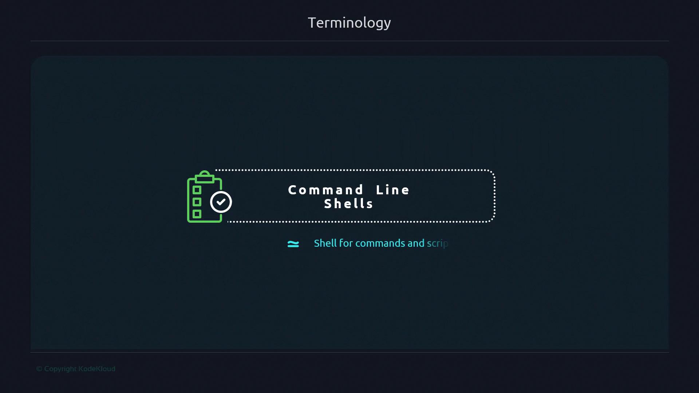
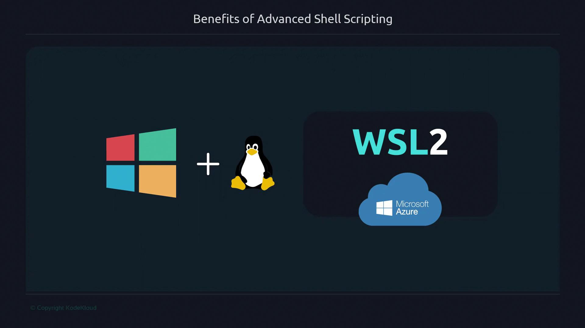
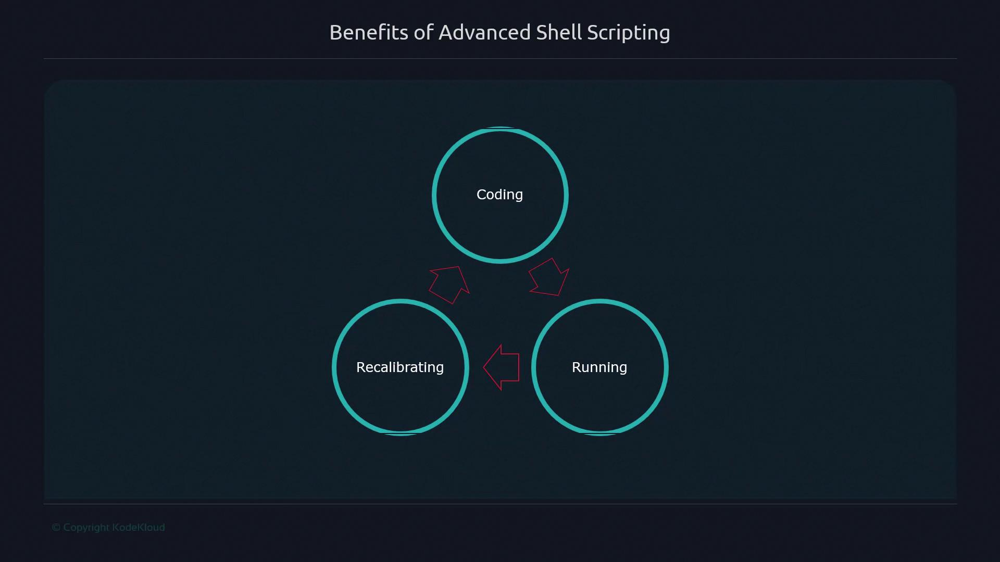
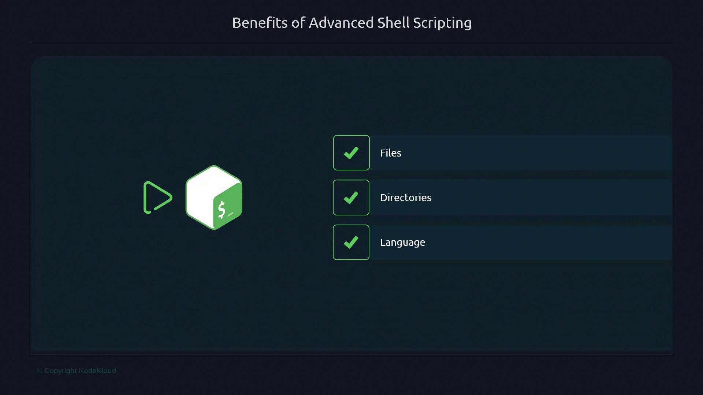

# e.g., /dev/pts/0
```

## POSIX and POSIX-compliance

**POSIX** (Portable Operating System Interface) is an IEEE standard that defines a common API and shell behavior for Unix-like systems. POSIX guarantees that scripts using standard utilities and syntax will run across compliant environments.

<Frame>
  
</Frame>

<Callout icon="triangle-alert">
  Not all shells are fully POSIX-compliant. If you need maximum portability, use `/bin/sh` or check your shell’s compliance level. Inline features like arrays or extended globbing may break on strict POSIX systems.
</Callout>

***

By distinguishing between shell, CLI, terminal, console, TTY, and POSIX, you’ll reduce confusion and build a strong foundation for advanced Bash scripting.

## Links and References

* [POSIX Standard on Wikipedia](https://en.wikipedia.org/wiki/POSIX)
* [Bash Reference Manual](https://www.gnu.org/software/bash/manual/)
* [GNU Coreutils](https://www.gnu.org/software/coreutils/)
* [GNU Terminal Emulators](https://www.gnu.org/software/gnome-terminal/)

<CardGroup>
  <Card title="Watch Video" icon="video" href="https://learn.kodekloud.com/user/courses/advanced-bash-scripting/module/62d639a9-3779-4ae6-b8b2-1cc49f117f64/lesson/0e4541f7-c3a1-48ca-84bb-50994ac84fac" />
</CardGroup>


# Why learn advanced bash scripting

Source: https://notes.kodekloud.com/docs/Advanced-Bash-Scripting/Introduction/Why-learn-advanced-bash-scripting/page

Learning advanced Bash scripting enhances automation, troubleshooting, and productivity, making it essential for DevOps and systems engineers in production environments.

Learning advanced Bash scripting unlocks powerful automation and rapid troubleshooting capabilities—often faster to deploy than higher-level languages like Python. In this guide, you’ll discover how mastering Bash can streamline tasks in production environments, boost your productivity, and strengthen your career as a DevOps or systems engineer.

## Why Bash Still Matters

* 90% of corporate servers run Linux.
* 70% of academic servers use Unix-like OSes.
* Microsoft embraces Linux via [WSL2](https://docs.microsoft.com/windows/wsl/) and Azure.

Although Python is bundled with most distributions, adding new runtimes often requires approval in enterprise settings. In contrast, Bash is POSIX-compliant and available out of the box on Linux and macOS.

<Callout icon="lightbulb">
  Bash is pre-installed on virtually every server and requires no additional packages to get started.
</Callout>

<Frame>
  
</Frame>

## Real-World Example: On-Call Incident Automation

When CI pipelines break in production, you often need a quick fix. There’s no time to write Ansible playbooks or install Python modules. In one high-pressure incident, I needed to monitor total open connections on multiple load balancers over 24 hours. Instead of a heavyweight solution, I used this concise Bash script:

```bash theme={null}
#!/usr/bin/env bash

log() {
    echo "$(date -u +"%Y-%m-%dT%H:%M:%SZ") $@"
}

while true; do
    log "Open connections:" "$(netstat -tnlp | wc -l)"
    sleep 30
done
```

### Script Features at a Glance

| Feature                 | Description                                    | Example                         |
| ----------------------- | ---------------------------------------------- | ------------------------------- |
| Shebang portability     | Uses `/usr/bin/env` to locate `bash`           | `#!/usr/bin/env bash`           |
| Logging with timestamps | ISO-8601 formatted UTC timestamps              | `date -u +"%Y-%m-%dT%H:%M:%SZ"` |
| Functions               | Encapsulate reusable logic                     | `log() { … }`                   |
| Infinite loops          | Polling or watchdog tasks                      | `while true; do …; done`        |
| Command substitution    | Capture command output into variables          | `$(netstat -tnlp \| wc -l)`     |
| Networking & text utils | Leverage built-in tools for quick data parsing | `netstat`, `wc -l`              |

## The Development Cycle

Bash scripting offers an immediate feedback loop: write code, run it, and adjust on the fly. This three-stage cycle accelerates learning and troubleshooting.

<Frame>
  
</Frame>

## Core Benefits of Advanced Shell Scripting

By working directly with files, directories, and OS primitives—without extra frameworks—you gain practical skills that translate to real-world tasks:

<Frame>
  
</Frame>

* Direct file and directory manipulation
* Minimal dependencies—no external libraries
* Instant script execution and iteration
* Reusable functions and modular patterns

<Callout icon="lightbulb">
  Investing time in Bash improves your problem-solving agility, from daily automation to critical production fixes.
</Callout>

## Further Reading and References

* [GNU Bash Reference Manual](https://www.gnu.org/software/bash/manual/)
* [POSIX Shell and Utilities](https://pubs.opengroup.org/onlinepubs/9699919799/)
* [Kubernetes Basics](https://kubernetes.io/docs/concepts/overview/what-is-kubernetes/)
* [Terraform Registry](https://registry.terraform.io/)

<CardGroup>
  <Card title="Watch Video" icon="video" href="https://learn.kodekloud.com/user/courses/advanced-bash-scripting/module/62d639a9-3779-4ae6-b8b2-1cc49f117f64/lesson/ba78ece3-37ea-47bd-a24d-cebe87de75bd" />
</CardGroup>
