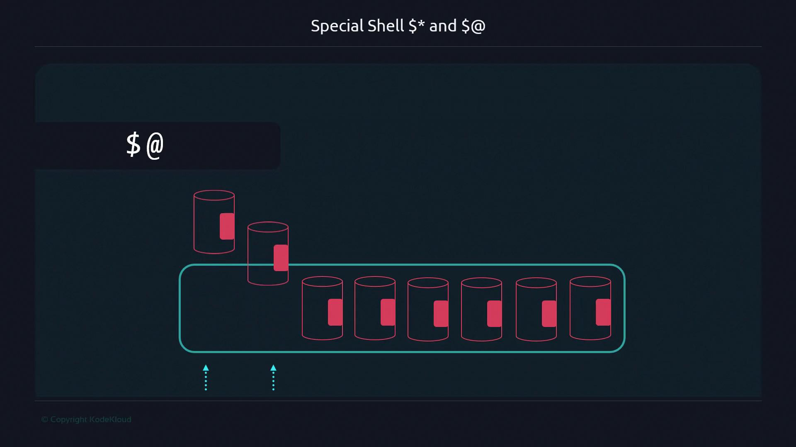
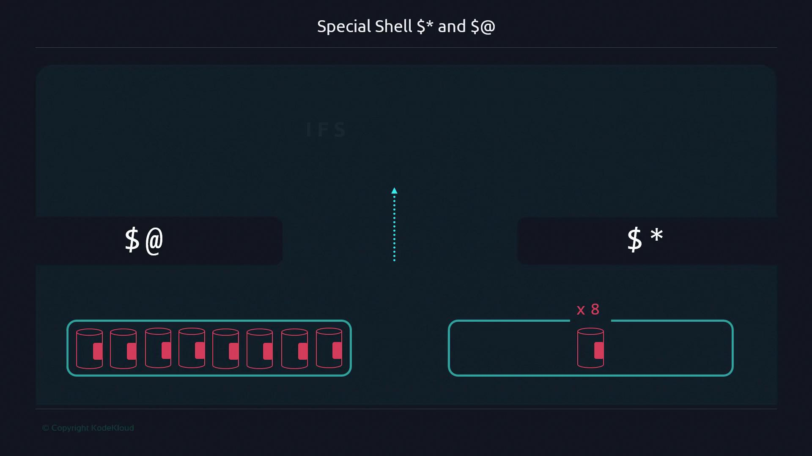

# list processes and search for bash
$ ps -ef | grep bash
501 29898 27796 0 11:00PM ttys007 0:00.01 bash
501 29928 29898 0 11:00PM ttys007 0:00.00 grep bash

# show the TTY for your current terminal
$ tty
/dev/ttys007
```

Each terminal tab or window typically has a different TTY. For example, open a second tab and you’ll likely see a different TTY and another bash process:

```bash theme={null}
# Tab 1
$ tty
/dev/ttys000

$ ps -ef | grep bash
501 87852 87851 0 8:32PM ttys000 0:00.76 -bash

# Tab 2
$ tty
/dev/ttys001

$ ps -ef | grep bash
501 8561 8560 0 12:36AM ttys001 0:00.04 -bash
```

Observe PID chains with a simple script that sleeps so we can watch spawned processes:

```bash theme={null}
# script.sh
#!/bin/bash
sleep 180
```

Make it executable and run in the foreground:

```bash theme={null}
$ chmod +x script.sh
$ ./script.sh
```

While the script runs in the foreground, the launching shell is occupied. Inspecting processes shows the script has its own PID, and the PPID points back to the shell that started it:

```bash theme={null}
$ ps -ef | grep script.sh
501 8689 87852 0 12:36AM ttys000 0:00.00 /bin/bash ./script.sh
501 87852 87851 0 8:32PM ttys000 0:00.77 -bash
```

Within the script the sleep command itself spawns a child process:

```bash theme={null}
$ ps -ef | grep sleep
501 8690 8689 0 12:36AM ttys000 0:00.00 sleep 180
```

This shows the parent-child chain:

* shell (parent) → script (child) → sleep (grandchild)

To run the script without blocking the terminal, send it to the background with &:

```bash theme={null}
$ ./script.sh &
[1] 8862
```

A background job has a PID and remains associated with the launching shell’s TTY. If you close the terminal, the background job will typically receive SIGHUP and terminate. To keep a process running after the terminal closes, detach it from the session using nohup (or alternatives like setsid or disown). nohup prevents SIGHUP from terminating the process and redirects output to nohup.out by default:

```bash theme={null}
$ nohup ./script.sh & 
[1] 9028
appending output to nohup.out

$ ps -ef | grep script.sh
501 9028 1      0 12:39AM ??      0:00.00 /bin/bash ./script.sh
```

Notice the PPID may change (commonly to 1) and the TTY can become "??", indicating the process is no longer attached to the terminal.

> **lightbulb** Use nohup to detach a process from its terminal so it survives when the terminal closes. Alternatives include setsid (start a new session) or using job control (run, then disown) for interactive shells.

Not all commands create new processes. Shell builtins (for example, cd, export, read) execute inside the current shell and do not create separate PIDs when invoked directly. Many builtins also exist as external binaries; invoking the external binary (for example /usr/bin/command) will create a new process.

<Frame>
  
</Frame>

Process execution methods at a glance:

| Execution method           | When it creates a new PID                                   | Example                 |
| -------------------------- | ----------------------------------------------------------- | ----------------------- |
| Run by name (PATH)         | Creates a new process for the external binary found in PATH | `ls`, `cat`             |
| Run by absolute path       | Creates a new process for the specified binary              | `/usr/bin/cat file.txt` |
| Run from current directory | Creates a new process (explicit path)                       | `./script.sh`           |
| Shell builtin              | Runs inside the shell, no new PID                           | `cd`, `export`, `read`  |

Example showing binary by name vs absolute path:

```bash theme={null}
$ cat file.txt
Hello World!

$ /usr/bin/cat file.txt
Hello World!
```

To inspect running processes, use ps and top (or htop). ps -ef gives full details (user, PID, PPID, TTY, time, and command). Note that ps output and options differ across Unix-like systems (Linux, macOS, BSD).

```bash theme={null}
$ ps -ef | grep bash
501 87852 87851 0  8:32PM ttys000 0:00.77 -bash
501 8561  8560  0 12:36AM ttys001 0:00.04 -bash
```

<Frame>
  
</Frame>

Terminate processes using kill, which sends a signal to a PID. The default is SIGTERM (15) — a polite request to terminate. If the process won’t exit, SIGKILL (9) forces immediate termination.

| Signal  | Number | Meaning                                  |
| ------- | ------ | ---------------------------------------- |
| SIGTERM | 15     | Request graceful shutdown                |
| SIGKILL | 9      | Force immediate termination              |
| SIGHUP  | 1      | Hangup — often sent when terminal closes |

Examples:

```bash theme={null}
# Send SIGTERM (default)
$ kill 99838

# Explicit forms
$ kill -15 99838
$ kill -TERM 99838

# Force kill with SIGKILL
$ kill -9 99838
$ kill -KILL 99838
```

For tracing system calls on Linux use strace. Useful flags:

* -T : show time spent in each syscall
* -f : follow child processes
* -p \<pid> : attach to an existing process

Example:

```bash theme={null}
$ strace -T -f -p 99838
```

On macOS and other Unix-like systems, strace may not be available; alternatives include dtruss, truss, or ktrace (often requiring sudo).

This attaches to PID 99838 and prints system call traces with timing while following child processes.

Further reading and references:

* [tty — print filename of terminal connected to standard input](https://man7.org/linux/man-pages/man1/tty.1.html)
* [ps(1) — report process status](https://man7.org/linux/man-pages/man1/ps.1.html)
* [nohup(1) — run a command immune to hangups](https://man7.org/linux/man-pages/man1/nohup.1.html)
* [strace(1) — trace system calls and signals](https://strace.io/)
* [kill(1) — send signals to processes](https://man7.org/linux/man-pages/man1/kill.1.html)

We'll dive deeper into shell internals, job control, builtins vs external commands, and advanced techniques for managing long-running background work in later sections.

- [Watch Video](https://learn.kodekloud.com/user/courses/advanced-bash-scripting/module/397a2175-a186-4a6d-916e-d688c8def203/lesson/6fc6ced7-3d71-495d-93ca-44997527ff80)


# Args

Source: https://notes.kodekloud.com/docs/Advanced-Bash-Scripting/Special-Shell-Variables/Args/page

This guide explains handling command-line arguments in Bash scripts using positional parameters, special variables, and quoting techniques.

When writing Bash scripts, handling command-line arguments efficiently is crucial. You can access each argument by its position (`$1`, `$2`, …), but when the number of parameters varies, special variables like `$@` and `$*` simplify your logic. This guide covers:

* Positional parameters
* Grouping arguments
* Iterating with `"$@"` vs `"$*"`
* The impact of quoting
* Customizing the internal field separator (IFS)
* Compatibility considerations

***

## 1. Positional Parameters: `$1`, `$2`, …

By default, Bash assigns each argument to a numbered variable:

```bash theme={null}
#!/usr/bin/env bash
firstarg=$1
secondarg=$2

echo "First argument: ${firstarg}"
echo "Second argument: ${secondarg}"
```

```bash theme={null}
$ ./simple-args.sh "arg1"
First argument: arg1
Second argument:

$ ./simple-args.sh "arg1" "arg2"
First argument: arg1
Second argument: arg2
```

When you need to accept an unpredictable number of parameters, indexing each one becomes cumbersome. That’s where `$@` and `$*` come in.

***

## 2. Grouping All Arguments: `$@` vs `$*`

Both `$@` and `$*` collect *all* positional arguments:


```bash theme={null}
#!/usr/bin/env bash
packaged_args1="$@"
packaged_args2="$*"

echo "Using \$@: ${packaged_args1}"
echo "Using \$*: ${packaged_args2}"
```

```bash theme={null}
$ ./simple-args2.sh arg1 arg2 arg3
Using $@: arg1 arg2 arg3
Using $*: arg1 arg2 arg3
```

Both variables contain the full list of parameters, but they differ when you iterate over them.

***

## 3. Iterating with a For Loop

Compare two scripts that loop over their arguments:

```bash theme={null}
#!/usr/bin/env bash
echo "Number of arguments: $#"
echo "All arguments: $@"
for arg in "$@"; do
  echo "Argument: $arg"
done
```

```bash theme={null}
#!/usr/bin/env bash
echo "Number of arguments: $#"
echo "All arguments: $*"
for arg in "$*"; do
  echo "Argument: $arg"
done
```

```bash theme={null}
$ ./atsign-example1.sh one two three
Number of arguments: 3
All arguments: one two three
Argument: one
Argument: two
Argument: three

$ ./star-example1.sh one two three
Number of arguments: 3
All arguments: one two three
Argument: one two three
```



In the soda‐can analogy:

* `$@` places each can in its own compartment.
* `$*` pours all the soda into one big bottle—individual cans are no longer separate.



***

## 4. The Importance of Double Quotes

> **lightbulb** Always quote `$@` and `$*`:

  * `"$@"` expands each argument separately.
  * `"$*"` joins all arguments into a single string, separated by the first character of `IFS` (default: space).

Unquoted, both behave identically:

```bash theme={null}
#!/usr/bin/env bash
print_section_header() {
  local title="$1"
  echo "==============================="
  echo "= Section ${title} ="
  echo "==============================="
}

print_section_header "1: \$@"
echo "--> Output of \$@: $@"
echo "Looping \$@ without quotes:"
for arg in $@; do
  echo "$arg"
done

print_section_header "2: \$*"
echo "--> Output of \$*: $*"
echo "Looping \$* without quotes:"
for arg in $*; do
  echo "$arg"
done
```

```bash theme={null}
$ ./special-shell-noquotes.sh one two three
===============================
= Section 1: $@ =
===============================
--> Output of $@: one two three
Looping $@ without quotes:
one
two
three
===============================
= Section 2: $* =
===============================
--> Output of $*: one two three
Looping $* without quotes:
one
two
three
```

***

## 5. Modifying the Internal Field Separator (IFS)

You can change `IFS` to alter how `"$*"` joins arguments:

```bash theme={null}
#!/usr/bin/env bash
IFS=','

echo "Output of \$@: $@"
echo "Output of \$*: $*"
```

```bash theme={null}
$ ./modified-ifs-v1.sh one two three
Output of $@: one two three
Output of $*: one,two,three
```

Splitting later requires unquoted iteration:

```bash theme={null}
#!/usr/bin/env bash
IFS='_'
args_at="$@"
args_star="$*"

print_section_header() { ... }

print_section_header "1: \$@"
echo "--> \$@: $@"
echo "Looping over args_at:"
for arg in $args_at; do
  echo "$arg"
done

print_section_header "2: \$*"
echo "--> \$*: $*"
echo "Looping over args_star:"
for arg in $args_star; do
  echo "$arg"
done
```

***

## 6. Compatibility with Older Bash Versions

Some pre-4.0 Bash releases split unquoted assignments differently. For example, under Bash 3:

```bash theme={null}
#!/usr/bin/env bash
IFS=','
args_at=$@
echo "--> \$@: ${args_at}"
for arg in $args_at; do
  echo "$arg"
done
```

Still, quoting on assignment ensures consistent splitting:

```bash theme={null}
#!/usr/bin/env bash
IFS=','
args_at="$@"
echo "--> \$@: $@"
for arg in $args_at; do
  echo "$arg"
done
```

***

## 7. Summary: `$@` vs `$*`

| Variable | Quoted Expansion     | Unquoted Expansion | Use Case                                        |
| -------- | -------------------- | ------------------ | ----------------------------------------------- |
| `$@`     | Each arg is separate | Each word separate | Looping over arguments                          |
| `$*`     | All args as one      | Splits on `IFS`    | Passing all args to another command or function |

***

## 8. Conclusion

* Use `"$@"` when you need to preserve each argument.
* Use `"$*"` to aggregate them into a single string with a custom delimiter.
* Always quote both to maintain consistent behavior across Bash versions and avoid word-splitting pitfalls.


***

## Links and References

* [Bash Reference Manual – Special Parameters](https://www.gnu.org/software/bash/manual/html_node/Special-Parameters.html)
* [Shell Parameter Expansion](https://www.gnu.org/software/bash/manual/html_node/Shell-Parameter-Expansion.html)
* [Advanced Bash-Scripting Guide](https://tldp.org/LDP/abs/html/)

- [Watch Video](https://learn.kodekloud.com/user/courses/advanced-bash-scripting/module/7ff1ccc1-5a14-41fc-817c-c0ec4a100231/lesson/e6b2052d-a391-4b11-9c67-726aa4128360)
