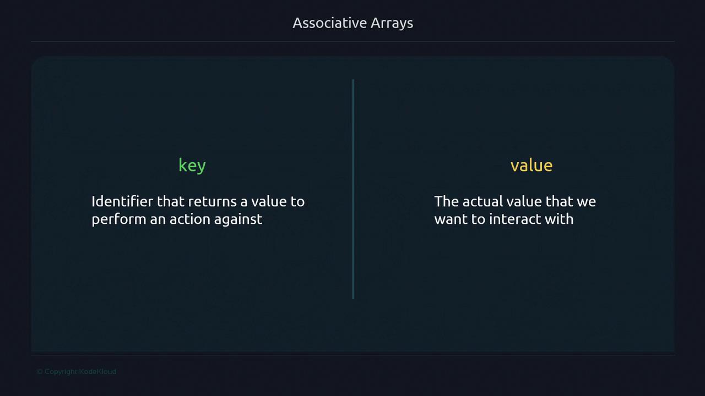

# Unquoted
for s in ${sections[@]}; do
  echo "$s"
done

# Quoted
for s in "${sections[@]}"; do
  echo "$s"
done
```

Output:

```plaintext theme={null}
Coding
Standards

Coding Standards
```

> **triangle-alert** Always **quote** `${array[@]}` in loops or commands to preserve elements containing spaces.\
  Unquoted expansions can lead to unexpected word splitting.

***

## Modifying Arrays

### Append an Element

```bash theme={null}
#!/usr/bin/env bash

sections=("Intro" "Methods")
sections+=("Conclusion")
echo "${sections[@]}"  # Intro Methods Conclusion
```

### Overwrite Entire Array

Assigning a string replaces index `0` but retains the array type:

```bash theme={null}
#!/usr/bin/env bash

sections=("A" "B" "C")
sections="NewSection"
echo "${sections[@]}"  # NewSection
```

***

## Further Reading and References

* [Bash Reference Manual: Arrays](https://www.gnu.org/software/bash/manual/html_node/Arrays.html)
* [Kubernetes Documentation](https://kubernetes.io/docs/)
* [Docker Hub](https://hub.docker.com/)
* [Terraform Registry](https://registry.terraform.io/)

- [Watch Video](https://learn.kodekloud.com/user/courses/advanced-bash-scripting/module/df27d5e6-23c2-4e4e-9163-4dd73f639282/lesson/a623fdf5-7868-4d07-8054-cd0a4077b562)


# Associative

Source: https://notes.kodekloud.com/docs/Advanced-Bash-Scripting/Arrays/Associative/page

This tutorial explores associative arrays in Bash, covering declaration, access, modification, and iteration in scripts.

In this tutorial, you will explore **associative arrays** in Bash—powerful data structures that use named keys for direct value lookup. By the end, you’ll understand how to declare, access, modify, and iterate over associative arrays in your scripts.

## Indexed Arrays vs. Associative Arrays

Think of indexed arrays as a numbered chest of drawers (0-based), and associative arrays as labeled drawers you open by name.

| Array Type        | Indexing Method   | Declaration            |
| ----------------- | ----------------- | ---------------------- |
| Indexed Array     | Numeric, 0-based  | `declare -a arr=(...)` |
| Associative Array | String-based keys | `declare -A arr=(...)` |

### Example: Indexed Array (Socks Analogy)

```bash theme={null}
#!/usr/bin/env bash
declare -a chest_drawer=("shirts" "sports clothing" "socks" "jeans")
echo "${chest_drawer[2]}"
```

```bash theme={null}
$ ./socks.sh
socks
```

## Checking Your Bash Version

Associative arrays require **Bash 4.0+**. Verify with:

```bash theme={null}
$ echo $BASH_VERSION
5.2.15(1)-release
```

> **triangle-alert** If your Bash version is older than 4.0, associative arrays won’t work. Please upgrade before continuing.

## Declaring and Accessing an Associative Array

Use `declare -A` to define an associative array. Here’s how to store and retrieve “socks” by key:

```bash theme={null}
#!/usr/bin/env bash
declare -A chest_drawer=(
  ["shirts"]="T-Shirts and polo shirts"
  ["sports"]="All sorts of Sports Clothing here"
  ["socks"]="Formal and everyday socks"
  ["jeans"]="Jeans, and some casual dress shorts"
)

echo "${chest_drawer["socks"]}"
```

```bash theme={null}
$ ./associative-v1.sh
Formal and everyday socks
```

## Analogy: Emergency Contacts

Store quick-dial numbers by department name:

```bash theme={null}
#!/usr/bin/env bash
declare -A emergency_contacts=(
  ["Fire Department"]="555-0001"
  ["Police Department"]="555-0002"
  ["Hospital"]="555-0003"
)

echo "${emergency_contacts["Fire Department"]}"
```

```bash theme={null}
$ ./emergency.sh
555-0001
```

## Key-Value Pair Concept

Associative arrays map **keys** (identifiers) to **values** (data).

> **lightbulb** In Bash associative arrays, each key is unique and case-sensitive: `"Mark"` ≠ `"mark"`.



## Example: Email Addresses

```bash theme={null}
#!/usr/bin/env bash
declare -A email_addresses=(
  ["Mark"]="mark@email.com"
  ["Kriti"]="kriti@email.com"
  ["Feng"]="feng@email.com"
)

echo "${email_addresses["Mark"]}"
```

```bash theme={null}
$ ./email-1.sh
mark@email.com
```

## Adding New Elements

Assign a key in square brackets to insert or append:

```bash theme={null}
#!/usr/bin/env bash
declare -A email_addresses=(
  ["Mark"]="mark@email.com"
  ["Kriti"]="kriti@email.com"
  ["Feng"]="feng@email.com"
)
