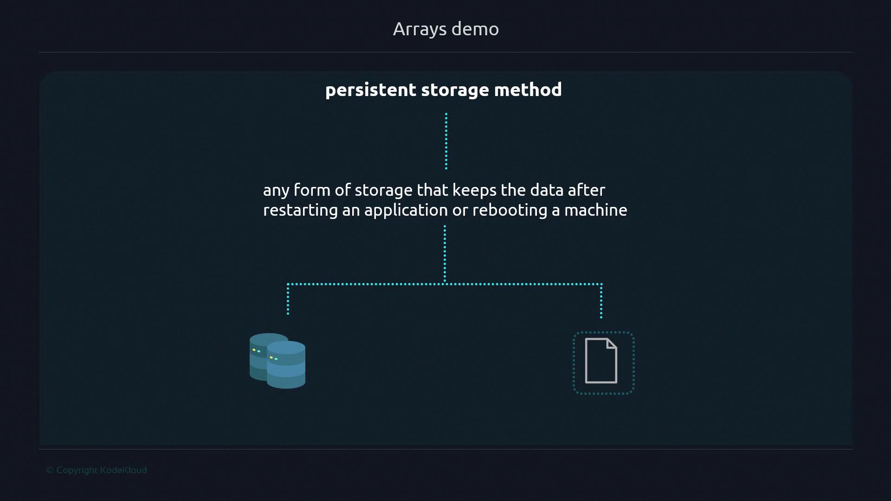
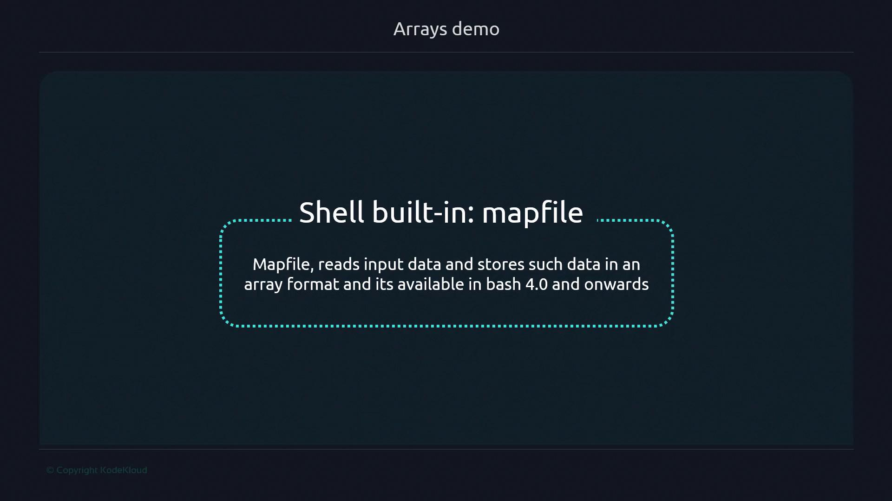
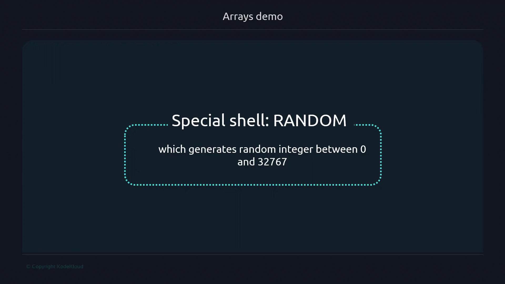

# Arrays demo

Source: https://notes.kodekloud.com/docs/Advanced-Bash-Scripting/Arrays/Arrays-demo/page

This tutorial explains how to create a Bash script that randomly selects a lunch spot from a list without repeats.

In this tutorial, we’ll build a Bash script that picks a random lunch spot from a list—without repeats—by combining indexed arrays and simple file-based persistence. This pattern is perfect for one-time draws, rotating duties, or any scenario where you want to consume items until the list is exhausted.

Imagine a team of 20 colleagues who vote on their favorite restaurants each Friday. Everyone adds their go-to spot to an array. The script then:

* Reads the list into memory
* Selects a random entry
* Displays it
* Removes it from both memory and disk
* Exits with an error if the list is missing or empty

## Why In-Memory vs Persistent Storage?

1. Manipulating data in memory means changes disappear once the script ends.


2. Persistent storage (files, databases) retains data between runs.



> **lightbulb** This script uses Bash 4.0+ for the `mapfile` builtin.

## Key Bash Features

* **mapfile -t**: Loads lines from a file (or stdin) into an array.



* **\$RANDOM**: Yields a pseudo-random integer between 0 and 32767.



### Exit Code Reference

| Exit Code               | Condition                              |
| ----------------------- | -------------------------------------- |
| 150 (`FILE_NOT_FOUND`)  | `food_places.txt` is missing           |
| 180 (`NO_OPTIONS_LEFT`) | No entries remain in `food_places.txt` |

***

## 1. Prepare the Data File

Create `food_places.txt` with initial entries:

```bash theme={null}
cat <<EOF > food_places.txt
Ramen
Sushi
Tacos
Dal makhani
EOF
```

***

## 2. Initialize the Script

Create `lunch_selector.sh`:

```bash theme={null}
#!/usr/bin/env bash
declare -a lunch_options
