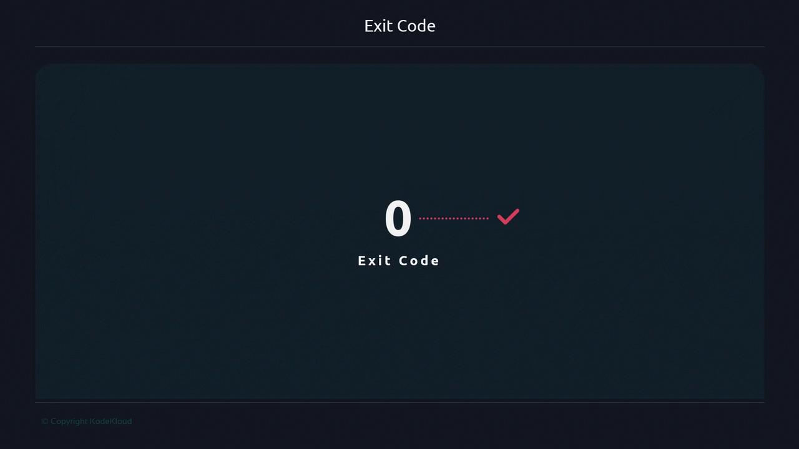

# Other workflow steps...
echo "Now running additional setup tasks..."

<Callout icon="triangle-alert" color="#FF6B6B">
Always ensure you `kill` the correct PID. Accidentally terminating the wrong process can disrupt critical services.
</Callout>

echo "Stopping JMeter server (PID: $jmeter_pid)"
kill -SIGTERM "$jmeter_pid"
```

***

## Using `$$` to Identify Your Shell or Script

The `$$` variable prints the PID of the current shell or script process:

```bash theme={null}
$ echo $$
79315
$ ps -p $$ -o pid,cmd
  PID CMD
79315 -bash
```

Opening a new terminal tab or window yields a different `$$` value:

```bash theme={null}
$ echo $$
91933
```

### Inspecting `$$` Inside a Script

Create `print_pid.sh`:

```bash theme={null}
#!/usr/bin/env bash
echo "This script’s PID is $$"
sleep 60
```

Run it in the background:

```bash theme={null}
$ ./print_pid.sh &
[1] 94479
94479
$ ps --pid 94479,94481 -o pid,ppid,cmd
  PID  PPID CMD
94479 79315 /bin/bash ./print_pid.sh
94481 94479 sleep 60
```

* **PID 94479** corresponds to the script itself (`$$`).
* **PID 94481** is the child `sleep` process.

***

## `$$` and Subshell Behavior

Subshells inherit the parent shell’s PID, so `$$` stays constant:

```bash theme={null}
#!/usr/bin/env bash

echo "Parent shell PID: $$"
(
  echo "Inside subshell PID: $$"
)
```

Output:

```bash theme={null}
$ ./subshell_pid.sh
Parent shell PID: 54344
Inside subshell PID: 54344
```

All references to `$$` show the same PID because subshells share the parent’s process ID.

***

## Key Takeaways

* **`$!`** returns the PID of the last command run **in the background**.
* **`$$`** returns the PID of **your current shell** or the running script.

Understanding these variables will help you write more robust scripts, automate process control, and debug complex workflows with confidence.

***

## Links and References

* [Bash Reference Manual](https://www.gnu.org/software/bash/manual/bash.html)
* [Linux Process Management](https://tldp.org/LDP/abs/html/processes.html)
* [Apache JMeter](https://jmeter.apache.org/)

<CardGroup>
  <Card title="Watch Video" icon="video" href="https://learn.kodekloud.com/user/courses/advanced-bash-scripting/module/7ff1ccc1-5a14-41fc-817c-c0ec4a100231/lesson/fa6ec11d-812c-48b9-a061-728a7275b5a6" />
</CardGroup>


# Exit code

Source: https://notes.kodekloud.com/docs/Advanced-Bash-Scripting/Streams/Exit-code/page

This article explains exit codes in Bash scripts, their significance, and how to implement custom exit codes for error handling.

Applications and commands in Unix return an exit status—a numerical code indicating success or failure. By convention, a zero exit code means success, while any non-zero code signals an error. Understanding these codes is crucial for writing robust shell scripts and ensuring predictable automation.

## Analogy: The Food Delivery Driver

Consider a food delivery driver verifying an address before dispatch. If the address is correct, the driver proceeds. If it’s wrong, they return with an error report. This mirrors how scripts and commands operate: they check conditions, perform tasks, and then report their status.

<Frame>
  
</Frame>

## How Exit Codes Work in Unix

Every Unix-based command finishes with an exit code:

* **0**: Success
* **Non-zero**: An error occurred

<Frame>
  
</Frame>

### Common Exit Codes Table

| Exit Code | Description                            |
| --------- | -------------------------------------- |
| 0         | Success                                |
| 1         | General error                          |
| 2         | Misuse of shell builtins               |
| 126       | Command invoked cannot execute         |
| 127       | Command not found                      |
| 128+      | Fatal error (invalid argument to exit) |

<Callout icon="triangle-alert">
  Exit codes are constrained to the range 0–255. Any value above 255 wraps around modulo 256.
</Callout>

Certain exit codes are reserved by the shell or operating system. Defining your own codes (above 2) helps callers distinguish between different failure modes.

## Custom Exit Codes in Your Script

Below is a template that checks for a configuration file and terminates with meaningful exit statuses.

```bash theme={null}
#!/usr/bin/env bash

export CONF_FILE="/var/tmp/file.conf"

terminate() {
    local message="$1"
    local code="${2:-1}"
    echo "${message}" >&2
    exit "${code}"
}

echo "Starting script execution"
echo "Sourcing configuration file"
if [[ ! -f "${CONF_FILE}" ]]; then
    terminate "Configuration file not found: ${CONF_FILE}" 2
fi

exit 0
```

<Callout icon="lightbulb">
  Use clear, documented exit codes in your scripts. This makes it easier for users and other scripts to handle errors automatically.
</Callout>

## References

* [GNU Bash Manual: Exit Status](https://www.gnu.org/software/bash/manual/html_node/Exit-Status.html)
* [Linux Shell Exit Codes](https://tldp.org/LDP/abs/html/exitcodes.html)

<CardGroup>
  <Card title="Watch Video" icon="video" href="https://learn.kodekloud.com/user/courses/advanced-bash-scripting/module/d972cdb8-d83f-4d2a-bf89-4d4b38161cf2/lesson/5262e47c-04af-4fe1-a50e-514f85c85a97" />

  <Card title="Practice Lab" icon="installation" href="https://learn.kodekloud.com/user/courses/advanced-bash-scripting/module/d972cdb8-d83f-4d2a-bf89-4d4b38161cf2/lesson/0357fc3d-7800-4944-a641-b5d713d957f4" />
</CardGroup>
