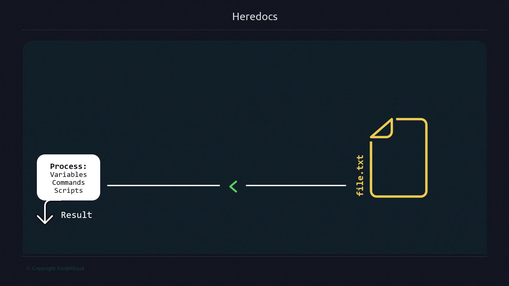

# Heredocs

Source: https://notes.kodekloud.com/docs/Advanced-Bash-Scripting/Streams/Heredocs/page

Heredocs allow embedding multi-line text in Bash scripts, simplifying command execution and reducing errors compared to multiple echo statements.

Heredocs let you include multi-line text or commands directly within a Bash script, avoiding repetitive `echo` statements and manual editing. They’re invaluable for generating configuration files, embedding SQL queries, or executing batches of commands over SSH—especially in non-interactive environments where editors like Vim or Nano aren’t available.

<Callout icon="lightbulb">
  A Heredoc sends an entire block of text as input to a command. This keeps your scripts clean and reduces the risk of accidental overwrites when using `>` vs. `>>`.
</Callout>

<Frame>
  
</Frame>

***

## Why Choose Heredocs Over Multiple `echo` Commands

Using individual `echo` lines quickly becomes error-prone as your script grows:

```bash theme={null}
echo "line1" > file.txt   # creates or overwrites file.txt
echo "line2" >> file.txt  # appends to file.txt
echo "line3" >> file.txt  # appends to file.txt
```

If you mistakenly use `>` instead of `>>`, you can overwrite your file. Heredocs treat the block as a single unit of input, eliminating this risk.

***

## Basic Heredoc Syntax

Feed a block of text into any command—here, `cat`—using the `<<DELIM` operator:

```bash theme={null}
cat <<EOF
line1
line2
line3
EOF
```

Output:

```text theme={null}
line1
line2
line3
```

To write directly to a file, redirect the command’s output:

```bash theme={null}
cat > file.txt <<EOF
line1
line2
line3
EOF
```

Tips for smooth usage:

* The closing delimiter must match exactly (case-sensitive) and have no leading spaces.
* Common delimiters include `EOF`, `EOM`, or a custom token of your choice.

```bash theme={null}
cat <<CUSTOM
alpha
beta
gamma
CUSTOM
```

<Callout icon="triangle-alert">
  If you mistype the closing token, the shell will continue to prompt for input until you either provide the correct delimiter or cancel with `Ctrl+C`.
</Callout>

***

## Common Use Cases for Heredocs

| Use Case                      | Example Command                |
| ----------------------------- | ------------------------------ |
| Generate configuration files  | `cat > app.conf <<EOF ... EOF` |
| Embed SQL scripts             | `psql <<SQL ... SQL`           |
| Batch SSH commands            | `ssh user@host <<EOF ... EOF`  |
| Create Dockerfiles on the fly | `docker build - <<EOF ... EOF` |

***

## Quick Checklist: Heredoc Benefits

<Frame>
  
</Frame>

* One-liner for simple operations
* Embed large blocks of text without quotes
* Support complex scripting scenarios

***

## Remote Command Execution via SSH

You can run multiple commands on a remote host in one go. First, check your remote directory:

```bash theme={null}
ssh ubuntu@54.161.198.22 ls
