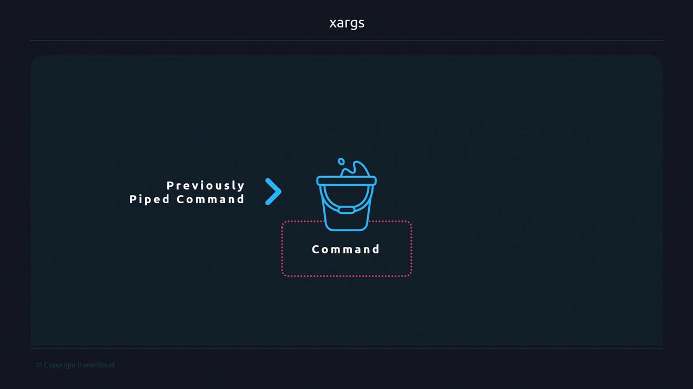
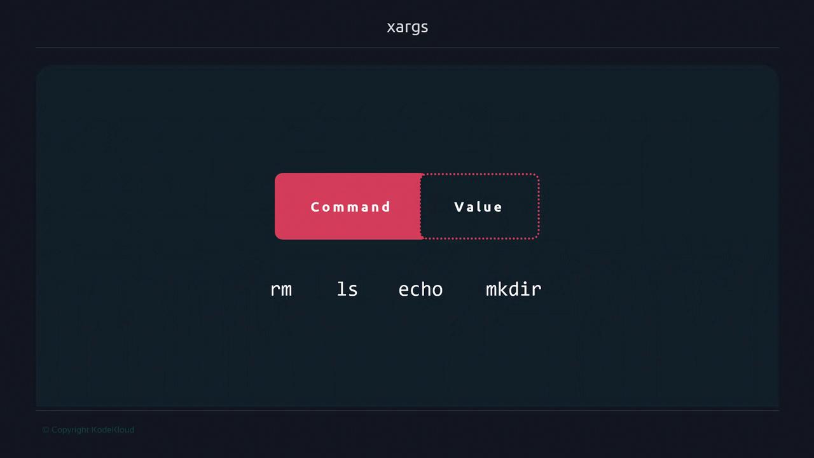

# 7
```

You can redirect or pipe interchangeably:

```bash theme={null}
sort file.txt
sort < file.txt

cat file.txt
cat < file.txt
```

By contrast, `xargs` acts like a “bucket”—it collects output from a previous command and then invokes another command, passing those collected items as arguments.

<Frame>
  
</Frame>

***

## How xargs Works

Assume `file.txt` contains:

```text theme={null}
file
content
to demonstrate
xargs functionality
```

Piping to `echo` without `xargs` preserves newlines in the input stream but not in output:

```bash theme={null}
cat file.txt | xargs echo
# file content to demonstrate xargs functionality
```

Under the hood, `xargs`:

1. Reads whitespace (spaces, tabs, newlines) by default.
2. Constructs a single command line by concatenating all items.
3. Executes that command:

```bash theme={null}
echo file content to demonstrate xargs functionality
```

***

## Common Use Cases

### Supplying Arguments to Commands

Commands like `rm`, `ls`, `mkdir` or even custom scripts require positional arguments. Instead of writing loops, `xargs` can automate this:

<Frame>
  
</Frame>

```bash theme={null}
# Prepend a custom message to file.txt contents
cat file.txt \
  | xargs echo "The contents of file.txt passed by xargs are:"
# The contents of file.txt passed by xargs are: file content to demonstrate xargs functionality
```

### Creating Multiple Directories

Generate directories from a whitespace-separated list:

```bash theme={null}
echo "dir1 dir2 dir3" \
  | xargs mkdir
ls
# dir1  dir2  dir3
```

### Table of Handy xargs Examples

| Use Case              | Command Example                                   |
| --------------------- | ------------------------------------------------- |
| Remove log files      | `find . -name '*.log' \| xargs rm -f`             |
| Create directories    | `echo "a b c" \| xargs mkdir`                     |
| Parallel SSH sessions | `cat hosts.txt \| xargs -P4 -I{} ssh {} hostname` |

***

## Handling Special Characters

<Callout icon="triangle-alert">
  By default, `xargs` splits on any whitespace. Filenames containing spaces or special characters may break. Use `-0` with NUL-separated data (e.g., `find . -print0 \| xargs -0`) to handle arbitrary names safely.
</Callout>

<Frame>
  
</Frame>

***

## Additional Resources

* [GNU xargs Manual](https://www.gnu.org/software/findutils/manual/html_mono/findutils.html#xargs-invocation)
* [Bash Guide: Process Substitution & xargs](https://mywiki.wooledge.org/BashFAQ/082)
* [Linux `find` + `xargs` Examples](https://www.tecmint.com/15-practical-examples-of-linux-find-command/)

***

<CardGroup>
  <Card title="Watch Video" icon="video" href="https://learn.kodekloud.com/user/courses/advanced-bash-scripting/module/d972cdb8-d83f-4d2a-bf89-4d4b38161cf2/lesson/1b69f303-8a40-4884-b120-f24532f0854a" />
</CardGroup>


# devnull

Source: https://notes.kodekloud.com/docs/Advanced-Bash-Scripting/Streams/devnull/page

Redirecting standard error to standard output in Bash to capture or suppress command output effectively.

Redirecting standard error (stderr) into standard output (stdout) is a powerful shell idiom that helps you capture or suppress all command output in one place. In this guide, we’ll start with basic redirection operators and build up to the full pattern:

```bash theme={null}
2>&1
```

By the end, you’ll know how to merge streams, write them to files, and even discard them using `/dev/null`.

## 1. Basic redirection with `>`

A single greater‐than symbol sends a file descriptor to a file (or another stream):

```bash theme={null}
$ ls > stdout.txt
```

* Left of `>` is the source FD (default is 1, i.e. stdout).
* Right of `>` is the destination (often a filename).

You can explicitly specify the FD:

```bash theme={null}
$ ls 1>stdout.txt    # same as `ls > stdout.txt`
$ ls 2>stderr.txt    # redirect stderr (fd 2) into stderr.txt
```

<Callout icon="lightbulb">
  When you omit the FD before `>`, Bash assumes `1` (standard output).
</Callout>

## 2. Merging stdout and stderr with `&>`

Bash provides a shorthand to capture both streams at once:

```bash theme={null}
$ ls -z &> all-logs.txt
$ cat all-logs.txt
ls: cannot access '-z': No such file or directory
```

Here, `&>` is equivalent to `>file 2>&1` in Bash.

## 3. Duplicating file descriptors using `>&n`

When `&` appears on the right side of `>`, you’re duplicating an FD instead of writing to a filename:

```bash theme={null}
$ echo "warning" >&2    # send stdout (fd 1) into stderr (fd 2)
```

This is different from `&> file.txt`, which writes both stdout and stderr into a file.

## 4. Swapping streams with `n>&m`

You can redirect one FD into another:

* Send stdout into stderr:

  ```bash theme={null}
  $ echo "warning" >&2
  ```

* Send stderr into stdout:

  ```bash theme={null}
  $ ls -z 2>&1
  ls: cannot access '-z': No such file or directory
  ```

<Callout icon="triangle-alert">
  Order matters when combining redirections. Always redirect stdout first, then redirect stderr into it.
</Callout>

## 5. Redirecting both streams to a file

To capture **both** stdout and stderr in a single file, use:

```bash theme={null}
$ ls -z > file.txt 2>&1
```

1. `> file.txt` sends stdout (fd 1) into `file.txt`.
2. `2>&1` redirects stderr (fd 2) into wherever stdout is now pointing.

## 6. Discarding all output with `/dev/null`

If you want a command to produce **no output**, redirect both streams to `/dev/null`, the special “black hole” in Unix-like systems:

```bash theme={null}
> /dev/null 2>&1
```

<Frame>
  
</Frame>

Use this pattern when you need a silent command—no stdout, no stderr.

<Frame>
  
</Frame>

***

## Key takeaways

| Operator           | Purpose                                   | Example                         |
| ------------------ | ----------------------------------------- | ------------------------------- |
| `>file`            | Redirect stdout (fd 1) to a file          | `ls > out.txt`                  |
| `2>file`           | Redirect stderr (fd 2) to a file          | `ls -z 2>err.txt`               |
| `&>file`           | Redirect both stdout and stderr to a file | `cmd &>all.txt`                 |
| `n>&m`             | Duplicate FD n into FD m                  | `echo "err" >&2`                |
| `2>&1`             | Merge stderr into stdout                  | `cmd >out.txt 2>&1`             |
| `> /dev/null 2>&1` | Discard both stdout and stderr            | `some_command > /dev/null 2>&1` |

<Frame>
  
</Frame>

***

## Links and References

* [Bash Redirections (GNU Manual)](https://www.gnu.org/software/bash/manual/html_node/Redirections.html)
* [The Linux `/dev/null` Explained (StackOverflow)](https://stackoverflow.com/questions/1146320/what-is-dev-null)
* [Advanced Bash-Scripting Guide](https://tldp.org/LDP/abs/html/)

<CardGroup>
  <Card title="Watch Video" icon="video" href="https://learn.kodekloud.com/user/courses/advanced-bash-scripting/module/d972cdb8-d83f-4d2a-bf89-4d4b38161cf2/lesson/f38941db-7cb5-45ee-a2ad-aaacfffe30f7" />
</CardGroup>
