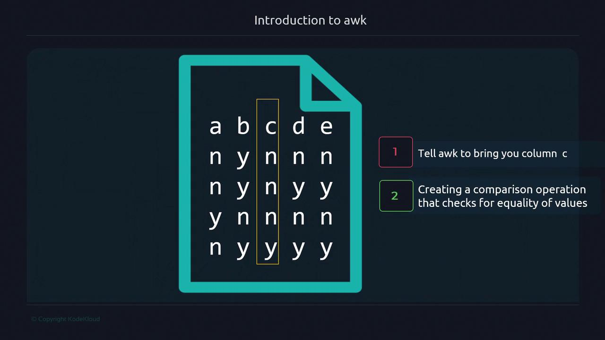

# Introduction to awk

Source: https://notes.kodekloud.com/docs/Advanced-Bash-Scripting/awk/Introduction-to-awk/page

Awk is a powerful language for text processing, enabling easy filtering, transforming, and formatting of structured text.

Awk is a powerful, domain-specific language for text processing. Whether you’re automating seat lookups in a movie theater or parsing system statistics, Awk’s field-oriented syntax and built-in variables make it easy to filter, transform, and format structured text.

## Why Use Awk?

* Processes structured data by rows (records) and columns (fields)
* Handles irregular whitespace automatically
* Integrates seamlessly into Unix pipelines
* Offers concise one-liners or full-fledged scripts

## Fields and Records

Imagine a seating chart stored in `minimovies.txt`, where “Y” means a seat is taken and “N” means it’s available. Awk treats each line as a **record** and each whitespace-separated item as a **field**.


* Columns ➔ Fields (`$1`, `$2`, …)
* Rows ➔ Records (`NR` is the built-in record counter)

### Extracting a Specific Seat

Step 1: Select the third column (`$3`) for every record.\
Step 2: Filter for record number 2 using `NR`.



```bash theme={null}
