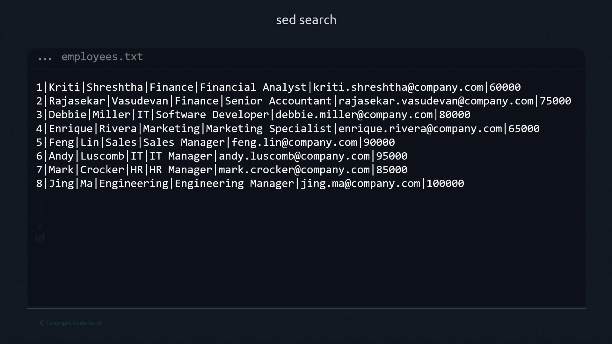

# Inspect original
cat employees.txt

# Delete lines 2 through 7 and save changes
sed -i '2,7d' employees.txt

# Verify result
cat employees.txt
```

Resulting file:

```text theme={null}
1|Kriti|Shreshtha|Finance|Financial Analyst|kriti.shreshtha@company.com|60000
8|Jing|Ma|Engineering|Engineering Manager|jing.ma@company.com|100000
```

<Callout icon="triangle-alert">
  On macOS, `sed -i` requires a zero-length extension: `sed -i '' '2,7d' file.txt`. Always back up critical data before in-place edits.
</Callout>

***

## Quick Reference

| Command Syntax  | Effect            | Example                       |
| --------------- | ----------------- | ----------------------------- |
| `sed 'd'`       | Delete all lines  | `sed 'd' employees.txt`       |
| `sed 'Nd'`      | Delete Nth line   | `sed '6d' employees.txt`      |
| `sed 'M,Nd'`    | Delete line range | `sed '3,5d' employees.txt`    |
| `sed -i 'M,Nd'` | In-place deletion | `sed -i '2,7d' employees.txt` |

***

## Links & References

* [GNU `sed` Manual](https://www.gnu.org/software/sed/manual/sed.html)
* [Sed One-Liners Explained](https://www.pement.org/sed/)
* [Shell Quoting Best Practices](https://www.gnu.org/software/bash/manual/html_node/Quoting.html)

By mastering these delete operations, you can efficiently cleanse, filter, or reorganize textual data in scripts and pipelines. Happy editing!

<CardGroup>
  <Card title="Watch Video" icon="video" href="https://learn.kodekloud.com/user/courses/advanced-bash-scripting/module/2d48deee-c9f8-4d65-b92f-f164c06b545c/lesson/0dadaabc-b371-4fc5-ace4-1a1b4dca9f42" />
</CardGroup>


# Find

Source: https://notes.kodekloud.com/docs/Advanced-Bash-Scripting/sed/Find/page

Learn to use `sed` for searching, printing, and deleting text patterns in files efficiently.

Enhance your text-processing workflow by using `sed` to search, print, or delete specific patterns directly within files. While similar to [grep](https://www.gnu.org/software/grep/manual/grep.html), `sed` lets you combine pattern matching with editing commands in one step.

To follow along, we’ll use an `employees.txt` file with records formatted as `ID|First|Last|Department|Role|Email|Salary`.

<Frame>
  
</Frame>

## 1. Basic Search Syntax

`sed` requires both a pattern and an action. The minimal form is:

```bash theme={null}
sed '/pattern/' file
```

Without an explicit action, `sed` may default to printing every line or throw an error:

```bash theme={null}
$ sed '/Manager/' employees.txt
