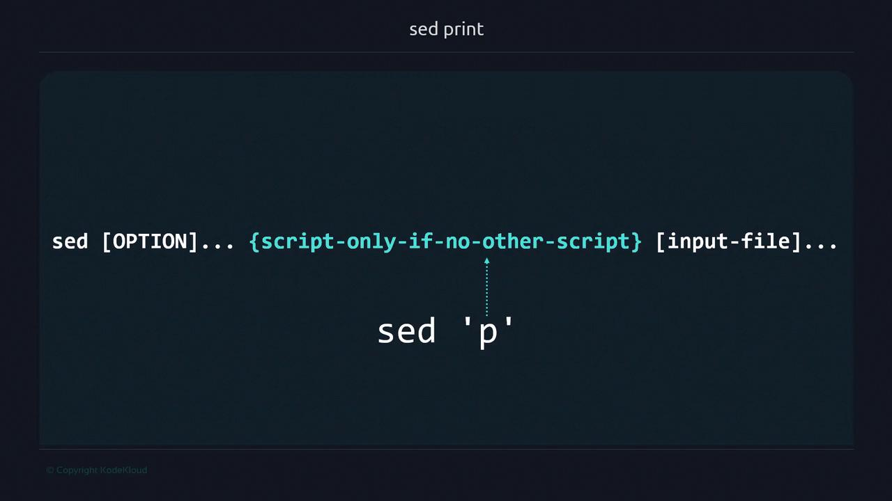

# sed print

Source: https://notes.kodekloud.com/docs/Advanced-Bash-Scripting/sed/sed-print/page

This guide teaches how to use seds print script to selectively display lines and control output in command-line workflows.

sed is a powerful **stream editor** for transforming text on the command line. In this guide, you'll learn how to use the `p` (print) script to display lines selectively, control automatic output, and integrate sed into complex pipelines. Whether you're filtering log files or extracting specific records, mastering sed's I/O model is essential for efficient command-line workflows.

## Unix I/O Model

| I/O Type          | Description                                        | Example                                        |               |           |
| ----------------- | -------------------------------------------------- | ---------------------------------------------- | ------------- | --------- |
| Default Output    | Commands write to the terminal by default          | `ls`                                           |               |           |
| Default Input     | Commands read from files or stdin when unspecified | `grep "pattern" file.txt`                      |               |           |
| Pipes (\`         | \`)                                                | Passes one command's output as another's input | \`echo "data" | sed 'p'\` |
| Interactive Input | Reads from keyboard until EOF or termination       | `sed 'p'`                                      |               |           |

## sed's Default Behavior

By default, sed processes text from **stdin** or listed files and writes each line to **stdout**, applying any provided scripts.

Typing:

```bash theme={null}
sed 'p'
```

reads from stdin and applies the `p` (print) script to every line.

Example:

```bash theme={null}
echo "Hello from sed" | sed 'p'
```

Output:

```bash theme={null}
Hello from sed
Hello from sed
```

Explanation:

1. sed reads each line into the *pattern space*.
2. The `p` script prints it immediately.
3. Without disabling automatic printing, sed outputs the line again after processing.

### Syntax Overview

```text theme={null}
sed [OPTION]... {script-only-if-no-other-script} [input-file]...
```



## Using sed with Pipes and Files

### Piping Input

```bash theme={null}
echo "This line prints twice" | sed 'p'
```

Output:

```text theme={null}
This line prints twice
This line prints twice
```

### Reading from a File

```bash theme={null}
echo "File line example" > sample.txt
sed 'p' sample.txt
```

Output:

```text theme={null}
File line example
File line example
```

In this case, `sample.txt` replaces stdin as sed's input source.

## Selecting Specific Lines

sed supports *addresses* (such as line numbers) to target scripts.

```bash theme={null}
