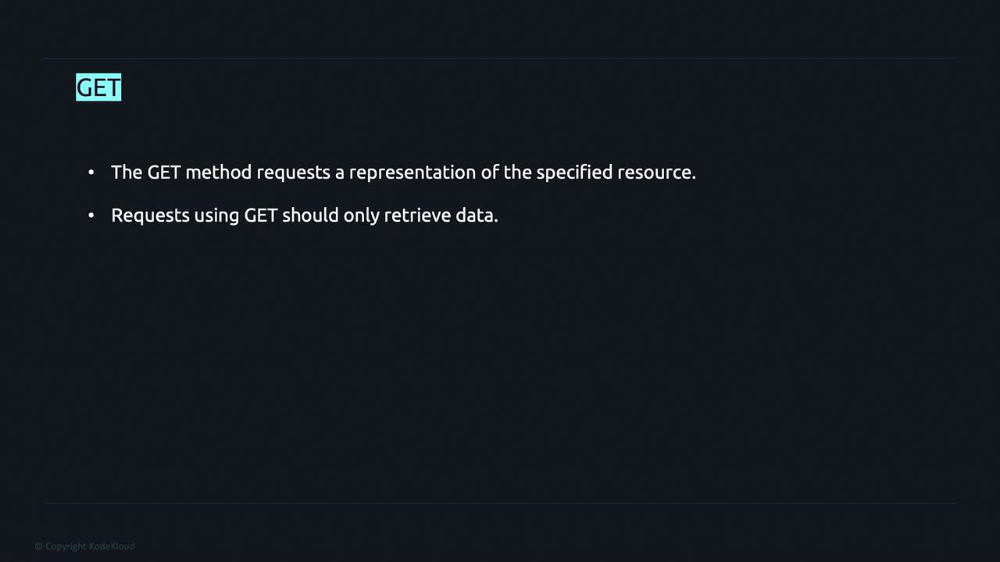
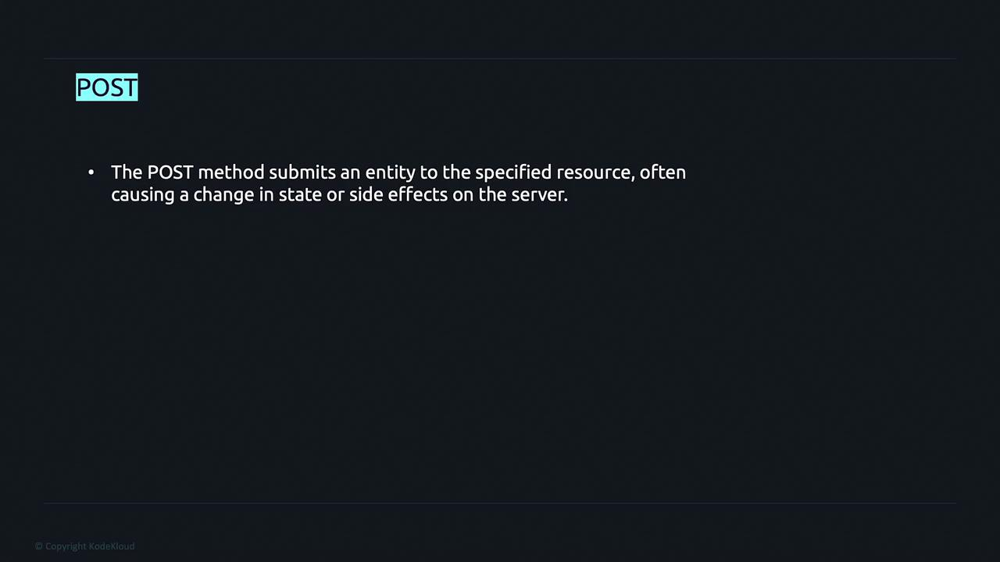
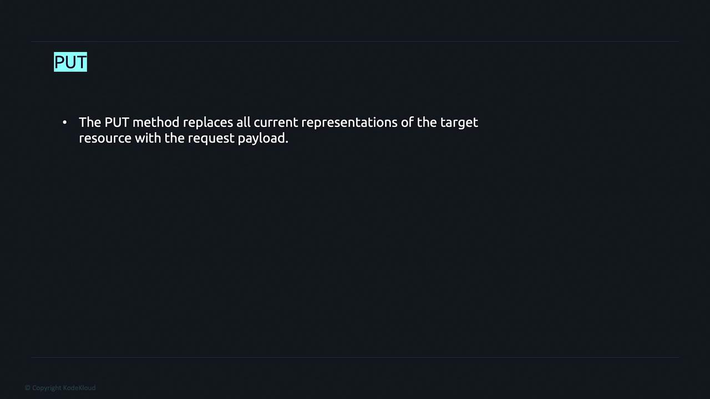
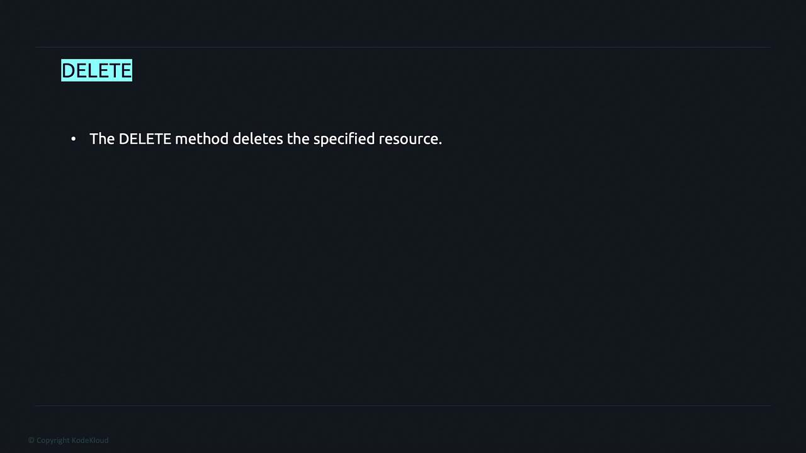

# HTTP verbs

Source: https://notes.kodekloud.com/docs/Advanced-Golang/API-Development-Project/HTTP-verbs/page

This guide explains how to build a RESTful API supporting GET, POST, PUT, and DELETE operations for complete CRUD functionality.

In this guide, we build a fully-fledged RESTful API that supports GET, POST, PUT, and DELETE operations—enabling complete CRUD (Create, Read, Update, Delete) functionality. Although this might seem complex at first, we will break down and implement each concept step by step.

HTTP defines several request methods to determine the action to be taken for a given resource. While these methods are sometimes seen as mere nouns, they are conventionally known as HTTP verbs. Below, we explore some of the most commonly used HTTP verbs:

## GET Method

The GET method is used to request a representation of a specified resource. Endpoints defined with GET should strictly retrieve data without causing any side effects, ensuring safe and idempotent operations.

> **lightbulb** Ensure that GET requests do not alter the resource state on the server.

## POST Method

The POST method allows you to submit data to a specified resource. This operation often results in the creation of a new resource or triggers a change in the server's state. In the context of CRUD, POST is typically associated with the "create" action.

## PUT Method

The PUT method is designed to update a resource. It replaces all current representations of the target resource with the data provided in the request payload. Use PUT when you need to perform full updates to existing resources.

> **lightbulb** When updating partial resources, consider using the PATCH method instead of PUT for efficiency.

## DELETE Method

The DELETE method allows for the removal of a specified resource from the server. This operation is essential for managing data lifecycle and cleaning up unnecessary resources.

For this project, we will focus on implementing these four HTTP methods—GET, POST, PUT, and DELETE—to perform the necessary CRUD operations effectively. This modular approach ensures that your API adheres to RESTful principles while providing a solid foundation for future expansion.

- [Watch Video](https://learn.kodekloud.com/user/courses/advanced-golang/module/483ddd82-96d2-43d5-a9a8-e27e8cdb064d/lesson/22c37a9c-6fc6-45e3-ace5-e35bca51308b)
