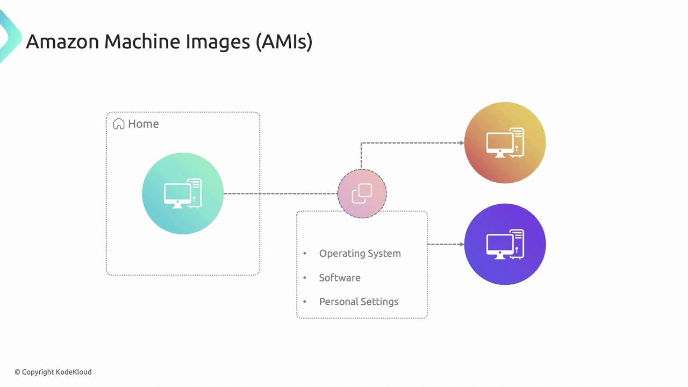
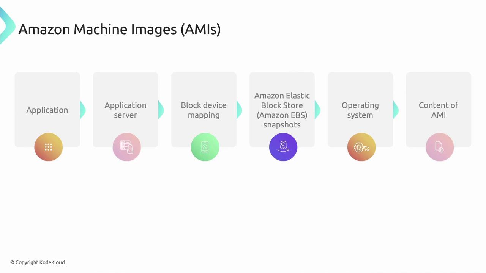
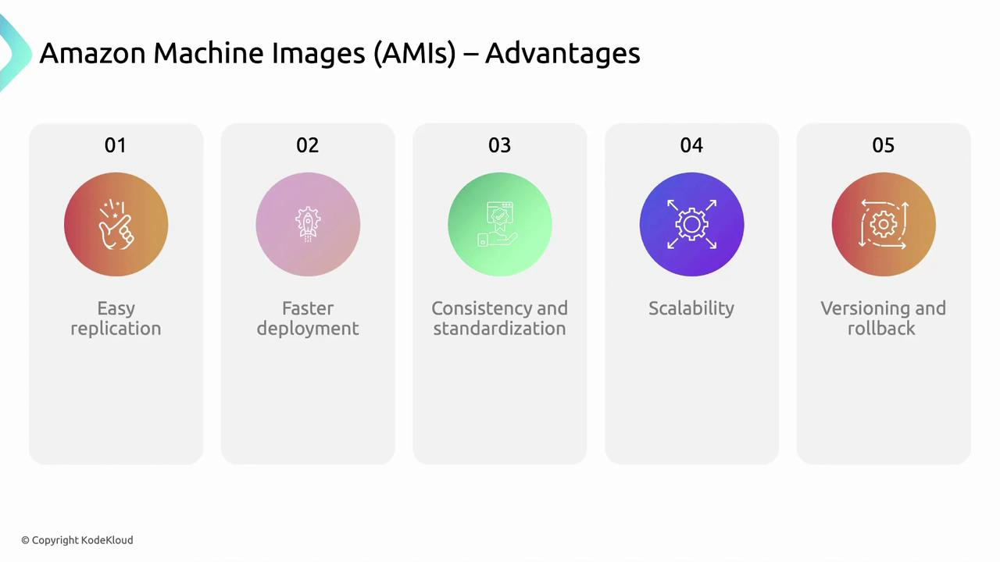

# commonly:
# /var/[AWS_SECRET_ACCESS_KEY]
```

There are many migration scenarios (master-to-master, containerized Jenkins, CloudBees-specific workflows). The steps below cover the common case for systemd-based, package-installed Jenkins instances.

<Frame>
  
</Frame>

## Pre-migration checklist

| Area                  | Why it matters                                  | Action / Example                                                |
| --------------------- | ----------------------------------------------- | --------------------------------------------------------------- |
| Jenkins & plugins     | Version mismatches can cause incompatibilities  | Ensure target Jenkins version and plugin set match source       |
| Java / JDK            | Jenkins is sensitive to Java versions           | Use the same JDK version on both nodes                          |
| Disk space            | Jenkins home can be large (jobs, artifacts)     | Confirm free space on target to accommodate archive             |
| Secrets & credentials | Secret files and `credentials.xml` are critical | Confirm `secrets/` and `credentials.xml` are included in backup |
| Agents / connectivity | Hostname/IP changes may require reconfiguration | Plan for reconnecting agents and updating hostnames/IPs         |

<Callout icon="lightbulb">
  Plan for plugin compatibility and integrations (e.g., secret stores, LDAP, external agents). If the target already has Jenkins installed, back it up before proceeding.
</Callout>

## Step-by-step migration

The instructions assume `JENKINS_HOME` is `/var/lib/jenkins` (common for package installs). If your `JENKINS_HOME` is elsewhere, substitute that path.

### 1) Prepare the source node (create a consistent snapshot)

Stop Jenkins to get a consistent filesystem snapshot:

```bash theme={null}
sudo systemctl stop jenkins
sudo systemctl disable jenkins
```

Create a compressed tarball of the `jenkins` directory from its parent (commonly `/var/lib`):

```bash theme={null}
cd /var/lib
sudo tar -czf jenkins-backup.tar.gz jenkins
```

Tip: Use a timestamped filename for versioning, e.g. `jenkins-backup-$(date +%Y%m%d).tar.gz`.

Explanation of tar flags:

* `-c` = create
* `-z` = gzip
* `-f` = filename

### 2) Transfer the backup to the target

Copy the tarball using `scp`, `rsync`, or another transport. Example with `scp`:

```bash theme={null}
scp /var/lib/jenkins-backup.tar.gz root@165.3.22.*:/tmp/
```

Use SSH keys for automation and resume-capable tools like `rsync`/`rsync --progress --partial` for large transfers.

### 3) Prepare and restore on the target node

Log into the target VM and stop/disable the existing Jenkins service:

```bash theme={null}
sudo systemctl stop jenkins
sudo systemctl disable jenkins
```

Back up any existing Jenkins home on the target before overwriting:

```bash theme={null}
cd /var/lib
# Only run the backup if the directory exists
if [ -d jenkins ]; then
  sudo tar -czf jenkins.bak.tar.gz jenkins
fi
```

Remove the old `jenkins` directory (only after confirming your backup is safe):

```bash theme={null}
sudo rm -rf jenkins
```

Move the copied tarball into `/var/lib` then extract it:

```bash theme={null}
sudo mv /tmp/jenkins-backup.tar.gz /var/lib/
cd /var/lib
sudo tar -xzf jenkins-backup.tar.gz
```

Extraction may take several minutes for large `JENKINS_HOME`s; the archive will print file names as it extracts.

Fix ownership and permissions (Jenkins typically runs as user/group `jenkins`):

```bash theme={null}
sudo chown -R jenkins:jenkins /var/lib/jenkins
```

### 4) Start Jenkins on the target and verify

Enable and start the service:

```bash theme={null}
sudo systemctl enable jenkins
sudo systemctl start jenkins
```

Check status and recent logs to ensure successful startup:

```bash theme={null}
sudo systemctl status jenkins
sudo journalctl -u jenkins -b --no-pager | tail -n 50
```

Open the Jenkins UI for the target node and verify:

* Jobs and build history
* Installed plugins and plugin versions
* Credentials and secrets
* Global and folder-level configurations
* Agent connectivity

If everything looks good, you can either decommission the source node or keep it stopped as a fallback.

<Callout icon="warning">
  Do not run two active Jenkins controllers against the same `JENKINS_HOME` or backing store simultaneously — this can cause data corruption and split-brain issues. Only one controller should own the `JENKINS_HOME`.
</Callout>

## Additional tips and common gotchas

* Secrets: `secrets/` and `credentials.xml` are inside `JENKINS_HOME` and are preserved by the tarball. Keep backups secure.
* Tools: Custom tool installations under `tools/` are included in the backup and should restore with the archive.
* Agents: Agents may need to be reconnected if their configuration relies on hostnames or IPs that changed.
* Quiet mode: To prevent new builds during migration, use Jenkins quiet mode:
  * Programmatic endpoints: `/quietDown` and `/cancelQuietDown`
  * Example URL: ``https://`<jenkins-url>`/cancelQuietDown``
  * Note: Programmatic POSTs may require CSRF crumbs and authentication.
* For very large `JENKINS_HOME`, consider file-level rsync (`rsync -aHAX`) instead of a single tarball to reduce downtime and allow incremental syncs.

## Quick command references

| Task                              | Command                                                      |              |
| --------------------------------- | ------------------------------------------------------------ | ------------ |
| Stop Jenkins                      | `sudo systemctl stop jenkins`                                |              |
| Create a tarball of JENKINS\_HOME | `cd /var/lib && sudo tar -czf jenkins-backup.tar.gz jenkins` |              |
| Copy tarball to target            | `scp /var/lib/jenkins-backup.tar.gz root@<target-ip>:/tmp/`  |              |
| Extract on target                 | `sudo tar -xzf jenkins-backup.tar.gz`                        |              |
| Fix ownership                     | `sudo chown -R jenkins:jenkins /var/lib/jenkins`             |              |
| Start Jenkins                     | `sudo systemctl enable --now jenkins`                        |              |
| View logs                         | \`sudo journalctl -u jenkins -b --no-pager                   | tail -n 50\` |

## Links and references

* Jenkins: [https://www.jenkins.io/](https://www.jenkins.io/)
* Jenkins system administration documentation: [https://www.jenkins.io/doc/book/system-administration/](https://www.jenkins.io/doc/book/system-administration/)
* CloudBees article on migrating Jenkins instances: [https://support.cloudbees.com/hc](https://support.cloudbees.com/hc)
* rsync documentation: [https://download.samba.org/pub/rsync/rsync.html](https://download.samba.org/pub/rsync/rsync.html)
* systemd service management: [https://www.freedesktop.org/wiki/Software/systemd/](https://www.freedesktop.org/wiki/Software/systemd/)

That’s it — following these steps should let you migrate a Jenkins controller to a new VM while preserving jobs, plugins, credentials, and build history.

<CardGroup>
  <Card title="Watch Video" icon="video" href="https://learn.kodekloud.com/user/courses/advanced-jenkins/module/fe8b8755-ab0a-429d-ac8c-a7763f723359/lesson/e0ca97b0-e495-4bd3-b38e-7cd8859c58e4" />
</CardGroup>


# AMIs and need of it

Source: https://notes.kodekloud.com/docs/Amazon-Elastic-Compute-Cloud-EC2/Basics-of-EC2/AMIs-and-need-of-it/page

Amazon Machine Images (AMIs) are pre-configured templates for launching virtual servers in AWS, enabling rapid environment replication.

Amazon Machine Images (AMIs) are the foundation for launching virtual servers in AWS. An AMI is a pre-configured template that packages an operating system, application server, software, and even data—enabling you to replicate environments in seconds.

<Frame>
  
</Frame>

## How AMIs Work

When you create or select an AMI, you’re capturing:

* **Operating System** (e.g., Amazon Linux, Ubuntu, Windows Server)
* **Installed Software** and custom application packages
* **Application Server Configurations** (such as Nginx or Tomcat)
* **Block Device Mappings**, defining which volumes attach on launch
* **Data, Configuration Files**, and underlying EBS snapshots

Use your AMI to launch new Amazon EC2 instances with the exact same setup—no manual install steps required. AMIs come in two flavors:

* **Official AMIs** maintained by AWS (no additional cost)
* **Marketplace AMIs** provided by third parties (may incur charges)

<Callout icon="lightbulb">
  Before sharing or publishing an AMI, remove any sensitive credentials or proprietary code. Any data included in the AMI becomes accessible to users you share it with.
</Callout>

<Frame>
  
</Frame>

## Key AMI Components

| Component              | Description                                                 |
| ---------------------- | ----------------------------------------------------------- |
| Operating System       | Base OS image (Linux, Windows, etc.)                        |
| Application Server     | Pre-configured servers (e.g., Nginx, Apache, Tomcat)        |
| Block Device Mappings  | Volume attachments (EBS, instance store)                    |
| EBS Snapshots          | Persistent storage snapshots for data durability            |
| Custom Software & Data | Any installed applications, scripts, or configuration files |

## Advantages of AMIs

Leveraging AMIs streamlines your AWS deployments and ensures consistency across environments:

* **Easy Replication**\
  Launch identical EC2 instances without repeating setup steps.
* **Faster Deployment**\
  Instantly spin up servers with pre-installed OS and applications.
* **Configuration Consistency**\
  Reduce configuration drift by standardizing on the same AMI.
* **Scalability**\
  Auto-scale groups can use your custom AMI to meet traffic demands.
* **Versioning & Rollback**\
  Maintain multiple AMI versions and revert to a previous state if needed.

<Callout icon="triangle-alert">
  Publishing an AMI publicly can expose internal configurations and data. Always review IAM permissions and share AMIs judiciously.
</Callout>

<Frame>
  
</Frame>

## Best Practices

* Regularly **update** your AMIs with security patches.
* **Automate** AMI creation using AWS CLI or Amazon EC2 Image Builder.
* **Tag** AMIs with version, date, and purpose for easy tracking.

## Links and References

* [AWS AMI Documentation](https://docs.aws.amazon.com/AWSEC2/latest/UserGuide/AMIs.html)
* [Amazon EC2 Image Builder](https://docs.aws.amazon.com/image-builder/latest/userguide/what-is-image-builder.html)
* [Amazon EBS Snapshots](https://docs.aws.amazon.[AWS_SECRET_ACCESS_KEY].html)

| Resource       | Use Case                             | Example CLI Command                                                           |
| -------------- | ------------------------------------ | ----------------------------------------------------------------------------- |
| Create AMI     | Capture a running instance as an AMI | `aws ec2 create-image --instance-id i-1234567890abcdef0 --name "MyCustomAMI"` |
| List AMIs      | View your AMIs                       | `aws ec2 describe-images --owners self`                                       |
| Deregister AMI | Remove an outdated AMI               | `aws ec2 deregister-image --image-id ami-0abcdef1234567890`                   |

<CardGroup>
  <Card title="Watch Video" icon="video" href="https://learn.kodekloud.com/user/courses/amazon-elastic-compute-cloud-ec2/module/6b1df5fc-e1d3-4e1d-9dd1-035d0c2737d4/lesson/c59b7db6-bb46-4920-8dd3-52eeb5e26f80" />
</CardGroup>
