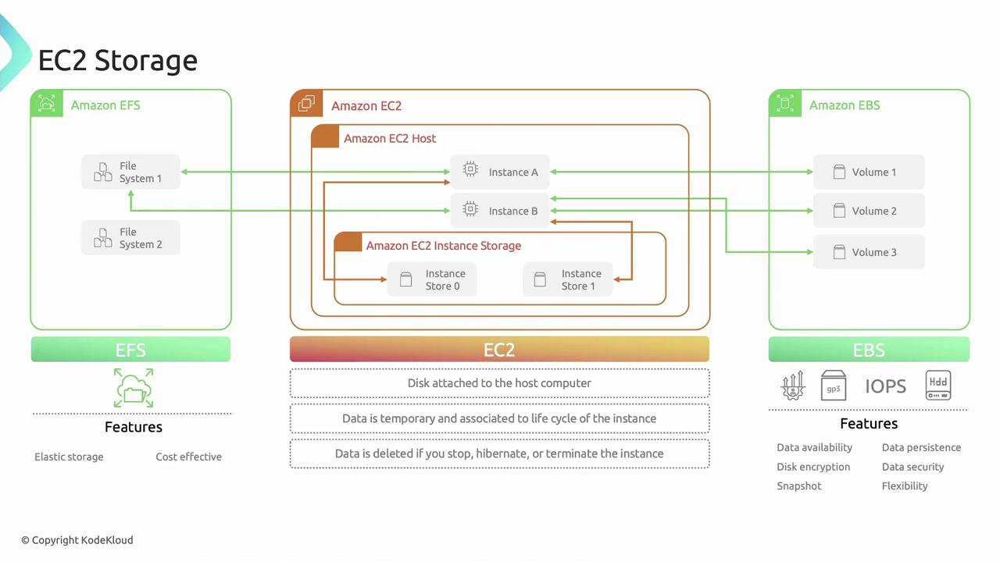

# Create an EFS file system
aws efs create-file-system --performance-mode generalPurpose

# Mount on Linux instance
sudo yum install -y amazon-efs-utils
sudo mkdir /mnt/efs
sudo mount -t efs fs-0123456789abcdef0:/ /mnt/efs
```

Use cases:

* Web serving and content management
* Shared development or build environments
* Data science, analytics, and media workflows

***

## 3. Amazon Elastic Block Store (EBS)

Amazon EBS offers persistent, block-level storage that you can attach to a single EC2 instance at a time. Volumes behave like raw block devices you can format, mount, and use as you would an on-premises disk.

| Volume Type              | Use Case                                       | Throughput/IOPS         |
| ------------------------ | ---------------------------------------------- | ----------------------- |
| General Purpose SSD      | Balanced price/performance (web servers, apps) | Up to 16,000 IOPS (gp3) |
| Provisioned IOPS SSD     | I/O-intensive databases (Oracle, SQL Server)   | Up to 256,000 IOPS      |
| Throughput Optimized HDD | Large, sequential workloads (big data, logs)   | Up to 500 MB/s          |
| Cold HDD                 | Infrequently accessed data (archival, backups) | Up to 250 MB/s          |

Core features:

* Data Persistence: volumes persist independently of the EC2 instance
* High Availability: data is replicated within the same AZ to prevent hardware failures
* Encryption: AES-256 at rest and in transit (managed with [AWS KMS](https://aws.amazon.com/kms/))
* Snapshots: create point-in-time backups stored in Amazon S3
* Dynamically adjustable: modify size, volume type, and IOPS without detaching

Sample commands:

```bash theme={null}
# Create a 100 GiB gp3 volume in us-east-1a
aws ec2 create-volume \
  --availability-zone us-east-1a \
  --size 100 \
  --volume-type gp3

# Attach the volume to an instance
aws ec2 attach-volume \
  --volume-id vol-0123456789abcdef0 \
  --instance-id i-0abcdef1234567890 \
  --device /dev/xvdf
```



***

## Storage Comparison at a Glance

| Feature       | Instance Store       | EBS                           | EFS                                   |
| ------------- | -------------------- | ----------------------------- | ------------------------------------- |
| Persistence   | Ephemeral            | Persistent (AZ-level replica) | Persistent (region-wide)              |
| Performance   | Very high IOPS       | High IOPS / throughput        | Scalable throughput                   |
| Protocol      | Direct-attached disk | iSCSI block device            | NFSv4                                 |
| Shared Access | No                   | Single instance per volume    | Multiple instances concurrently       |
| Best for      | Scratch, caches      | Databases, boot volumes       | Shared file storage, home directories |

***

## Links and References

* [AWS EC2 Instance Store Documentation](https://docs.aws.amazon.com/AWSEC2/latest/UserGuide/InstanceStorage.html)
* [Amazon EBS Documentation](https://docs.aws.amazon.com/ebs/latest/)
* [Amazon EFS Documentation](https://docs.aws.amazon.com/efs/latest/)
* [AWS Key Management Service](https://aws.amazon.com/kms/)
* [Amazon S3](https://aws.amazon.com/s3/)

- [Watch Video](https://learn.kodekloud.com/user/courses/amazon-elastic-compute-cloud-ec2/module/6b1df5fc-e1d3-4e1d-9dd1-035d0c2737d4/lesson/afb5d493-7c1f-40bd-a199-43e49824afc6)


# EC2 User data

Source: https://notes.kodekloud.com/docs/Amazon-Elastic-Compute-Cloud-EC2/Basics-of-EC2/EC2-User-data/page

Explains EC2 user data, its execution behavior, constraints, examples for bootstrapping instances, retrieval methods, and best practices for one-time initialization.

In this lesson we cover EC2 user data: what it is, when and how it runs, and practical examples for bootstrapping instances automatically.

When you launch an Amazon EC2 instance you can supply "user data": a script or set of instructions that the instance executes during its initial boot. This is useful for one-time setup tasks such as installing packages, pulling configuration, bootstrapping services, or writing files so the instance is immediately ready to serve traffic.

<Frame>
  
</Frame>

What user data does and important constraints

* User data is delivered to the instance at launch and interpreted by the instance (for example cloud-init on Linux or EC2Launch/EC2Config on Windows). EC2 treats the payload as opaque — it does not examine or validate the contents.
* The raw (pre-Base64) user data size limit is 16 KB.
* When launching via the AWS Console you can paste plain text; the console Base64-encodes it for you. When calling EC2 APIs or using SDKs, callers typically must provide Base64-encoded user data.
* When retrieved from the instance metadata service it is returned in decoded (human-readable) form. Some EC2 API responses (e.g., DescribeInstanceAttribute/UserData) return Base64-encoded user data that you must decode.

Summary table: common behaviors and their impact

| Behavior / Constraint             | What it means                                                                    | Notes / Action                                                                                                             |
| --------------------------------- | -------------------------------------------------------------------------------- | -------------------------------------------------------------------------------------------------------------------------- |
| Runs only on initial launch       | User data executes during the instance's first boot                              | For recurring boots, put scripts in per-boot hooks (cloud-init per-boot, systemd services, or OS-specific startup scripts) |
| Changing user data after creation | Modifying user data on a stopped instance does not cause it to run on next start | To apply new configuration, run scripts manually or bake new AMIs                                                          |
| Encoding requirements             | Console handles Base64; API/SDK may require Base64 input                         | Check your SDK/CLI docs — AWS CLI or SDKs often accept plain text and encode for you, but the raw EC2 API expects Base64   |
| Size limit                        | 16 KB raw                                                                        | Keep bootstrapping lightweight or use remote artifact downloads                                                            |
| Retrieval formats                 | Metadata service returns decoded text; some API responses return Base64          | Decode API responses before use                                                                                            |

> **lightbulb** User data is best for one-time bootstrapping: installing packages, placing configuration files, registering with a service, or making the instance ready for traffic. For recurring or per-boot tasks, use cloud-init per-boot hooks, OS startup scripts, or configuration management tools like Ansible, Chef, or Puppet.

Example: a minimal Linux user data script

* The following example updates packages, installs and starts Apache (httpd), ensures it is enabled at boot, and writes a simple index page. This is suitable for Amazon Linux/CentOS-based images that use yum and systemd:

```bash theme={null}
#!/bin/bash
