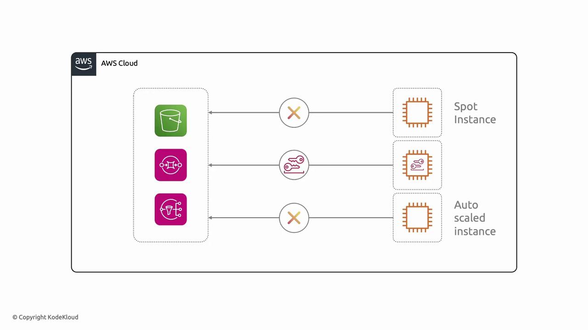
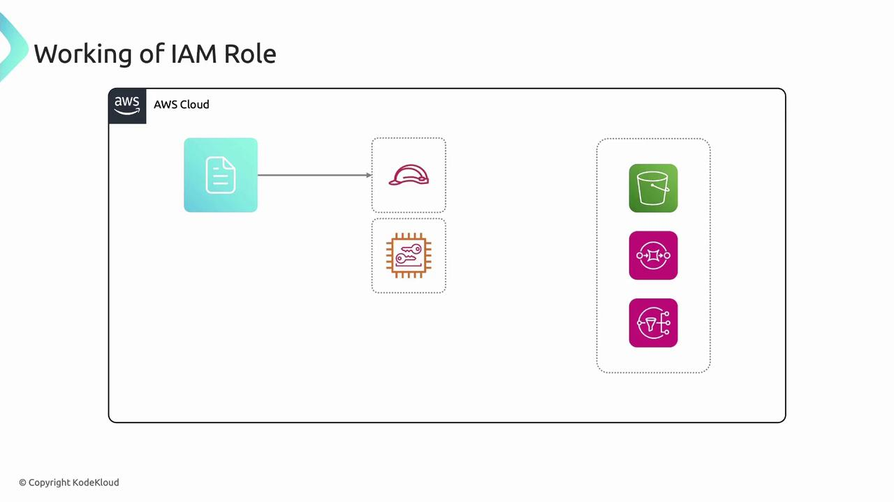
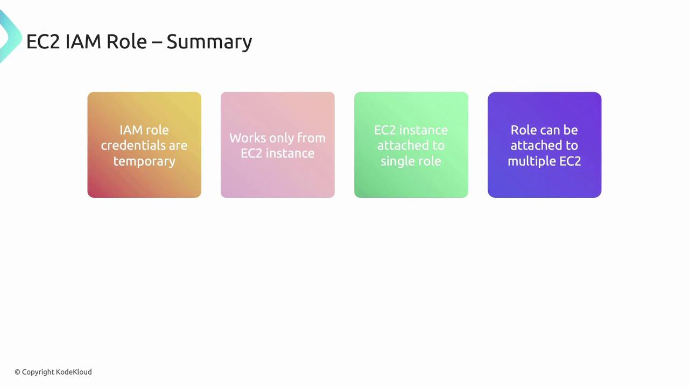

# EC2 Instance and IAM role

Source: https://notes.kodekloud.com/docs/Amazon-Elastic-Compute-Cloud-EC2/EC2-Advanced/EC2-Instance-and-IAM-role/page

This guide covers using IAM roles for secure permission management on EC2 instances without long-term access keys.

Welcome! In this guide, we cover how to use IAM roles to securely grant permissions to your EC2 instances without embedding long-term access keys.

## Why You Need IAM Roles

Managing static AWS access keys on EC2 instances poses several operational and security challenges:

* Securely provisioning credentials to every new instance.
* Rotating keys when they expire or are compromised.
* Preventing API request failures due to missing or revoked keys.

<Frame>
  
</Frame>

Static credentials don’t scale in dynamic environments. IAM roles deliver temporary credentials automatically, solving distribution and rotation issues.

<Callout icon="lightbulb">
  Instances with IAM roles receive short-lived credentials from the metadata service. This eliminates the need to store access keys on disk.
</Callout>

## What Is an IAM Role?

An IAM role is an AWS identity with attached permissions defined by IAM policies. Unlike an IAM user, a role:

* Isn’t tied to a specific individual.
* Has no long-term credentials (no static keys or passwords).
* Can be assumed by authorized entities (EC2, Lambda, ECS, etc.).

When you launch an EC2 instance, attach a role—and AWS will provision temporary credentials (AccessKeyId, SecretAccessKey, Token) via the instance metadata service.

<Frame>
  
</Frame>

## EC2 Instance Metadata Service

EC2 instance metadata provides instance information and temporary credentials at a fixed IP address. To list all metadata categories:

```bash theme={null}
curl http://169.254.169.254/latest/meta-data/
```

Sample output:

* ami-id/
* instance-id/
* iam/
* instance-action/

<Callout icon="triangle-alert">
  Enable and enforce IMDSv2 on your instances to protect against SSRF attacks. See [AWS IMDSv2 documentation](https://docs.aws.amazon.com/AWSEC2/latest/UserGuide/configuring-instance-metadata-service.html).
</Callout>

## Retrieving Temporary Credentials

Assuming your role is named `s3access`, fetch credentials with:

```bash theme={null}
curl http://169.254.169.254/latest/meta-data/iam/security-credentials/s3access
```

Example response:

```json theme={null}
{
  "Code" : "Success",
  "LastUpdated" : "2023-06-15T12:00:00Z",
  "Type" : "AWS-HMAC",
  "AccessKeyId" : "ASIAEXAMPLE",
  "SecretAccessKey" : "wJalrExampleKEY",
  "Token" : "IQoJb3JpZ2luX2VjExampleToken",
  "Expiration" : "2023-06-15T18:00:00Z"
}
```

These credentials expire automatically and cannot be reused elsewhere.

## Using AWS CLI with IAM Roles

With the IAM role attached, the AWS CLI handles credential retrieval and signing transparently. For example, list an S3 bucket:

```bash theme={null}
aws s3 ls s3://example-bucket
```

Under the hood:

1. CLI requests temporary credentials from the metadata service.
2. It uses those credentials to sign API calls.
3. Results (e.g., bucket contents) are returned.

<Frame>
  
</Frame>

## Best Practices

| Practice                | Recommendation                                                        |
| ----------------------- | --------------------------------------------------------------------- |
| Use IAM Roles           | Avoid embedding keys; assign minimal privileges to roles.             |
| Enforce IMDSv2          | Require session tokens and mitigate SSRF risks.                       |
| Rotate Policies         | Update IAM policies regularly to follow least-privilege principles.   |
| Monitor with CloudTrail | Track IAM role assumptions and API calls for auditing and compliance. |

## Summary

* IAM roles provide temporary, auto-rotated credentials scoped to your EC2 instances.
* A single EC2 instance can hold one IAM role, while a role can attach to multiple instances.
* AWS SDKs, CLI, and tools automatically retrieve metadata credentials without manual intervention.

<Frame>
  
</Frame>

## Links and References

* [AWS IAM Roles Documentation](https://docs.aws.amazon.com/IAM/latest/UserGuide/id_roles.html)
* [EC2 Instance Metadata Service](https://docs.aws.amazon.com/AWSEC2/latest/UserGuide/instancedata-data-retrieval.html)
* [AWS CLI Reference](https://docs.aws.amazon.com/cli/latest/reference/)
* [AWS Security Best Practices](https://aws.amazon.com/whitepapers/security/)

<CardGroup>
  <Card title="Watch Video" icon="video" href="https://learn.kodekloud.com/user/courses/amazon-elastic-compute-cloud-ec2/module/fe995ae2-a50f-4c70-9d50-3f2e017bd207/lesson/d06b0dc9-9fd9-4fa5-8cce-f87e0e7c3b8b" />

  <Card title="Practice Lab" icon="installation" href="https://learn.kodekloud.com/user/courses/amazon-elastic-compute-cloud-ec2/module/fe995ae2-a50f-4c70-9d50-3f2e017bd207/lesson/56bd053a-0c48-46bd-bab0-f56451fc2fc6" />
</CardGroup>
