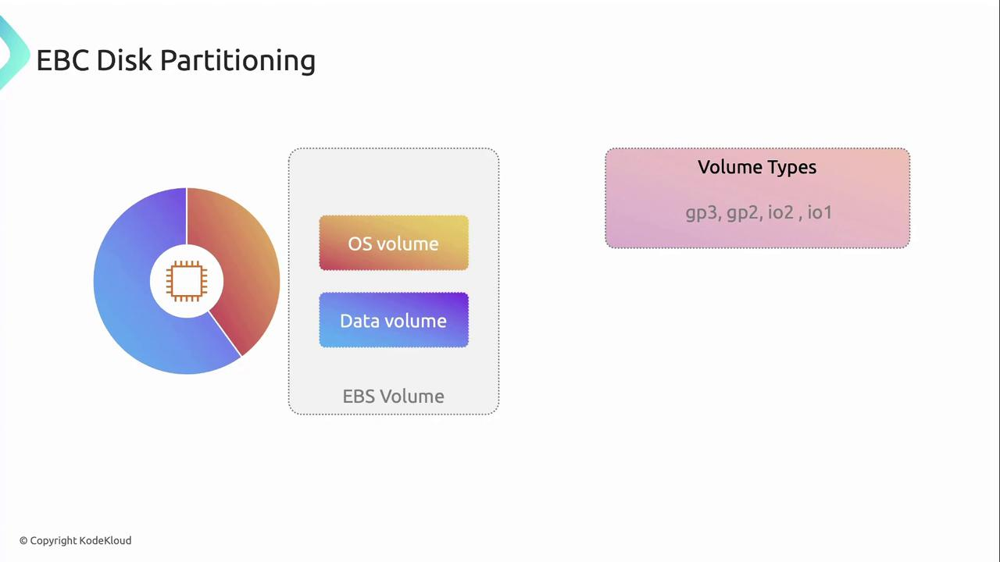

# Disk partition management snapshots

Source: https://notes.kodekloud.com/docs/Amazon-Elastic-Compute-Cloud-EC2/EC2-Real-Life-Problems-and-Solutions/Disk-partition-management-snapshots/page

This article explores managing disk partitions on AWS EC2 instances, focusing on EBS volumes and scheduling snapshots for data recovery.

In this article, we explore how to manage disk partitions on [AWS EC2](https://aws.amazon.com/ec2/) instances. By separating the operating system (OS) from application data into distinct partitions—and, crucially, onto separate [EBS volumes](https://aws.amazon.com/ebs/)—you minimize the risk of data loss if the OS partition becomes corrupted, and you simplify recovery.

<Callout icon="triangle-alert">
  Always ensure you have proper backups before resizing or modifying partitions. Unexpected interruptions can lead to data loss.
</Callout>

## Choosing the Right EBS Volume Type

Selecting the appropriate EBS volume type is critical for meeting your performance requirements. AWS offers SSD-backed volumes with varying baseline throughput and IOPS:

| Volume Type | Use Case                      | Baseline IOPS |
| ----------- | ----------------------------- | ------------- |
| gp3         | Balanced cost and performance | Up to 16,000  |
| gp2         | General-purpose workloads     | 3 IOPS/GiB    |
| io1         | High-performance databases    | Up to 64,000  |
| io2         | Mission-critical applications | Up to 64,000  |

<Frame>
  
</Frame>

<Callout icon="lightbulb">
  gp3 volumes let you provision IOPS and throughput independently, often yielding cost savings for variable workloads.
</Callout>

## Scheduling Point-in-Time Recovery with EBS Snapshots

To guarantee point-in-time recovery of your data, schedule regular [EBS snapshots](https://docs.aws.amazon.com/AWSEC2/latest/UserGuide/ebs-creating-snapshot.html). A snapshot captures the exact state of a volume at the moment it’s taken, enabling you to restore data to that precise point.

### Automating Snapshot Creation

Use Amazon Data Lifecycle Manager (DLM) or AWS Backup to automate snapshot schedules:

```bash theme={null}
